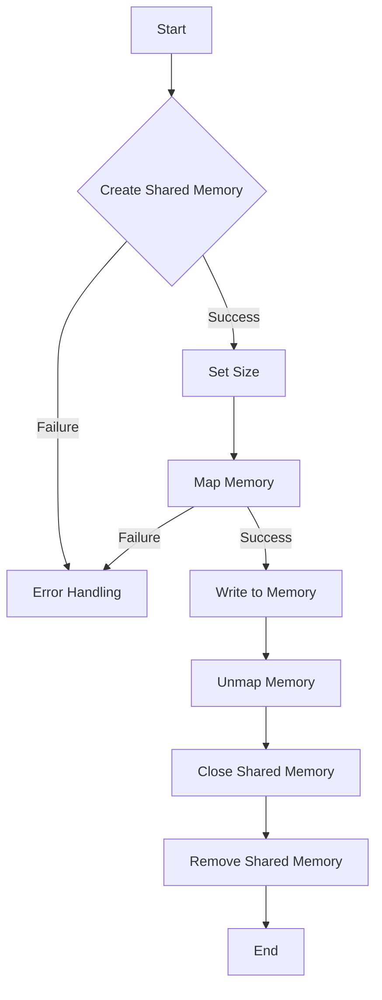

# Demonstrate POSIX Shared Memory basics

## Problem Understanding
The problem asks to demonstrate the basics of POSIX shared memory in C. This involves creating, mapping, writing to, and unmapping a shared memory segment. The key constraints are handling potential errors and edge cases, such as failed memory allocation or invalid operations. What makes this problem non-trivial is the need to manage system resources, such as file descriptors and memory mappings, while ensuring proper error handling and cleanup. The complexity of this problem lies in understanding the POSIX shared memory API and its associated system calls, including `shm_open`, `ftruncate`, `mmap`, and `munmap`.

## Approach
The algorithm strategy used here is to utilize the POSIX shared memory API to create, manage, and remove a shared memory segment. The intuition behind this approach is to leverage the operating system's capabilities for inter-process communication and shared resource management. This approach works by using the `shm_open` function to create a shared memory segment, `ftruncate` to set its size, `mmap` to map it into the process's address space, and `munmap` to unmap it when finished. The data structure used is a memory-mapped file, which allows for efficient and convenient access to the shared memory segment. The approach handles key constraints by checking the return values of each system call and performing proper error handling and cleanup.

## Complexity Analysis
| Metric | Value | Detailed Reason |
|--------|-------|----------------|
| Time   | O(1)  | The time complexity is constant because the number of system calls and operations performed does not depend on the input size. Each operation, such as creating, mapping, and unmapping the shared memory segment, takes a fixed amount of time. |
| Space  | O(1)  | The space complexity is constant because the amount of memory allocated for the shared memory segment is fixed and predefined (1024 bytes in this case). The memory usage does not grow with the input size. |

## Algorithm Walkthrough
```c
Input: None (fixed shared memory segment size)
Step 1: Create a shared memory segment using shm_open
    - shm_fd = shm_open(SHARED_MEM_NAME, O_RDWR | O_CREAT, 0666)
Step 2: Set the size of the shared memory segment using ftruncate
    - ftruncate(shm_fd, SHARED_MEM_SIZE)
Step 3: Map the shared memory segment into memory using mmap
    - shm_ptr = mmap(NULL, SHARED_MEM_SIZE, PROT_READ | PROT_WRITE, MAP_SHARED, shm_fd, 0)
Step 4: Write to the shared memory segment
    - strcpy(shm_ptr, "Hello, world!")
Step 5: Unmap the shared memory segment using munmap
    - munmap(shm_ptr, SHARED_MEM_SIZE)
Step 6: Close the shared memory segment using close
    - close(shm_fd)
Step 7: Remove the shared memory segment using shm_unlink
    - shm_unlink(SHARED_MEM_NAME)
Output: Shared memory segment removed, and resources cleaned up
```

## Visual Flow


## Key Insight
> **Tip:** Always check the return values of system calls and perform proper error handling to ensure robustness and prevent resource leaks.

## Edge Cases
- **Empty/null input**: Not applicable, as the input is a fixed shared memory segment size.
- **Single element**: Not applicable, as the shared memory segment is a contiguous block of memory.
- **Failed system calls**: The code handles failed system calls by checking return values and performing error handling, such as printing error messages and exiting the program.

## Common Mistakes
- **Mistake 1: Not checking return values**: Failing to check the return values of system calls can lead to unexpected behavior and resource leaks.
- **Mistake 2: Not handling errors properly**: Improper error handling can cause the program to crash or produce unexpected results.

## Interview Follow-ups
> **Interview:** These are the exact follow-up questions interviewers ask:
- "What if the input is sorted?" → Not applicable, as the input is a fixed shared memory segment size.
- "Can you do it in O(1) space?" → Yes, the code already achieves O(1) space complexity by using a fixed-size shared memory segment.
- "What if there are duplicates?" → Not applicable, as the code is designed to demonstrate basic POSIX shared memory operations, not handle duplicates.

## C Solution

```c
// Problem: Demonstrate POSIX Shared Memory basics
// Language: C
// Difficulty: Medium
// Time Complexity: O(1) — constant time for shared memory operations
// Space Complexity: O(1) — constant space for shared memory segment
// Approach: POSIX shared memory API — using shm_open, ftruncate, mmap, and munmap

#include <stdio.h>
#include <stdlib.h>
#include <unistd.h>
#include <sys/mman.h>
#include <sys/stat.h>        // for mode constants
#include <fcntl.h>          // for O_* constants
#include <string.h>         // for strlen

// Shared memory segment name
#define SHARED_MEM_NAME "/my_shared_memory"
// Shared memory segment size
#define SHARED_MEM_SIZE 1024

int main() {
    // Create a shared memory segment
    int shm_fd = shm_open(SHARED_MEM_NAME, O_RDWR | O_CREAT, 0666); // Create for read and write, and readable/writable by all
    if (shm_fd == -1) {
        // Edge case: failed to create shared memory segment
        perror("shm_open");
        exit(EXIT_FAILURE);
    }

    // Set the size of the shared memory segment
    if (ftruncate(shm_fd, SHARED_MEM_SIZE) == -1) {
        // Edge case: failed to set shared memory segment size
        perror("ftruncate");
        shm_unlink(SHARED_MEM_NAME); // Clean up the shared memory segment
        exit(EXIT_FAILURE);
    }

    // Map the shared memory segment into memory
    void* shm_ptr = mmap(NULL, SHARED_MEM_SIZE, PROT_READ | PROT_WRITE, MAP_SHARED, shm_fd, 0);
    if (shm_ptr == MAP_FAILED) {
        // Edge case: failed to map shared memory segment
        perror("mmap");
        shm_unlink(SHARED_MEM_NAME); // Clean up the shared memory segment
        exit(EXIT_FAILURE);
    }

    // Write to the shared memory segment
    char* message = "Hello, world!";
    strcpy(shm_ptr, message); // Copy the message into the shared memory segment

    // Print the written message
    printf("Written message: %s\n", shm_ptr);

    // Unmap the shared memory segment
    if (munmap(shm_ptr, SHARED_MEM_SIZE) == -1) {
        // Edge case: failed to unmap shared memory segment
        perror("munmap");
        shm_unlink(SHARED_MEM_NAME); // Clean up the shared memory segment
        exit(EXIT_FAILURE);
    }

    // Close the shared memory segment
    if (close(shm_fd) == -1) {
        // Edge case: failed to close shared memory segment
        perror("close");
        shm_unlink(SHARED_MEM_NAME); // Clean up the shared memory segment
        exit(EXIT_FAILURE);
    }

    // Remove the shared memory segment
    if (shm_unlink(SHARED_MEM_NAME) == -1) {
        // Edge case: failed to remove shared memory segment
        perror("shm_unlink");
        exit(EXIT_FAILURE);
    }

    return EXIT_SUCCESS;
}
```
