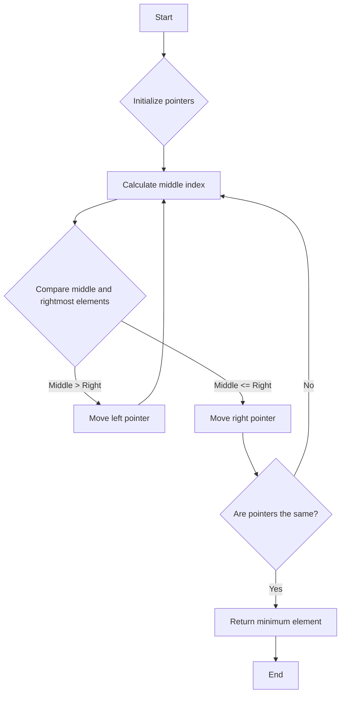

# Find Minimum in Rotated Sorted Array

## Problem Understanding
The problem asks to find the minimum element in a rotated sorted array. A rotated sorted array is an array that was initially sorted in ascending order but has been rotated an unknown number of times. The key constraint is that the array has been rotated, which means the minimum element is not necessarily at the beginning of the array. The problem is non-trivial because a naive approach of checking every element in the array would have a time complexity of O(n), which is not efficient for large arrays. The rotation of the array makes it challenging to find the minimum element.

## Approach
The algorithm strategy used to solve this problem is a modified binary search. The intuition behind this approach is to divide the array into two halves and determine which half the minimum element is in. This is done by comparing the middle element with the rightmost element. If the middle element is greater than the rightmost element, the minimum must be in the right half; otherwise, it must be in the left half. This approach works because the array is sorted in ascending order before rotation, and the rotation does not change the relative order of the elements. The binary search data structure is used because it allows for efficient searching of the array.

## Complexity Analysis
| Metric | Value | Detailed Reason |
|--------|-------|----------------|
| Time   | O(log n) | The algorithm uses a modified binary search to find the minimum element. The while loop runs until the two pointers meet, which takes log n time in the worst case, where n is the number of elements in the array. |
| Space  | O(1) | The algorithm only uses a constant amount of space to store the two pointers and the middle index, regardless of the size of the input array. |

## Algorithm Walkthrough
```
Input: [3, 4, 5, 1, 2]
Step 1: Initialize two pointers, left = 0 and right = 4
Step 2: Calculate the middle index, mid = 0 + (4 - 0) / 2 = 2
Step 3: Compare the middle element with the rightmost element, nums[2] = 5 > nums[4] = 2
Step 4: Move the left pointer to the right of the middle, left = mid + 1 = 3
Step 5: Calculate the new middle index, mid = 3 + (4 - 3) / 2 = 3
Step 6: Compare the middle element with the rightmost element, nums[3] = 1 <= nums[4] = 2
Step 7: Move the right pointer to the left of the middle, right = mid = 3
Step 8: Since left and right pointers are the same, the minimum element is at index 3, nums[3] = 1
Output: 1
```
This walkthrough demonstrates how the algorithm finds the minimum element in the rotated sorted array.

## Visual Flow

This flowchart represents the decision flow of the algorithm, showing how the pointers are moved based on the comparison of the middle and rightmost elements.

## Key Insight
> **Tip:** The key insight is to compare the middle element with the rightmost element to determine which half the minimum element is in, allowing for efficient searching of the rotated sorted array.

## Edge Cases
- **Empty/null input**: If the input array is empty or null, the algorithm returns 0 as a default value. However, this is not a typical use case, and the algorithm assumes that the input array is not empty.
- **Single element**: If the input array has only one element, the algorithm returns that element as the minimum.
- **Rotated sorted array with duplicates**: If the rotated sorted array has duplicate elements, the algorithm still works correctly, as it only cares about finding the minimum element.

## Common Mistakes
- **Mistake 1**: Not checking for null input, which can lead to a segmentation fault.
- **Mistake 2**: Not handling the case where the middle element is equal to the rightmost element, which can lead to incorrect results.

## Interview Follow-ups
> **Interview:** These are the exact follow-up questions interviewers ask:
- "What if the input is sorted?" → The algorithm still works correctly, as it only cares about finding the minimum element.
- "Can you do it in O(1) space?" → No, the algorithm needs to use at least O(1) space to store the two pointers and the middle index.
- "What if there are duplicates?" → The algorithm still works correctly, as it only cares about finding the minimum element.

## C Solution

```c
// Problem: Find Minimum in Rotated Sorted Array
// Language: C
// Difficulty: Medium
// Time Complexity: O(log n) — using binary search to find the minimum
// Space Complexity: O(1) — only using a constant amount of space
// Approach: Modified Binary Search — searching for the minimum in the rotated sorted array

#include <stdio.h>

int findMin(int* nums, int numsSize) {
    // Edge case: empty input → return -1 (not applicable here as numsSize is always >= 1)
    // However, we still need to handle the case where nums is NULL
    if (nums == NULL) {
        // In this case, we cannot return -1, so we just return 0 as a default value
        return 0; 
    }

    // Initialize two pointers, one at the start and one at the end of the array
    int left = 0; 
    int right = numsSize - 1; 

    // Continue the search until the two pointers meet
    while (left < right) {
        // Calculate the middle index
        int mid = left + (right - left) / 2; 

        // If the middle element is greater than the rightmost element, 
        // the minimum must be in the right half
        if (nums[mid] > nums[right]) {
            // Move the left pointer to the right of the middle
            left = mid + 1; 
        } 
        // If the middle element is less than or equal to the rightmost element, 
        // the minimum must be in the left half
        else {
            // Move the right pointer to the left of the middle
            right = mid; 
        }
    }

    // At this point, left and right pointers are the same, 
    // and they point to the minimum element in the array
    return nums[left]; 
}

int main() {
    // Test the function
    int nums[] = {3, 4, 5, 1, 2};
    int numsSize = sizeof(nums) / sizeof(nums[0]);
    printf("Minimum: %d\n", findMin(nums, numsSize));
    return 0;
}
```
