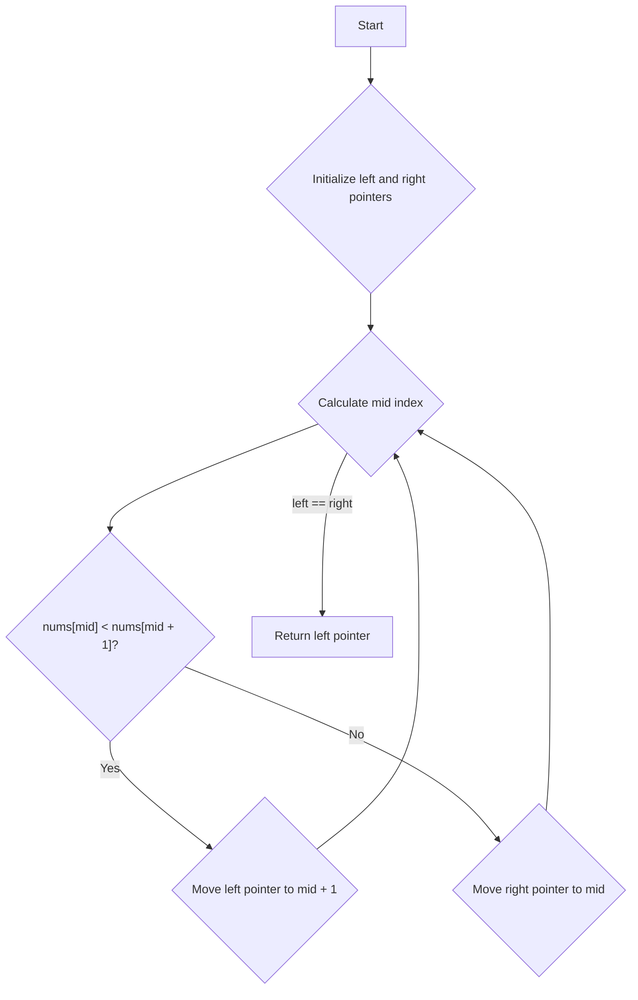

# Find Peak Element in an Array

## Problem Understanding
The problem is asking us to find the index of a peak element in a given array, where a peak element is an element that is not smaller than its neighbors. The key constraint is that the input array can be of any size and can contain any integers. What makes this problem non-trivial is that a naive approach, such as iterating through the array and checking each element with its neighbors, would have a time complexity of O(n), which may not be efficient for large arrays. Additionally, the problem requires finding a peak element in a single pass, without knowing the exact distribution of the elements in the array.

## Approach
The algorithm strategy used to solve this problem is binary search, which has a time complexity of O(log n). The intuition behind this approach is that by comparing the middle element with its next element, we can determine which side of the array the peak element is likely to be. If the middle element is smaller than its next element, then the peak element must be on the right side, and vice versa. This approach works because the problem guarantees that there is at least one peak element in the array. The data structure used is an array, and no extra space is needed, resulting in a space complexity of O(1).

## Complexity Analysis
| Metric | Value | Detailed Reason |
|--------|-------|----------------|
| Time   | O(log n) | The algorithm uses binary search to find the peak element. In each iteration, the search space is halved, resulting in a logarithmic time complexity. |
| Space  | O(1) | The algorithm only uses a constant amount of space to store the left and right pointers, regardless of the size of the input array. |

## Algorithm Walkthrough
```
Input: [1, 2, 3, 1]
Step 1: left = 0, right = 3
Step 2: mid = 1, nums[mid] = 2, nums[mid + 1] = 3
        Since nums[mid] < nums[mid + 1], left = mid + 1 = 2
Step 3: left = 2, right = 3, mid = 2, nums[mid] = 3, nums[mid + 1] = 1
        Since nums[mid] > nums[mid + 1], right = mid = 2
Step 4: left = 2, right = 2, so the loop ends
Output: 2 (the index of the peak element)
```
This example demonstrates how the algorithm finds the peak element by iteratively dividing the search space in half.

## Visual Flow

This flowchart illustrates the decision-making process of the algorithm.

## Key Insight
> **Tip:** The key insight is that by comparing the middle element with its next element, we can determine which side of the array the peak element is likely to be, allowing us to prune the search space in half.

## Edge Cases
- **Empty input**: If the input array is empty, the algorithm returns -1, indicating that there is no peak element.
- **Single element**: If the input array contains only one element, the algorithm returns 0, which is the index of the peak element.
- **Array with two elements**: If the input array contains only two elements, the algorithm compares the two elements and returns the index of the larger one.

## Common Mistakes
- **Mistake 1**: Not checking for the edge case where the input array is empty. → To avoid this, add a simple check at the beginning of the algorithm to return -1 if the input array is empty.
- **Mistake 2**: Not updating the left and right pointers correctly. → To avoid this, make sure to update the left and right pointers based on the comparison of the middle element with its next element.

## Interview Follow-ups
> **Interview:** These are the exact follow-up questions interviewers ask:
- "What if the input is sorted?" → In this case, the algorithm would still work, but it would not be the most efficient solution. A more efficient solution would be to simply return the index of the maximum element.
- "Can you do it in O(1) space?" → The algorithm already uses O(1) space, so this is not a concern.
- "What if there are duplicates?" → The algorithm would still work, but it may return the index of one of the duplicate peak elements. If we need to return all peak elements, we would need to modify the algorithm to keep track of all peak elements.

## C Solution

```c
// Problem: Find Peak Element in an Array
// Language: C
// Difficulty: Medium
// Time Complexity: O(log n) — using binary search
// Space Complexity: O(1) — no extra space needed
// Approach: Binary Search — find the peak element by dividing the array

#include <stdio.h>

int findPeakElement(int* nums, int numsSize) {
    // Edge case: empty input → return -1
    if (numsSize == 0) return -1;
    
    // Initialize two pointers for binary search
    int left = 0;  // left pointer
    int right = numsSize - 1;  // right pointer
    
    // Continue binary search until left and right pointers meet
    while (left < right) {
        // Calculate the middle index
        int mid = left + (right - left) / 2;
        
        // If the middle element is smaller than the next one, 
        // then the peak element must be on the right side
        if (nums[mid] < nums[mid + 1]) {
            left = mid + 1;  // move the left pointer to the right
        } 
        // If the middle element is larger than the next one, 
        // then the peak element must be on the left side
        else {
            right = mid;  // move the right pointer to the left
        }
    }
    
    // At this point, left and right pointers are the same
    // This is the index of the peak element
    return left;
}

int main() {
    int nums[] = {1, 2, 3, 1};
    int numsSize = sizeof(nums) / sizeof(nums[0]);
    
    int peakIndex = findPeakElement(nums, numsSize);
    
    printf("Peak element is at index %d\n", peakIndex);
    
    return 0;
}
```
