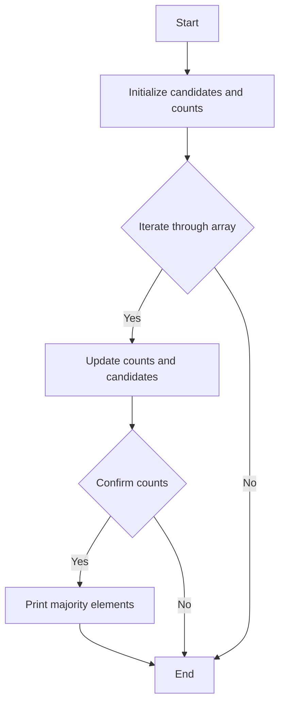

# Find the Majority Element II (Appears > N/3 times)

## Problem Understanding
The problem is asking to find the majority element(s) in an array that appear more than n/3 times, where n is the size of the array. The key constraint is that there can be more than one majority element. This problem is non-trivial because a naive approach, such as sorting the array and then counting the occurrences of each element, would have a time complexity of O(n log n), which is not efficient for large inputs. The Boyer-Moore Majority Vote algorithm is used to solve this problem in O(n) time complexity.

## Approach
The algorithm strategy used is the Boyer-Moore Majority Vote algorithm, which maintains a count of two potential majority elements. The intuition behind this approach is that if an element is a majority element, it will be one of the two elements with the highest counts. The algorithm iterates through the array, updating the counts of the two potential majority elements. If an element matches one of the candidates, its count is incremented; otherwise, the counts are decremented. If a count reaches zero, the current element becomes the new candidate. This approach works because the majority element will always be one of the two elements with the highest counts.

## Complexity Analysis
| Metric | Value | Detailed Reason |
|--------|-------|----------------|
| Time   | O(n)  | The algorithm iterates through the array twice: once to find the two potential majority elements and once to confirm their counts. Each iteration takes O(n) time. |
| Space  | O(1)  | The algorithm uses a constant amount of space to store the two potential majority elements and their counts, regardless of the input size. |

## Algorithm Walkthrough
```
Input: [3, 2, 3]
Step 1: Initialize candidate1 = 0, candidate2 = 1, count1 = 0, count2 = 0
Step 2: Iterate through the array:
    - For nums[0] = 3, candidate1 = 3, count1 = 1
    - For nums[1] = 2, candidate2 = 2, count2 = 1
    - For nums[2] = 3, count1 = 2
Step 3: Reset counts: count1 = 0, count2 = 0
Step 4: Iterate through the array again to confirm the counts:
    - For nums[0] = 3, count1 = 1
    - For nums[1] = 2, count2 = 1
    - For nums[2] = 3, count1 = 2
Step 5: Print the majority elements: candidate1 = 3 (count1 = 2 > n/3)
Output: 3
```

## Visual Flow


## Key Insight
> **Tip:** The key insight is that the Boyer-Moore Majority Vote algorithm can be extended to find multiple majority elements by maintaining multiple counts and candidates.

## Edge Cases
- **Empty/null input**: The algorithm will print -1, indicating that there is no majority element.
- **Single element**: The algorithm will print the single element as the majority element.
- **Duplicate elements**: The algorithm will correctly count the occurrences of each duplicate element and print the majority elements.

## Common Mistakes
- **Mistake 1**: Not resetting the counts after finding the two potential majority elements. This can be avoided by initializing the counts to zero before the second iteration.
- **Mistake 2**: Not checking for the edge case of an empty input. This can be avoided by adding a simple check at the beginning of the algorithm.

## Interview Follow-ups
> **Interview:** These are the exact follow-up questions interviewers ask:
- "What if the input is sorted?" → The algorithm will still work correctly, but it will not take advantage of the sorted input.
- "Can you do it in O(1) space?" → No, the algorithm requires O(1) space to store the two potential majority elements and their counts.
- "What if there are duplicates?" → The algorithm will correctly count the occurrences of each duplicate element and print the majority elements.

## C Solution

```c
// Problem: Find the Majority Element II (Appears > N/3 times)
// Language: C
// Difficulty: Medium
// Time Complexity: O(n) — single pass through array using Boyer-Moore Majority Vote
// Space Complexity: O(1) — constant space to store candidate elements
// Approach: Boyer-Moore Majority Vote — maintain count of two potential majority elements

#include <stdio.h>

void majorityElement(int* nums, int numsSize) {
    // Initialize variables to store two potential majority elements and their counts
    int count1 = 0, count2 = 0; 
    int candidate1 = 0, candidate2 = 1; // Any initial values, will be updated
    
    // Iterate through the array to find two potential majority elements
    for (int i = 0; i < numsSize; i++) {
        // If current element matches candidate1, increment its count
        if (nums[i] == candidate1) {
            count1++;
        } 
        // If current element matches candidate2, increment its count
        else if (nums[i] == candidate2) {
            count2++;
        } 
        // If count1 is zero, set current element as new candidate1
        else if (count1 == 0) {
            candidate1 = nums[i];
            count1 = 1;
        } 
        // If count2 is zero, set current element as new candidate2
        else if (count2 == 0) {
            candidate2 = nums[i];
            count2 = 1;
        } 
        // If current element does not match either candidate, decrement both counts
        else {
            count1--;
            count2--;
        }
    }
    
    // Reset counts for the two candidates
    count1 = 0, count2 = 0;
    
    // Edge case: empty input → return -1
    if (numsSize == 0) {
        printf("-1\n");
        return;
    }
    
    // Iterate through the array again to confirm the majority elements
    for (int i = 0; i < numsSize; i++) {
        // Count occurrences of candidate1
        if (nums[i] == candidate1) {
            count1++;
        }
        // Count occurrences of candidate2
        else if (nums[i] == candidate2) {
            count2++;
        }
    }
    
    // Print the majority elements that appear more than n/3 times
    if (count1 > numsSize / 3) {
        printf("%d ", candidate1);
    }
    if (count2 > numsSize / 3) {
        printf("%d ", candidate2);
    }
}

int main() {
    int nums[] = {3, 2, 3};
    int numsSize = sizeof(nums) / sizeof(nums[0]);
    majorityElement(nums, numsSize);
    return 0;
}
```
