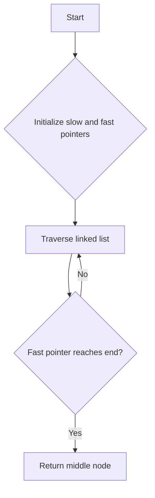

# Find the Middle Node of a Linked List (Tortoise and Hare)

## Problem Understanding
The problem asks us to find the middle node of a singly linked list. The key constraint is that we can only traverse the linked list once, and we cannot use any extra space that scales with the input size. This problem is non-trivial because a naive approach, such as counting the number of nodes and then finding the middle node, would require two passes through the linked list. The two-pointer technique, also known as the Tortoise and Hare algorithm, is used to solve this problem efficiently.

## Approach
The algorithm strategy is to use two pointers, a slow pointer and a fast pointer, that move at different speeds through the linked list. The slow pointer moves one step at a time, while the fast pointer moves two steps at a time. This approach works because when the fast pointer reaches the end of the linked list, the slow pointer will be at the middle node. The mathematical reasoning behind this is that the fast pointer covers twice the distance of the slow pointer, so when the fast pointer reaches the end, the slow pointer will be halfway through the list. We use a simple linked list node structure to represent the nodes in the list.

## Complexity Analysis
| Metric | Value | Detailed Reason |
|--------|-------|----------------|
| Time   | O(n)  | The algorithm makes a single pass through the linked list, where n is the number of nodes in the list. The while loop iterates until the fast pointer reaches the end of the list, which takes n/2 iterations in the worst case. Since we drop constant factors, the time complexity is O(n). |
| Space  | O(1)  | The algorithm uses a constant amount of space to store the slow and fast pointers, regardless of the input size. The space used does not scale with the input size, so the space complexity is O(1). |

## Algorithm Walkthrough
```
Input: 1 -> 2 -> 3 -> 4 -> 5
Step 1: slow = head (1), fast = head (1)
Step 2: slow = 2, fast = 3
Step 3: slow = 3, fast = 5
Step 4: fast reaches the end, slow is at the middle node (3)
Output: 3
```
This example demonstrates how the slow and fast pointers move through the linked list, with the slow pointer ending up at the middle node when the fast pointer reaches the end.

## Visual Flow

This flowchart shows the decision flow of the algorithm, with the slow and fast pointers moving through the linked list until the fast pointer reaches the end.

## Key Insight
> **Tip:** The key insight is that the fast pointer moves twice as fast as the slow pointer, so when the fast pointer reaches the end of the linked list, the slow pointer will be at the middle node.

## Edge Cases
- **Empty linked list**: If the linked list is empty, the function returns NULL, as there is no middle node to return.
- **Single node**: If the linked list has only one node, the function returns that node, as it is the middle node by default.
- **Even number of nodes**: If the linked list has an even number of nodes, the function returns the second middle node. This is because the problem statement does not specify which middle node to return in this case.

## Common Mistakes
- **Mistake 1**: Not checking for NULL pointers before accessing node values. To avoid this, always check if a node is NULL before accessing its value or next pointer.
- **Mistake 2**: Not handling the case where the linked list has an even number of nodes. To avoid this, consider the problem statement and decide which middle node to return in this case.

## Interview Follow-ups
> **Interview:** These are the exact follow-up questions interviewers ask:
- "What if the input is sorted?" → The algorithm still works, as it only cares about the length of the linked list, not the values of the nodes.
- "Can you do it in O(1) space?" → The algorithm already uses O(1) space, so this is not a concern.
- "What if there are duplicates?" → The algorithm still works, as it only cares about the length of the linked list, not the values of the nodes.

## C Solution

```c
// Problem: Find the Middle Node of a Linked List (Tortoise and Hare)
// Language: C
// Difficulty: Medium
// Time Complexity: O(n) — single pass through linked list
// Space Complexity: O(1) — constant space used
// Approach: Two-pointer technique (Tortoise and Hare) — two pointers moving at different speeds

#include <stdio.h>
#include <stdlib.h>

// Define the structure for a linked list node
typedef struct ListNode {
    int val; // Node value
    struct ListNode *next; // Pointer to the next node
} ListNode;

// Function to find the middle node of a linked list
ListNode* middleNode(ListNode* head) {
    // Edge case: empty linked list → return NULL
    if (head == NULL) return NULL;

    // Initialize two pointers: slow and fast
    ListNode* slow = head; // Slow pointer moves one step at a time
    ListNode* fast = head; // Fast pointer moves two steps at a time

    // Traverse the linked list
    while (fast != NULL && fast->next != NULL) { // Fast pointer and its next node should not be NULL
        // Move the slow pointer one step
        slow = slow->next; // Move to the next node
        // Move the fast pointer two steps
        fast = fast->next->next; // Move to the node after the next node
    }

    // At this point, the slow pointer is at the middle node
    return slow; // Return the middle node
}

// Function to create a new linked list node
ListNode* createNode(int val) {
    ListNode* newNode = (ListNode*)malloc(sizeof(ListNode)); // Allocate memory for the new node
    newNode->val = val; // Set the node value
    newNode->next = NULL; // Initialize the next pointer to NULL
    return newNode; // Return the new node
}

// Function to print the linked list
void printList(ListNode* head) {
    while (head != NULL) { // Traverse the linked list
        printf("%d -> ", head->val); // Print the current node value
        head = head->next; // Move to the next node
    }
    printf("NULL\n"); // Print NULL at the end
}

int main() {
    // Create a sample linked list: 1 -> 2 -> 3 -> 4 -> 5
    ListNode* head = createNode(1);
    head->next = createNode(2);
    head->next->next = createNode(3);
    head->next->next->next = createNode(4);
    head->next->next->next->next = createNode(5);

    // Print the original linked list
    printf("Original Linked List: ");
    printList(head);

    // Find and print the middle node
    ListNode* middle = middleNode(head);
    printf("Middle Node: %d\n", middle->val); // Print the middle node value

    return 0;
}
```
