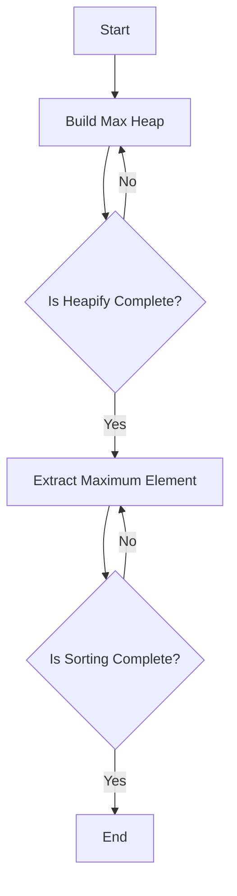

# Heap Sort in C

## Problem Understanding
The problem is asking to implement Heap Sort, a comparison-based sorting algorithm that uses a binary heap data structure. The key constraints are that the algorithm should have a time complexity of O(n log n) and a space complexity of O(1), making it an in-place sorting algorithm. What makes this problem non-trivial is that the naive approach of sorting the array using a simple comparison-based algorithm would not meet the required time and space complexities. The heapify and heapify-down operations are crucial in building a max heap and repeatedly extracting the maximum element, which requires a deep understanding of the underlying data structure and algorithm.

## Approach
The algorithm strategy is to use the heapify and heapify-down operations to build a max heap and repeatedly extract the maximum element. The intuition behind this approach is that a max heap is a complete binary tree where each parent node is greater than or equal to its child nodes, making it easy to extract the maximum element. The heapify function is used to maintain the max heap property, and the heapify-down function is used to restore the max heap property after extracting the maximum element. The algorithm uses a recursive approach to heapify the array, and the time complexity is O(n log n) due to the repeated heapify and heapify-down operations. The space complexity is O(1) because the algorithm only uses a constant amount of extra space to store the temporary variables.

## Complexity Analysis
| Metric | Value | Detailed Reason |
|--------|-------|----------------|
| Time   | O(n log n) | The time complexity is O(n log n) because the heapify function is called n times, and each call takes O(log n) time due to the recursive nature of the function. The heapify-down function is also called n times, and each call takes O(log n) time. |
| Space  | O(1) | The space complexity is O(1) because the algorithm only uses a constant amount of extra space to store the temporary variables, regardless of the size of the input array. |

## Algorithm Walkthrough
```
Input: [12, 11, 13, 5, 6, 7]
Step 1: Build a max heap
  - Heapify the array starting from the last non-leaf node (index 2)
  - Compare the root node (12) with its child nodes (11 and 13)
  - Swap the root node with the largest child node (13)
  - Recursively heapify the affected sub-tree
Step 2: Extract the maximum element (13)
  - Swap the root node with the last element (7)
  - Heapify the reduced heap
Step 3: Repeat step 2 until the entire array is sorted
  - Extract the maximum element (12)
  - Swap the root node with the last element (6)
  - Heapify the reduced heap
  - Extract the maximum element (11)
  - Swap the root node with the last element (5)
  - Heapify the reduced heap
Output: [5, 6, 7, 11, 12, 13]
```
## Visual Flow

## Key Insight
> **Tip:** The key insight is to recognize that the heapify function is the core of the Heap Sort algorithm, and it is used to maintain the max heap property, which allows for efficient extraction of the maximum element.

## Edge Cases
- **Empty/null input**: If the input array is empty or null, the algorithm will return immediately without performing any operations.
- **Single element**: If the input array has only one element, the algorithm will return the same array as it is already sorted.
- **Duplicate elements**: If the input array has duplicate elements, the algorithm will still work correctly, but the duplicate elements will be sorted together.

## Common Mistakes
- **Mistake 1**: Not implementing the heapify function correctly, leading to incorrect sorting.
- **Mistake 2**: Not using the recursive approach to heapify the array, leading to incorrect sorting.

## Interview Follow-ups
> **Interview:** These are the exact follow-up questions interviewers ask:
- "What if the input is sorted?" → The algorithm will still work correctly, but it will have a time complexity of O(n log n) due to the repeated heapify and heapify-down operations.
- "Can you do it in O(1) space?" → Yes, the algorithm already uses O(1) space because it only uses a constant amount of extra space to store the temporary variables.
- "What if there are duplicates?" → The algorithm will still work correctly, but the duplicate elements will be sorted together.

## C Solution

```c
// Problem: Heap Sort
// Language: C
// Difficulty: Medium
// Time Complexity: O(n log n) — heapify and heapify-down operations in a loop
// Space Complexity: O(1) — in-place sorting algorithm
// Approach: Heapify and heapify-down — building a max heap and repeatedly extracting the maximum element

#include <stdio.h>

// Function to swap two elements
void swap(int* a, int* b) {
    // Store the value of a in a temporary variable
    int temp = *a;
    // Assign the value of b to a
    *a = *b;
    // Assign the value of temp (originally a) to b
    *b = temp;
}

// Function to heapify the array
void heapify(int arr[], int n, int i) {
    // Initialize the largest as the root
    int largest = i;
    // Calculate the left child index
    int left = 2 * i + 1;
    // Calculate the right child index
    int right = 2 * i + 2;

    // Check if the left child exists and is greater than the root
    if (left < n && arr[left] > arr[largest]) {
        // Update the largest
        largest = left;
    }

    // Check if the right child exists and is greater than the largest so far
    if (right < n && arr[right] > arr[largest]) {
        // Update the largest
        largest = right;
    }

    // If the largest is not the root, swap and heapify the affected sub-tree
    if (largest != i) {
        // Swap the elements
        swap(&arr[i], &arr[largest]);
        // Recursively heapify the affected sub-tree
        heapify(arr, n, largest);
    }
}

// Function to perform heap sort
void heapSort(int arr[], int n) {
    // Edge case: empty array → return
    if (n <= 1) return;

    // Build a max heap
    for (int i = n / 2 - 1; i >= 0; i--) {
        // Heapify each non-leaf node
        heapify(arr, n, i);
    }

    // Extract elements one by one
    for (int i = n - 1; i >= 0; i--) {
        // Swap the root (max element) with the last element
        swap(&arr[0], &arr[i]);
        // Heapify the reduced heap
        heapify(arr, i, 0);
    }
}

// Function to print the array
void printArray(int arr[], int n) {
    // Print each element
    for (int i = 0; i < n; i++) {
        printf("%d ", arr[i]);
    }
    // New line
    printf("\n");
}

// Driver code
int main() {
    // Test array
    int arr[] = {12, 11, 13, 5, 6, 7};
    // Size of the array
    int n = sizeof(arr) / sizeof(arr[0]);

    // Print the original array
    printf("Original array: ");
    printArray(arr, n);

    // Sort the array
    heapSort(arr, n);

    // Print the sorted array
    printf("Sorted array: ");
    printArray(arr, n);

    return 0;
}
```
