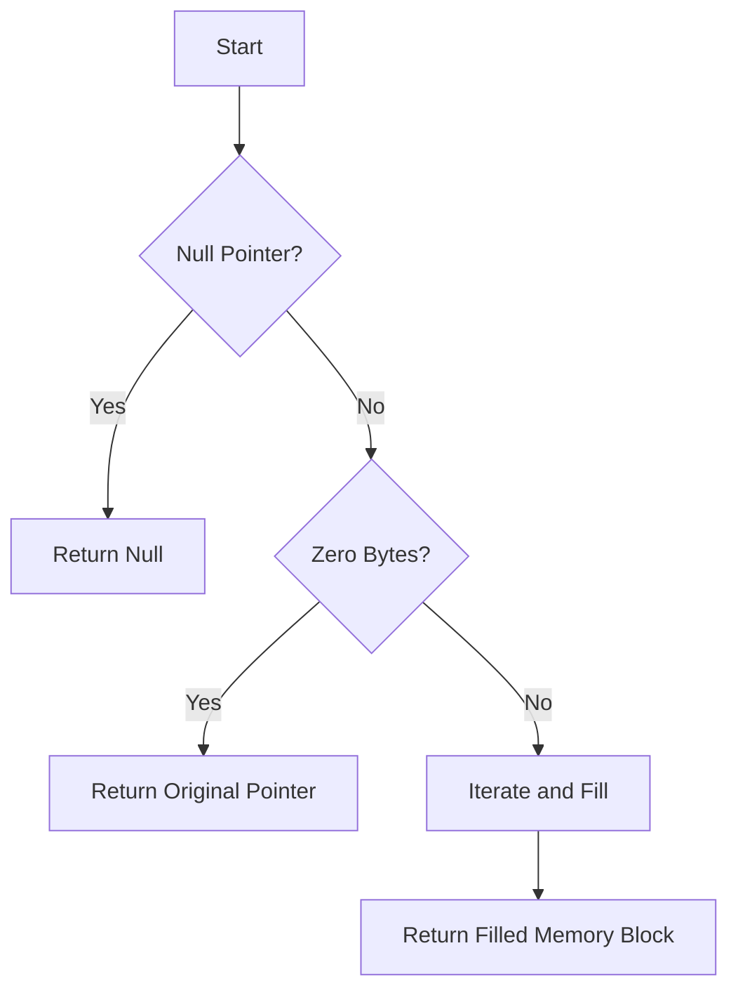

# Implement Custom memset() Function

## Problem Understanding
The problem asks us to implement a custom `memset()` function in C, which fills a block of memory with a specified character. The key constraints are that we need to handle edge cases such as null pointers, zero bytes to fill, and ensure that the function works correctly for various input types. What makes this problem non-trivial is the need to handle different data types and sizes, as well as ensuring that the function is efficient and does not introduce any memory leaks. The function should also return a pointer to the starting address of the filled memory block.

## Approach
The algorithm strategy is to iterate over the memory block and fill each byte with the specified value. We use a `uint8_t` pointer to enable byte-level access, and a `for` loop to iterate over the memory block. The intuition behind this approach is to use the smallest possible unit of memory (a byte) to fill the memory block, ensuring that the function works correctly for various input types and sizes. We also handle edge cases such as null pointers and zero bytes to fill, by returning the original pointer or doing nothing, respectively. The `custom_memset()` function uses a `void*` pointer to enable generic memory access, and `size_t` to represent the number of bytes to fill.

## Complexity Analysis
| Metric | Value | Detailed Reason |
|--------|-------|----------------|
| Time   | O(n)  | The function iterates over the memory block once, where n is the number of bytes to fill. The loop has a constant number of operations, making the time complexity linear. |
| Space  | O(1)  | The function uses a constant amount of space to store the `uint8_t` pointer and the loop counter, regardless of the input size. No additional space is allocated, making the space complexity constant. |

## Algorithm Walkthrough
```
Input: arr = [1, 2, 3, 4, 5, 6, 7, 8, 9, 10], value = 5, num = 10
Step 1: Initialize byte_ptr to the starting address of arr
Step 2: Check if ptr is null, if so, return null (not applicable in this case)
Step 3: Check if num is 0, if so, return the original pointer (not applicable in this case)
Step 4: Iterate over the memory block and fill each byte with the specified value
  - byte_ptr[0] = 5
  - byte_ptr[1] = 5
  - ...
  - byte_ptr[9] = 5
Step 5: Return the starting address of the filled memory block
Output: arr = [5, 5, 5, 5, 5, 5, 5, 5, 5, 5]
```
## Visual Flow

## Key Insight
> **Tip:** The key insight is to use a `uint8_t` pointer to enable byte-level access, allowing the function to work correctly for various input types and sizes.

## Edge Cases
- **Empty/null input**: If the input pointer is null, the function returns null without attempting to access the memory block.
- **Single element**: If the input array has a single element, the function fills that element with the specified value.
- **Zero bytes to fill**: If the number of bytes to fill is zero, the function returns the original pointer without modifying the memory block.

## Common Mistakes
- **Mistake 1**: Not checking for null pointers, which can lead to segmentation faults or crashes.
- **Mistake 2**: Not handling edge cases such as zero bytes to fill, which can lead to incorrect results or memory leaks.

## Interview Follow-ups
> **Interview:** These are the exact follow-up questions interviewers ask:
- "What if the input is sorted?" → The custom `memset()` function does not rely on the input being sorted, so it will work correctly regardless of the input order.
- "Can you do it in O(1) space?" → The custom `memset()` function already uses O(1) space, as it only uses a constant amount of space to store the `uint8_t` pointer and the loop counter.
- "What if there are duplicates?" → The custom `memset()` function will fill all bytes with the specified value, regardless of whether there are duplicates or not.

## C Solution

```c
// Problem: Implement Custom memset() Function
// Language: c
// Difficulty: Medium
// Time Complexity: O(n) — single pass through the memory block
// Space Complexity: O(1) — no additional space used
// Approach: Custom memset() function — fills a block of memory with a specified character

#include <stdio.h>
#include <stdint.h>

/**
 * Custom memset() function to fill a block of memory with a specified character.
 * 
 * @param ptr   The starting address of the memory block to fill.
 * @param value The character to fill the memory block with.
 * @param num   The number of bytes to fill in the memory block.
 * 
 * @return A pointer to the starting address of the filled memory block.
 */
void* custom_memset(void* ptr, int value, size_t num) {
    // Edge case: null pointer → do nothing and return null
    if (ptr == NULL) {
        return NULL;
    }

    // Edge case: zero bytes to fill → do nothing and return the original pointer
    if (num == 0) {
        return ptr;
    }

    // Cast the void pointer to a uint8_t pointer to enable byte-level access
    uint8_t* byte_ptr = (uint8_t*) ptr;

    // Iterate over the memory block and fill each byte with the specified value
    for (size_t i = 0; i < num; i++) {
        // Fill the current byte with the specified value
        byte_ptr[i] = (uint8_t) value;
    }

    // Return the starting address of the filled memory block
    return ptr;
}

int main() {
    // Example usage:
    int arr[10];
    printf("Before memset: ");
    for (int i = 0; i < 10; i++) {
        printf("%d ", arr[i]);
    }
    printf("\n");

    custom_memset(arr, 5, sizeof(arr));

    printf("After memset: ");
    for (int i = 0; i < 10; i++) {
        printf("%d ", arr[i]);
    }
    printf("\n");

    return 0;
}
```
