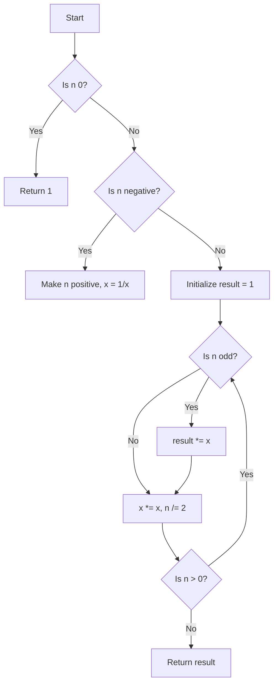

# Implement Power Function (x^n) efficiently

## Problem Understanding
The problem asks for an efficient implementation of the power function, which calculates the result of raising a number `x` to the power of `n`. The key constraint is to achieve this with a time complexity better than the naive approach of repeated multiplication, which has a time complexity of O(n). The problem becomes non-trivial because a straightforward approach would require `n` multiplications, leading to inefficient computation for large values of `n`. Additionally, handling negative `n` and edge cases like `n` being 0 or `x` being 0 or 1 adds complexity to the solution.

## Approach
The algorithm strategy used is exponentiation by squaring, which reduces the number of multiplications required by using the property that `x^n = (x^(n/2))^2` when `n` is even, and `x^n = x * (x^((n-1)/2))^2` when `n` is odd. This approach works because it leverages the mathematical properties of exponentiation to minimize the number of operations. The data structure used is a simple while loop, which is chosen for its efficiency in handling the iterative process of squaring `x` and halving `n`. The approach handles key constraints by first addressing edge cases (like `n` being 0 or negative) and then applying the exponentiation by squaring method to efficiently calculate `x^n`.

## Complexity Analysis
| Metric | Value | Detailed Reason |
|--------|-------|----------------|
| Time   | O(log n) | Each iteration of the while loop halves the value of `n`, leading to a logarithmic number of iterations. The operations within the loop (multiplication and division) are constant time. |
| Space  | O(1) | The algorithm uses a constant amount of space to store the variables `result`, `x`, and `n`, regardless of the input size. |

## Algorithm Walkthrough
```
Input: x = 2.0, n = 3
Step 1: n is 3 (odd), so result = 1 * 2.0 = 2.0, x = 2.0 * 2.0 = 4.0, n = 3 / 2 = 1
Step 2: n is 1 (odd), so result = 2.0 * 4.0 = 8.0, x = 4.0 * 4.0 = 16.0, n = 1 / 2 = 0
Output: result = 8.0
```
This walkthrough demonstrates how the algorithm efficiently calculates `x^n` using exponentiation by squaring for a small example.

## Visual Flow

This flowchart illustrates the decision flow of the algorithm, including handling edge cases and the iterative process of exponentiation by squaring.

## Key Insight
> **Tip:** The key to efficient exponentiation is leveraging the property `x^n = (x^(n/2))^2` for even `n` and `x^n = x * (x^((n-1)/2))^2` for odd `n`, reducing the number of multiplications required.

## Edge Cases
- **Empty/null input**: This case is not applicable as the function requires specific input values for `x` and `n`. If `x` or `n` is not provided, the function cannot proceed.
- **Single element**: If `n` is 1, the function simply returns `x`, which is the base case for the exponentiation.
- **Negative n**: The function handles negative `n` by taking the reciprocal of `x` and making `n` positive, utilizing the property `x^(-n) = 1 / x^n`.

## Common Mistakes
- **Mistake 1**: Not handling the edge case where `n` is 0, which should return 1 regardless of the value of `x`. → To avoid this, always check for `n` being 0 at the beginning of the function.
- **Mistake 2**: Not considering the case where `x` is 0 and `n` is negative, which would result in a division by zero error. → To avoid this, ensure that the function handles the case where `x` is 0 and `n` is negative by returning an appropriate error or handling it based on the specific requirements.

## Interview Follow-ups
> **Interview:** These are the exact follow-up questions interviewers ask:
- "What if the input is sorted?" → This question is not directly relevant to the exponentiation problem, as the input is a pair of numbers (`x` and `n`) rather than a sorted list.
- "Can you do it in O(1) space?" → The current solution already achieves O(1) space complexity by using a constant amount of space to store the necessary variables.
- "What if there are duplicates?" → This question is not applicable to the exponentiation problem, as the inputs are distinct numbers (`x` and `n`) rather than a collection that could contain duplicates.

## C Solution

```c
// Problem: Implement Power Function (x^n) efficiently
// Language: C
// Difficulty: Medium
// Time Complexity: O(log n) — using exponentiation by squaring
// Space Complexity: O(1) — using constant space
// Approach: Exponentiation by squaring — reducing the number of multiplications required

#include <stdio.h>

double myPow(double x, int n) {
    // Edge case: n is 0 → return 1
    if (n == 0) return 1;

    // Edge case: n is negative → use reciprocal and make n positive
    if (n < 0) {
        x = 1 / x; // take reciprocal
        n = -n; // make n positive
    }

    double result = 1.0; // initialize result
    while (n > 0) {
        // if n is odd, multiply result by x
        if (n % 2 == 1) result *= x;

        // square x and halve n
        x *= x; // square x
        n /= 2; // halve n
    }

    return result;
}

int main() {
    printf("%f\n", myPow(2.0, 3)); // test case
    printf("%f\n", myPow(2.1, 3)); // test case
    printf("%f\n", myPow(2.0, -3)); // test case
    return 0;
}
```
