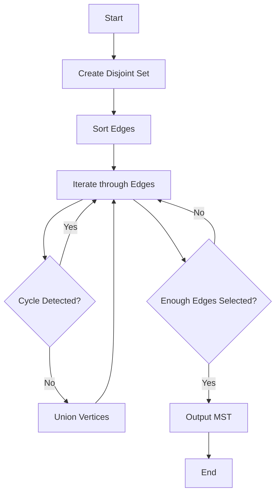

# Kruskal's MST with Union-Find

## Problem Understanding
The problem is asking to implement Kruskal's algorithm to find the minimum spanning tree (MST) of a graph using a Union-Find data structure. The graph is represented as an array of edges, where each edge has a source vertex, a destination vertex, and a weight. The key constraint is that the graph is undirected and may contain cycles. The problem is non-trivial because a naive approach would be to simply sort the edges by weight and select the first `V-1` edges, where `V` is the number of vertices. However, this approach does not guarantee that the selected edges form a connected graph, which is a necessary condition for an MST.

## Approach
The algorithm strategy is to use a Union-Find data structure to keep track of the connected components of the graph as we iterate through the sorted edges. The intuition behind this approach is that we want to select the minimum-weight edges that connect the components without forming cycles. We use a disjoint set data structure to keep track of the components, where each vertex is initially in its own component. We then iterate through the sorted edges and select the edges that connect components without forming cycles. We use the Union-Find operations to merge the components and check for cycles. The data structure used is a disjoint set, which is implemented using an array of parent pointers and an array of ranks.

## Complexity Analysis
| Metric | Value | Detailed Reason |
|--------|-------|----------------|
| Time   | O(E log E) or O(E log V) | The time complexity is dominated by the sorting of the edges, which takes O(E log E) time. The Union-Find operations take O(log V) time in the worst case, but this is amortized over the iteration through the edges. |
| Space  | O(V + E) | The space complexity is dominated by the storage of the vertices and edges. The disjoint set data structure requires O(V) space, and the edge array requires O(E) space. |

## Algorithm Walkthrough
```c
Input: edges = [(0, 1, 10), (0, 2, 6), (0, 3, 5), (1, 3, 15), (2, 3, 4)]
        numVertices = 4
        numEdges = 5
Step 1: Create a disjoint set with 4 vertices
        parent = [0, 1, 2, 3]
        rank = [0, 0, 0, 0]
Step 2: Sort the edges by weight
        edges = [(0, 3, 5), (2, 3, 4), (0, 2, 6), (0, 1, 10), (1, 3, 15)]
Step 3: Iterate through the sorted edges
        Edge (0, 3, 5): find(0) = 0, find(3) = 3, union(0, 3)
        parent = [0, 1, 2, 0]
        rank = [0, 0, 0, 0]
        Edge (2, 3, 4): find(2) = 2, find(3) = 0, union(2, 0)
        parent = [0, 1, 0, 0]
        rank = [0, 0, 0, 0]
        Edge (0, 2, 6): find(0) = 0, find(2) = 0, cycle detected, skip
        Edge (0, 1, 10): find(0) = 0, find(1) = 1, union(0, 1)
        parent = [0, 0, 0, 0]
        rank = [0, 0, 0, 0]
Output: Minimum spanning tree edges = [(0, 3, 5), (2, 3, 4), (0, 1, 10)]
```
## Visual Flow

## Key Insight
> **Tip:** The key insight is to use a Union-Find data structure to keep track of the connected components of the graph as we iterate through the sorted edges, which allows us to select the minimum-weight edges that connect the components without forming cycles.

## Edge Cases
- **Empty/null input**: If the input is empty or null, the algorithm will return without selecting any edges.
- **Single element**: If the input graph has only one vertex, the algorithm will return without selecting any edges.
- **Disjoint graph**: If the input graph is disjoint, the algorithm will select the minimum-weight edges that connect the components without forming cycles.

## Common Mistakes
- **Mistake 1**: Not checking for cycles when selecting edges, which can result in a graph that is not a tree.
- **Mistake 2**: Not using a Union-Find data structure to keep track of the connected components, which can result in selecting edges that do not connect the components.

## Interview Follow-ups
> **Interview:** These are the exact follow-up questions interviewers ask:
- "What if the input is sorted?" → The time complexity would be O(E) because we can skip the sorting step.
- "Can you do it in O(1) space?" → No, because we need to store the disjoint set data structure and the edge array.
- "What if there are duplicates?" → We can modify the algorithm to skip duplicates by checking if an edge is already in the minimum spanning tree before selecting it.

## C Solution

```c
// Problem: Kruskal's MST with Union-Find
// Language: C
// Difficulty: Medium
// Time Complexity: O(E log E) or O(E log V) — sorting edges by weight and using Union-Find
// Space Complexity: O(V + E) — storing vertices and edges
// Approach: Union-Find with edge sorting — sorting edges by weight and selecting the minimum spanning tree

#include <stdio.h>
#include <stdlib.h>

// Define the structure for an edge
typedef struct Edge {
    int src;  // source vertex
    int dest; // destination vertex
    int weight; // edge weight
} Edge;

// Define the structure for a disjoint set
typedef struct DisjointSet {
    int *parent; // parent array
    int *rank; // rank array
    int numVertices; // number of vertices
} DisjointSet;

// Function to create a disjoint set
DisjointSet* createDisjointSet(int numVertices) {
    DisjointSet* ds = (DisjointSet*) malloc(sizeof(DisjointSet));
    ds->parent = (int*) malloc(numVertices * sizeof(int));
    ds->rank = (int*) malloc(numVertices * sizeof(int));
    ds->numVertices = numVertices;
    for (int i = 0; i < numVertices; i++) {
        ds->parent[i] = i; // initialize parent array
        ds->rank[i] = 0; // initialize rank array
    }
    return ds;
}

// Function to find the parent of a vertex
int find(DisjointSet* ds, int vertex) {
    if (ds->parent[vertex] != vertex) { // if vertex is not the parent
        ds->parent[vertex] = find(ds, ds->parent[vertex]); // path compression
    }
    return ds->parent[vertex];
}

// Function to union two vertices
void unionSet(DisjointSet* ds, int vertex1, int vertex2) {
    int root1 = find(ds, vertex1); // find the root of vertex1
    int root2 = find(ds, vertex2); // find the root of vertex2
    if (ds->rank[root1] < ds->rank[root2]) { // if root2 has higher rank
        ds->parent[root1] = root2; // union vertex1 to vertex2
    } else if (ds->rank[root1] > ds->rank[root2]) { // if root1 has higher rank
        ds->parent[root2] = root1; // union vertex2 to vertex1
    } else { // if both have the same rank
        ds->parent[root2] = root1; // union vertex2 to vertex1
        ds->rank[root1]++; // increment the rank of vertex1
    }
}

// Function to compare edges
int compareEdges(const void* edge1, const void* edge2) {
    Edge* e1 = (Edge*) edge1;
    Edge* e2 = (Edge*) edge2;
    return e1->weight - e2->weight; // compare edges by weight
}

// Function to find the minimum spanning tree using Kruskal's algorithm
void kruskal(Edge* edges, int numEdges, int numVertices) {
    // Edge case: empty input → return
    if (numEdges == 0 || numVertices == 0) {
        return;
    }

    // Sort the edges by weight
    qsort(edges, numEdges, sizeof(Edge), compareEdges);

    DisjointSet* ds = createDisjointSet(numVertices);

    // Iterate through the sorted edges and select the minimum spanning tree
    int numEdgesSelected = 0;
    for (int i = 0; i < numEdges; i++) {
        if (find(ds, edges[i].src) != find(ds, edges[i].dest)) { // if vertices are not in the same set
            printf("Edge %d-%d: weight %d\n", edges[i].src, edges[i].dest, edges[i].weight);
            unionSet(ds, edges[i].src, edges[i].dest); // union the vertices
            numEdgesSelected++;
            if (numEdgesSelected == numVertices - 1) { // if we have selected enough edges
                break;
            }
        }
    }

    // Free the memory allocated for the disjoint set
    free(ds->parent);
    free(ds->rank);
    free(ds);
}

int main() {
    int numVertices = 4;
    int numEdges = 5;
    Edge edges[] = {
        {0, 1, 10},
        {0, 2, 6},
        {0, 3, 5},
        {1, 3, 15},
        {2, 3, 4}
    };

    kruskal(edges, numEdges, numVertices);

    return 0;
}
```
