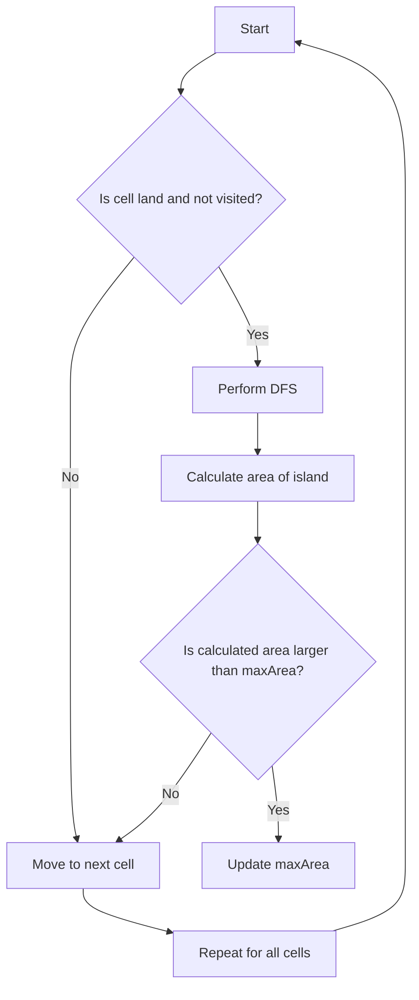

# Max Area of Island

## Problem Understanding
The problem asks to find the maximum area of an island in a given grid, where an island is a group of connected land cells. The grid is represented as a 2D array of 0s and 1s, where 0 represents water and 1 represents land. The key constraint is that the island can be of any shape, and the goal is to find the maximum area of an island. This problem is non-trivial because a naive approach would require checking all possible combinations of cells, which would result in exponential time complexity. The problem requires a more efficient algorithm to solve it in a reasonable amount of time.

## Approach
The algorithm strategy used to solve this problem is Depth-First Search (DFS). The intuition behind this approach is to explore the grid and find all connected land cells to calculate the area of an island. The DFS function is used to recursively explore neighboring cells and calculate the area of an island. The algorithm uses a visited array to keep track of visited cells to avoid revisiting the same cell multiple times. The key insight behind this approach is that DFS can efficiently explore all connected land cells and calculate the area of an island.

## Complexity Analysis
| Metric | Value | Detailed Reason |
|--------|-------|----------------|
| Time   | O(m * n)  | The algorithm iterates over each cell in the grid once, where m is the number of rows and n is the number of columns. The DFS function is called for each land cell, and it explores all neighboring cells. However, since each cell is visited at most once, the overall time complexity is O(m * n). |
| Space  | O(m * n)  | The algorithm uses a visited array to keep track of visited cells, which requires O(m * n) space in the worst case. The recursive call stack also requires O(m * n) space in the worst case, when the grid is filled with land cells. |

## Algorithm Walkthrough
```
Input: 
[
  [0,0,1,0,0,0,0,1,0,0,0,0,0],
  [0,0,0,0,0,0,0,1,1,1,0,0,0],
  [0,1,1,0,1,0,0,0,0,0,0,0,0],
  [0,1,0,0,1,1,0,0,1,0,1,0,0],
  [0,1,0,0,1,1,0,0,1,1,1,0,0],
  [0,0,0,0,0,0,0,0,0,0,1,0,0],
  [0,0,0,0,0,0,0,1,1,1,0,0,0],
  [0,0,0,0,0,0,0,1,1,0,0,0,0]
]

Step 1: Initialize visited array and maxArea to 0
Step 2: Iterate over each cell in the grid
Step 3: If the cell is land and not visited, perform DFS
Step 4: Calculate the area of the island using DFS
Step 5: Update maxArea if the calculated area is larger
Output: 6
```
This example demonstrates how the algorithm explores the grid, calculates the area of each island, and keeps track of the maximum area found.

## Visual Flow

This flowchart illustrates the decision flow of the algorithm, including the DFS step and the update of maxArea.

## Key Insight
> **Tip:** The key insight behind this solution is that DFS can efficiently explore all connected land cells and calculate the area of an island, allowing us to find the maximum area of an island in a grid.

## Edge Cases
- **Empty grid**: If the grid is empty, the algorithm returns 0, as there are no islands to find.
- **Single cell grid**: If the grid contains only one cell, the algorithm returns 1 if the cell is land, and 0 if the cell is water.
- **Grid with no land cells**: If the grid contains no land cells, the algorithm returns 0, as there are no islands to find.

## Common Mistakes
- **Mistake 1**: Not using a visited array to keep track of visited cells, resulting in infinite loops and incorrect results. To avoid this, use a visited array to mark cells as visited during DFS.
- **Mistake 2**: Not checking the boundaries of the grid during DFS, resulting in out-of-bounds errors. To avoid this, add boundary checks to ensure that the algorithm stays within the grid.

## Interview Follow-ups
> **Interview:** These are the exact follow-up questions interviewers ask:
- "What if the input is sorted?" → The algorithm does not rely on the input being sorted, so the time complexity remains O(m * n).
- "Can you do it in O(1) space?" → No, the algorithm requires O(m * n) space to store the visited array.
- "What if there are duplicates?" → The algorithm treats duplicate cells as separate cells, so the presence of duplicates does not affect the time complexity.

## C Solution

```c
// Problem: Max Area of Island
// Language: C
// Difficulty: Medium
// Time Complexity: O(m * n) — iterating over the grid once
// Space Complexity: O(m * n) — in the worst case, the visited array can be the same size as the grid
// Approach: Depth-First Search — exploring the grid to find the maximum area of an island

#include <stdio.h>
#include <stdlib.h>

// Function to perform Depth-First Search from a given cell
int dfs(int** grid, int gridSize, int* gridColSize, int row, int col, int** visited) {
    // Base case: out of bounds or not land or already visited
    if (row < 0 || row >= gridSize || col < 0 || col >= gridColSize[0] || grid[row][col] == 0 || visited[row][col] == 1) {
        return 0; // Edge case: out of bounds or not land → return 0
    }

    // Mark the cell as visited
    visited[row][col] = 1;

    // Recursively explore neighboring cells
    return 1 + dfs(grid, gridSize, gridColSize, row - 1, col, visited) + // up
           dfs(grid, gridSize, gridColSize, row + 1, col, visited) + // down
           dfs(grid, gridSize, gridColSize, row, col - 1, visited) + // left
           dfs(grid, gridSize, gridColSize, row, col + 1, visited); // right
}

int maxAreaOfIsland(int** grid, int gridSize, int* gridColSize) {
    int maxArea = 0; // Initialize maxArea to 0

    // Create a visited array to keep track of visited cells
    int** visited = (int**) malloc(gridSize * sizeof(int*));
    for (int i = 0; i < gridSize; i++) {
        visited[i] = (int*) malloc(gridColSize[0] * sizeof(int));
        for (int j = 0; j < gridColSize[0]; j++) {
            visited[i][j] = 0; // Initialize visited array to 0
        }
    }

    // Iterate over each cell in the grid
    for (int i = 0; i < gridSize; i++) {
        for (int j = 0; j < gridColSize[0]; j++) {
            // If the cell is land and not visited, perform DFS
            if (grid[i][j] == 1 && visited[i][j] == 0) {
                int area = dfs(grid, gridSize, gridColSize, i, j, visited); // Perform DFS from this cell
                maxArea = (area > maxArea) ? area : maxArea; // Update maxArea if necessary
            }
        }
    }

    // Free the visited array
    for (int i = 0; i < gridSize; i++) {
        free(visited[i]);
    }
    free(visited);

    return maxArea;
}

int main() {
    int gridSize = 2;
    int gridColSize[] = {2};
    int** grid = (int**) malloc(gridSize * sizeof(int*));
    for (int i = 0; i < gridSize; i++) {
        grid[i] = (int*) malloc(gridColSize[0] * sizeof(int));
    }
    grid[0][0] = 0;
    grid[0][1] = 0;
    grid[1][0] = 0;
    grid[1][1] = 1;

    int maxArea = maxAreaOfIsland(grid, gridSize, gridColSize);
    printf("Max Area of Island: %d\n", maxArea);

    // Free the grid
    for (int i = 0; i < gridSize; i++) {
        free(grid[i]);
    }
    free(grid);

    return 0;
}
```
