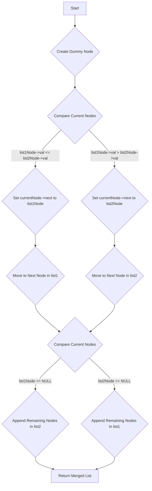

# Merge Two Sorted Linked Lists

## Problem Understanding
The problem asks to merge two sorted linked lists into a single sorted linked list. The key constraint is that both input lists are already sorted, which allows for an efficient merging process. The problem is non-trivial because a naive approach, such as concatenating the lists and then sorting, would have a higher time complexity than the optimal solution. The merging process must compare nodes from both lists and merge them in order, handling cases where one list is exhausted before the other.

## Approach
The algorithm strategy is to iteratively compare nodes from both lists and merge them in order. This approach works by utilizing the fact that both input lists are sorted, allowing for a simple comparison of the current nodes to determine which one should come first in the merged list. The algorithm uses a dummy node to simplify the merging process and avoid special cases for the head of the result list. The key data structure is the linked list, which is used to represent the input lists and the merged result. The approach handles the key constraint of sorted input lists by comparing nodes and merging them in order.

## Complexity Analysis
| Metric | Value | Detailed Reason |
|--------|-------|----------------|
| Time   | O(n + m) | The algorithm iterates through both linked lists, where n and m are the lengths of the lists. The comparison and merging process takes constant time for each node, resulting in a linear time complexity. |
| Space  | O(n + m) | The algorithm creates a new linked list to store the merged result, which requires additional space proportional to the total length of the input lists. |

## Algorithm Walkthrough
```
Input: l1 = [1, 3, 5], l2 = [2, 4, 6]
Step 1: Create a dummy node and initialize pointers: currentNode = dummyNode, list1Node = l1, list2Node = l2
Step 2: Compare values of current nodes: list1Node->val = 1, list2Node->val = 2, so currentNode->next = list1Node, list1Node = list1Node->next
Step 3: Compare values of current nodes: list1Node->val = 3, list2Node->val = 2, so currentNode->next = list2Node, list2Node = list2Node->next
Step 4: Compare values of current nodes: list1Node->val = 3, list2Node->val = 4, so currentNode->next = list1Node, list1Node = list1Node->next
Step 5: Compare values of current nodes: list1Node->val = 5, list2Node->val = 4, so currentNode->next = list2Node, list2Node = list2Node->next
Step 6: Handle remaining nodes in l1: currentNode->next = list1Node
Output: [1, 2, 3, 4, 5, 6]
```
This walkthrough demonstrates the merging process, where the algorithm compares nodes from both lists and merges them in order.

## Visual Flow

This flowchart illustrates the decision flow of the algorithm, where the comparison of current nodes determines which node to append to the merged list.

## Key Insight
> **Tip:** The key insight is to utilize the fact that both input lists are sorted, allowing for a simple comparison of the current nodes to determine which one should come first in the merged list.

## Edge Cases
- **Empty/null input**: If both input lists are empty, the algorithm returns NULL.
- **Single element**: If one of the input lists has only one element, the algorithm simply appends the remaining nodes from the other list.
- **Unequal list lengths**: If the input lists have unequal lengths, the algorithm handles the remaining nodes in the longer list by appending them to the merged list.

## Common Mistakes
- **Mistake 1**: Not handling the case where one of the input lists is empty, leading to a NULL pointer exception.
- **Mistake 2**: Not properly updating the `currentNode` pointer, resulting in incorrect merging of the lists.

## Interview Follow-ups
> **Interview:** These are the exact follow-up questions interviewers ask:
- "What if the input is sorted in descending order?" → The algorithm would need to be modified to compare nodes in descending order.
- "Can you do it in O(1) space?" → No, the algorithm requires additional space to store the merged list.
- "What if there are duplicates?" → The algorithm would need to be modified to handle duplicates, either by removing them or preserving them in the merged list.

## C Solution

```c
// Problem: Merge Two Sorted Linked Lists
// Language: C
// Difficulty: Medium
// Time Complexity: O(n + m) — iterating through both linked lists
// Space Complexity: O(n + m) — creating a new linked list
// Approach: Iterative merging — compare nodes from both lists and merge in order

// Definition for singly-linked list.
struct ListNode {
    int val;
    struct ListNode *next;
};

// Function to merge two sorted linked lists
struct ListNode* mergeTwoLists(struct ListNode* l1, struct ListNode* l2) {
    // Edge case: both lists are empty
    if (!l1 && !l2) return NULL; // return NULL for empty lists

    // Create a new dummy node to serve as the start of the result list
    struct ListNode* dummyNode = (struct ListNode*)malloc(sizeof(struct ListNode)); // allocate memory for dummy node
    dummyNode->next = NULL; // initialize next pointer to NULL

    // Initialize pointers for the current node and the result list
    struct ListNode* currentNode = dummyNode; // set current node to dummy node
    struct ListNode* list1Node = l1; // set list1 node to the start of list1
    struct ListNode* list2Node = l2; // set list2 node to the start of list2

    // Merge nodes from both lists in order
    while (list1Node && list2Node) { // continue until one list is exhausted
        if (list1Node->val <= list2Node->val) { // compare values of current nodes
            currentNode->next = list1Node; // set next pointer to the smaller value node
            list1Node = list1Node->next; // move to the next node in list1
        } else {
            currentNode->next = list2Node; // set next pointer to the smaller value node
            list2Node = list2Node->next; // move to the next node in list2
        }
        currentNode = currentNode->next; // move to the next node in the result list
    }

    // Handle remaining nodes in either list
    if (list1Node) { // list1 has remaining nodes
        currentNode->next = list1Node; // append remaining nodes to the result list
    } else if (list2Node) { // list2 has remaining nodes
        currentNode->next = list2Node; // append remaining nodes to the result list
    }

    // Return the merged list (excluding the dummy node)
    struct ListNode* result = dummyNode->next; // get the actual start of the result list
    free(dummyNode); // free the memory allocated for the dummy node
    return result; // return the merged list
}
```
