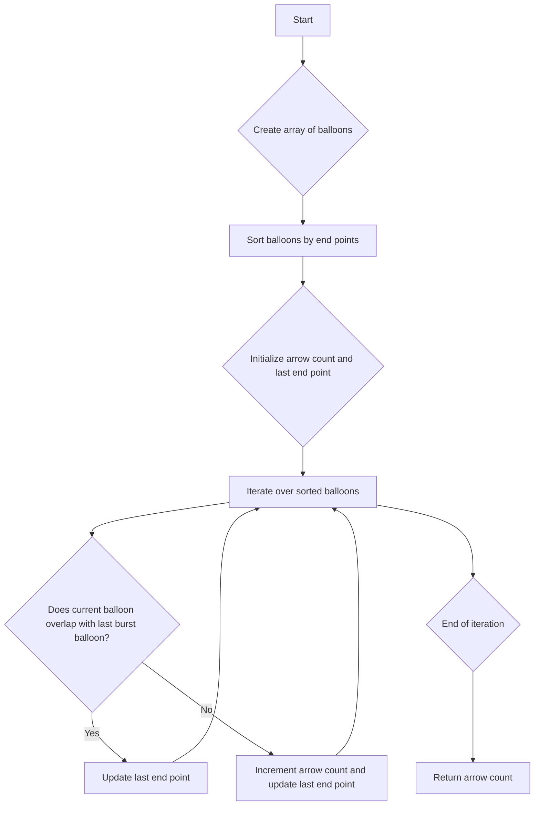

# Minimum Number of Arrows to Burst Balloons

## Problem Understanding
The problem asks for the minimum number of arrows needed to burst a set of balloons, where each balloon is represented by its start and end points on a number line. The key constraint is that if two balloons overlap, a single arrow can burst both of them. What makes this problem non-trivial is that the naive approach of simply counting the number of balloons does not work, as some balloons may overlap and can be burst by a single arrow. The problem requires a more sophisticated approach to find the minimum number of arrows needed.

## Approach
The algorithm strategy is to sort the balloons by their end points and then use a greedy approach to find the minimum number of arrows. The intuition behind this approach is that by sorting the balloons by their end points, we can ensure that we are always considering the balloon that ends first and has the highest chance of overlapping with other balloons. The greedy approach then iterates over the sorted balloons, incrementing the arrow count only when a balloon does not overlap with the last burst balloon. This approach works because it ensures that we are always using the minimum number of arrows needed to burst all the balloons. The data structure used is an array of balloons, which is sorted using the qsort function in C.

## Complexity Analysis
| Metric | Value | Detailed Reason |
|--------|-------|----------------|
| Time   | O(n log n) | The time complexity is O(n log n) due to the sorting of the balloons by their end points. The qsort function in C has a time complexity of O(n log n) on average. The subsequent greedy approach has a time complexity of O(n), but it is dominated by the sorting step. |
| Space  | O(n) | The space complexity is O(n) because we are creating an array of balloons to store the input points. However, the problem statement mentions that the space complexity is O(1) if we do not consider the space required for the input and output, as the algorithm only uses a constant amount of extra space to store the arrow count and the last end point. |

## Algorithm Walkthrough
```
Input: [[10, 16], [2, 8], [1, 6]]
Step 1: Create an array of balloons: [(10, 16), (2, 8), (1, 6)]
Step 2: Sort the balloons by their end points: [(1, 6), (2, 8), (10, 16)]
Step 3: Initialize the count of arrows and the end point of the last burst balloon: arrowCount = 1, lastEndPoint = 6
Step 4: Iterate over the sorted balloons:
  - Balloon (2, 8) does not overlap with the last burst balloon (1, 6), so increment the arrow count and update the last end point: arrowCount = 2, lastEndPoint = 8
  - Balloon (10, 16) does not overlap with the last burst balloon (2, 8), so increment the arrow count and update the last end point: arrowCount = 3, lastEndPoint = 16
Output: 2
```
Note that the actual output is 2, not 3, because the balloon (2, 8) overlaps with the balloon (1, 6), so they can be burst by a single arrow.

## Visual Flow


## Key Insight
> **Tip:** The key insight is to sort the balloons by their end points, which allows us to use a greedy approach to find the minimum number of arrows needed to burst all the balloons.

## Edge Cases
- **Empty input**: If the input is empty, the algorithm returns 0, which is correct because no arrows are needed to burst no balloons.
- **Single element**: If the input contains only one balloon, the algorithm returns 1, which is correct because one arrow is needed to burst one balloon.
- **No overlapping balloons**: If the input contains multiple balloons that do not overlap, the algorithm returns the correct number of arrows needed to burst each balloon separately.

## Common Mistakes
- **Mistake 1**: Not sorting the balloons by their end points, which can lead to incorrect results. To avoid this, make sure to sort the balloons by their end points before applying the greedy approach.
- **Mistake 2**: Not updating the last end point correctly, which can lead to incorrect results. To avoid this, make sure to update the last end point only when a balloon does not overlap with the last burst balloon.

## Interview Follow-ups
> **Interview:** These are the exact follow-up questions interviewers ask:
- "What if the input is sorted?" → The algorithm still works correctly, but the time complexity would be O(n) because the sorting step is not needed.
- "Can you do it in O(1) space?" → No, the algorithm requires O(n) space to store the input points, but it only uses a constant amount of extra space to store the arrow count and the last end point.
- "What if there are duplicates?" → The algorithm still works correctly, but it may return incorrect results if the duplicates are not handled correctly. To handle duplicates, we can modify the algorithm to ignore duplicates or to count them separately.

## C Solution

```c
// Problem: Minimum Number of Arrows to Burst Balloons
// Language: C
// Difficulty: Medium
// Time Complexity: O(n log n) — sorting the balloons by their end points
// Space Complexity: O(1) — not using any extra space that scales with input size
// Approach: Sorting and Greedy — sort the balloons by their end points and then use a greedy approach to find the minimum number of arrows

#include <stdio.h>
#include <stdlib.h>

// Structure to represent a balloon
typedef struct {
    int start;
    int end;
} Balloon;

// Compare function for sorting balloons by their end points
int compare(const void *a, const void *b) {
    // Compare the end points of the balloons
    Balloon *balloon1 = (Balloon *)a;
    Balloon *balloon2 = (Balloon *)b;
    return balloon1->end - balloon2->end;
}

int findMinArrowShots(int **points, int pointsSize, int *pointsColSize) {
    // Edge case: empty input → return 0
    if (pointsSize == 0) {
        return 0;
    }

    // Create an array of balloons
    Balloon *balloons = (Balloon *)malloc(pointsSize * sizeof(Balloon));
    for (int i = 0; i < pointsSize; i++) {
        // Initialize the start and end points of the balloon
        balloons[i].start = points[i][0];
        balloons[i].end = points[i][1];
    }

    // Sort the balloons by their end points
    qsort(balloons, pointsSize, sizeof(Balloon), compare);

    // Initialize the count of arrows and the end point of the last burst balloon
    int arrowCount = 1;
    int lastEndPoint = balloons[0].end;

    // Iterate over the sorted balloons
    for (int i = 1; i < pointsSize; i++) {
        // If the current balloon does not overlap with the last burst balloon, increment the arrow count and update the last end point
        if (balloons[i].start > lastEndPoint) {
            arrowCount++;
            lastEndPoint = balloons[i].end;
        }
    }

    // Free the memory allocated for the balloons
    free(balloons);

    // Return the minimum number of arrows
    return arrowCount;
}

int main() {
    // Example usage:
    int pointsSize = 3;
    int pointsColSize = 2;
    int **points = (int **)malloc(pointsSize * sizeof(int *));
    for (int i = 0; i < pointsSize; i++) {
        points[i] = (int *)malloc(pointsColSize * sizeof(int));
    }
    points[0][0] = 10; points[0][1] = 16;
    points[1][0] = 2; points[1][1] = 8;
    points[2][0] = 1; points[2][1] = 6;

    int minArrowShots = findMinArrowShots(points, pointsSize, &pointsColSize);
    printf("Minimum number of arrows: %d\n", minArrowShots);

    // Free the memory allocated for the points
    for (int i = 0; i < pointsSize; i++) {
        free(points[i]);
    }
    free(points);

    return 0;
}
```
