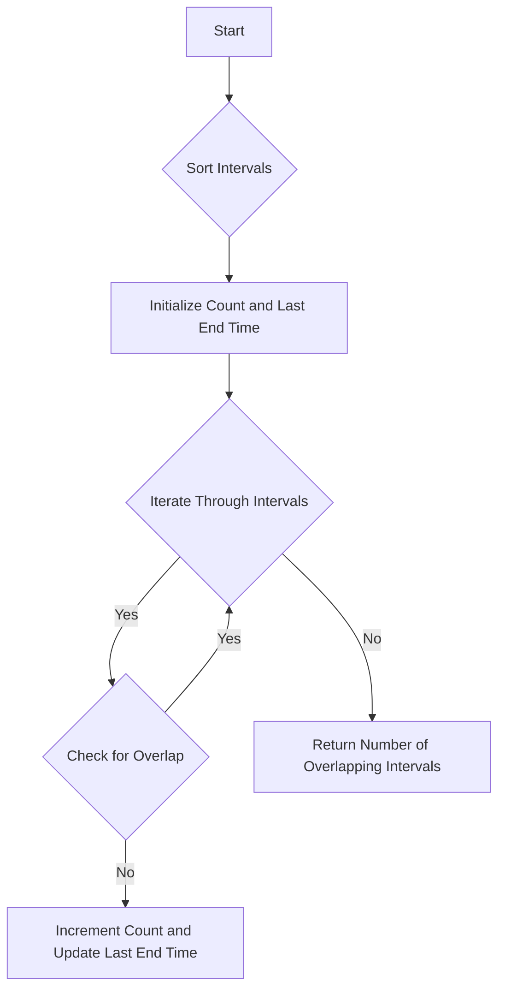

# Non-overlapping Intervals

## Problem Understanding
The Non-overlapping Intervals problem asks to find the minimum number of intervals that need to be removed from a given set of intervals so that no two intervals overlap. The key constraint is that the intervals are given as pairs of start and end times, and two intervals are considered overlapping if their start and end times overlap. This problem is non-trivial because a naive approach, such as checking all possible combinations of intervals, would have an exponential time complexity. The problem requires a more efficient algorithm that can handle a large number of intervals.

## Approach
The algorithm strategy used to solve this problem is a greedy algorithm, which always chooses the interval with the earliest end time. This approach works because by choosing the interval with the earliest end time, we are minimizing the chance of overlapping with the next interval. The intervals are first sorted based on their end times, and then iterated through to count the number of non-overlapping intervals. The data structure used is an array of intervals, which is sorted in-place using the qsort function. The approach handles the key constraint of non-overlapping intervals by only incrementing the count of non-overlapping intervals if the current interval does not overlap with the last non-overlapping interval.

## Complexity Analysis
| Metric | Value | Detailed Reason |
|--------|-------|----------------|
| Time   | O(n log n) | The time complexity is O(n log n) due to the sorting of intervals using qsort, which has a time complexity of O(n log n). The subsequent iteration through the sorted intervals has a time complexity of O(n), but this is dominated by the sorting step. |
| Space  | O(1) | The space complexity is O(1) because the sorting is done in-place, and no extra space is needed to store the sorted intervals. The only extra space used is for the variables to store the count of non-overlapping intervals and the end time of the last non-overlapping interval, which is constant. |

## Algorithm Walkthrough
```
Input: intervals = [[1, 2], [2, 3], [3, 4], [1, 3]]
Step 1: Sort intervals based on end time: [[1, 2], [2, 3], [3, 4], [1, 3]] → [[1, 2], [2, 3], [1, 3], [3, 4]]
Step 2: Initialize count of non-overlapping intervals and end time of last non-overlapping interval: count = 1, lastEndTime = 2
Step 3: Iterate through sorted intervals:
  - Interval [2, 3] does not overlap with [1, 2], so increment count and update lastEndTime: count = 2, lastEndTime = 3
  - Interval [1, 3] overlaps with [2, 3], so do not increment count
  - Interval [3, 4] does not overlap with [2, 3], so increment count and update lastEndTime: count = 3, lastEndTime = 4
Output: Number of overlapping intervals to remove = 4 - 3 = 1
```

## Visual Flow


## Key Insight
> **Tip:** The key to solving this problem is to sort the intervals based on their end times, which allows us to efficiently determine the minimum number of intervals that need to be removed to avoid overlaps.

## Edge Cases
- **Empty/null input**: If the input array is empty or null, the function returns 0, as there are no intervals to remove.
- **Single element**: If the input array contains only one interval, the function returns 0, as there are no overlapping intervals to remove.
- **Intervals with same start and end time**: If two intervals have the same start and end time, they are considered overlapping, and one of them needs to be removed.

## Common Mistakes
- **Mistake 1**: Not sorting the intervals based on their end times, which leads to incorrect results. To avoid this, make sure to use a reliable sorting algorithm like qsort.
- **Mistake 2**: Not checking for overlap between the current interval and the last non-overlapping interval, which leads to incorrect results. To avoid this, make sure to use a correct condition to check for overlap.

## Interview Follow-ups
> **Interview:** These are the exact follow-up questions interviewers ask:
- "What if the input is sorted?" → In that case, the time complexity would still be O(n) due to the iteration through the intervals, but the sorting step would be unnecessary.
- "Can you do it in O(1) space?" → The current solution already uses O(1) space, as the sorting is done in-place and no extra space is used.
- "What if there are duplicates?" → If there are duplicate intervals, they would be treated as separate intervals and would be counted separately. If you want to ignore duplicates, you would need to add an additional step to remove duplicates before sorting and iterating through the intervals.

## C Solution

```c
// Problem: Non-overlapping Intervals
// Language: C
// Difficulty: Medium
// Time Complexity: O(n log n) — sorting intervals and then iterating through them
// Space Complexity: O(1) — no extra space needed, sorting in-place
// Approach: Greedy algorithm — always choose the interval with the earliest end time

#include <stdio.h>
#include <stdlib.h>

// Structure to represent an interval
typedef struct {
    int start;
    int end;
} Interval;

// Compare function for sorting intervals based on end time
int compareIntervals(const void *a, const void *b) {
    Interval *intervalA = (Interval *) a;
    Interval *intervalB = (Interval *) b;
    // Sort intervals in ascending order of their end times
    return (intervalA->end - intervalB->end);
}

int eraseOverlapIntervals(Interval *intervals, int intervalsSize) {
    // Edge case: empty input → return 0
    if (intervalsSize == 0) return 0;

    // Sort intervals based on end time
    qsort(intervals, intervalsSize, sizeof(Interval), compareIntervals);

    // Initialize count of non-overlapping intervals and end time of last non-overlapping interval
    int count = 1;  // Start with 1 non-overlapping interval (the first one)
    int lastEndTime = intervals[0].end;  // End time of the first interval

    // Iterate through sorted intervals
    for (int i = 1; i < intervalsSize; i++) {
        // If current interval does not overlap with last non-overlapping interval, increment count and update last end time
        if (intervals[i].start >= lastEndTime) {
            count++;
            lastEndTime = intervals[i].end;  // Update last end time
        }
    }

    // Return number of overlapping intervals to remove
    return intervalsSize - count;
}

int main() {
    // Example usage:
    Interval intervals[] = {{1, 2}, {2, 3}, {3, 4}, {1, 3}};
    int intervalsSize = sizeof(intervals) / sizeof(Interval);
    int result = eraseOverlapIntervals(intervals, intervalsSize);
    printf("Number of overlapping intervals to remove: %d\n", result);
    return 0;
}
```
