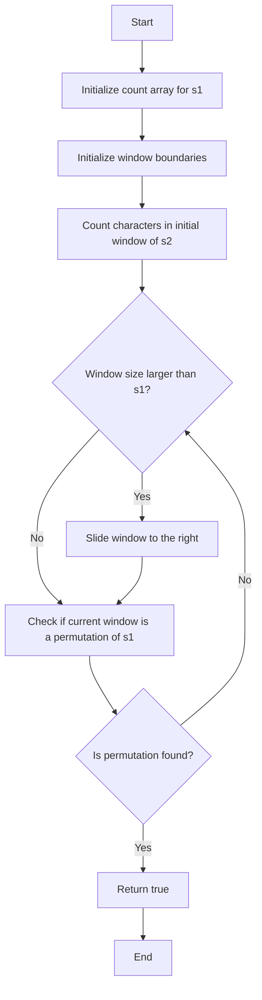

# Permutation in String

## Problem Understanding
The problem is asking to determine if a given string `s2` contains a permutation of another string `s1`. A permutation is an arrangement of characters where every character in `s1` appears exactly once in a substring of `s2`. The key constraint is that the permutation must be a contiguous substring of `s2`. The problem becomes non-trivial because a naive approach would involve checking every possible substring of `s2` for a permutation of `s1`, resulting in a time complexity of O(n^2) due to the nested loop structure.

## Approach
The algorithm strategy is to use a sliding window approach with two character count arrays, one for `s1` and one for the current window in `s2`. The intuition behind this approach is to maintain a count of characters in the window that matches the count of characters in `s1`, allowing for efficient detection of permutations. This approach works because it ensures that every character in `s1` appears exactly once in the window, thus forming a permutation. The character count arrays are used to keep track of the frequency of each character in `s1` and the window, enabling the comparison of character counts between `s1` and the window.

## Complexity Analysis
| Metric | Value | Detailed Reason |
|--------|-------|----------------|
| Time   | O(n)  | The algorithm makes a single pass through the string `s2` using a sliding window, where n is the length of `s2`. The operations within the loop (updating counts and checking for permutations) take constant time. |
| Space  | O(1)  | The space complexity is constant because the size of the character count array is fixed (26 elements for lowercase English letters), regardless of the input size. |

## Algorithm Walkthrough
```
Input: s1 = "ab", s2 = "eidbaooo"
Step 1: Initialize count array for s1: [1, 1, 0, 0, 0, 0, 0, 0, 0, 0, 0, 0, 0, 0, 0, 0, 0, 0, 0, 0, 0, 0, 0, 0, 0, 0]
Step 2: Initialize window boundaries: left = 0, right = 0
Step 3: Count characters in initial window of s2: update count array for s2 character frequencies
Step 4: Slide window to the right and update count array
Step 5: Check if current window is a permutation of s1: verify that all character counts are zero
Output: true (permutation found in the substring "ba")
```
This walkthrough demonstrates how the algorithm iterates through `s2` and checks for permutations of `s1` using the sliding window approach.

## Visual Flow

This flowchart illustrates the decision flow and data transformation of the algorithm.

## Key Insight
> **Tip:** The key insight is to use a sliding window approach with character count arrays to efficiently detect permutations of `s1` in `s2`, allowing for a single pass through the string and constant space complexity.

## Edge Cases
- **Empty/null input**: If either `s1` or `s2` is empty or null, the function returns false because there is no permutation to find.
- **Single element**: If `s1` has only one character, the function checks if that character appears in `s2` and returns true if it does, false otherwise.
- **s1 is longer than s2**: If `s1` is longer than `s2`, the function immediately returns false because `s2` cannot contain a permutation of `s1`.

## Common Mistakes
- **Mistake 1**: Not updating the count array correctly when sliding the window to the right, leading to incorrect permutation detection. To avoid this, ensure that the count array is updated correctly for characters entering and leaving the window.
- **Mistake 2**: Not checking for the edge case where `s1` is longer than `s2`, resulting in incorrect function behavior. To avoid this, add a check at the beginning of the function to return false if `s1` is longer than `s2`.

## Interview Follow-ups
> **Interview:** These are the exact follow-up questions interviewers ask:
- "What if the input is sorted?" → The algorithm still works correctly because the character count arrays ensure that the permutation detection is order-agnostic.
- "Can you do it in O(1) space?" → No, because the character count array requires a fixed amount of space to keep track of character frequencies.
- "What if there are duplicates?" → The algorithm handles duplicates correctly because the character count arrays keep track of the frequency of each character in `s1` and the window, allowing for correct permutation detection even in the presence of duplicates.

## C Solution

```c
// Problem: Permutation in String
// Language: C
// Difficulty: Medium
// Time Complexity: O(n) — single pass through string using sliding window
// Space Complexity: O(1) — constant space for character counts
// Approach: Sliding window with character count arrays — compare counts of characters in window with target string

#include <stdbool.h>
#include <string.h>

bool checkInclusion(char * s1, char * s2) {
    int s1Len = strlen(s1);
    int s2Len = strlen(s2);
    
    // Edge case: s1 is longer than s2 → return false
    if (s1Len > s2Len) return false;
    
    int count[26] = {0};
    
    // Count characters in s1
    for (int i = 0; i < s1Len; i++) {
        // Update count array with s1 character frequencies
        count[s1[i] - 'a']++;
    }
    
    // Initialize window boundaries
    int left = 0;
    int right = 0;
    
    // Count characters in initial window of s2
    for (right = 0; right < s2Len; right++) {
        // Update count array with s2 character frequencies
        count[s2[right] - 'a']--;
        
        // If window size is larger than s1, slide window to the right
        if (right >= s1Len) {
            // Restore count array for character going out of window
            count[s2[left] - 'a']++;
            left++;
        }
        
        // Check if current window is a permutation of s1
        if (right >= s1Len - 1) {
            bool isPermutation = true;
            // Verify that all character counts are zero
            for (int i = 0; i < 26; i++) {
                if (count[i] != 0) {
                    isPermutation = false;
                    break;
                }
            }
            // If window is a permutation, return true
            if (isPermutation) return true;
        }
    }
    
    // Edge case: no permutation found → return false
    return false;
}
```
