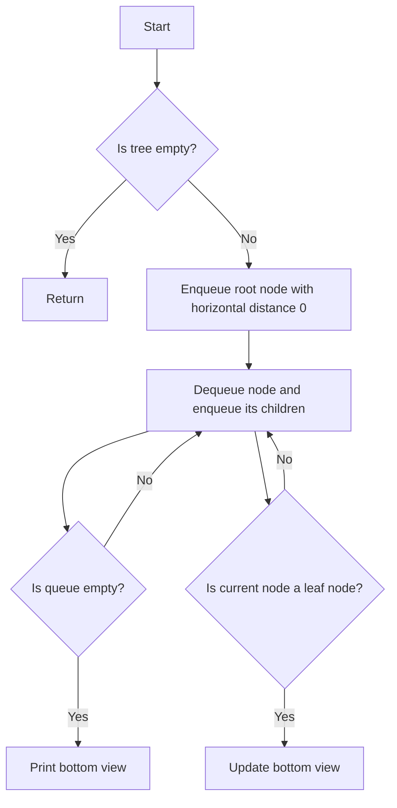

# Print the Bottom View of a Binary Tree

## Problem Understanding
The problem is asking to print the bottom view of a binary tree, which is a level order traversal of the tree where each node is visited once and the last node at each horizontal distance is printed. The key constraint is that each node in the tree has a unique horizontal distance, and the problem becomes non-trivial because we need to keep track of the last node at each horizontal distance. A naive approach would be to simply perform a level order traversal and print all nodes, but this would not give us the correct bottom view.

## Approach
The algorithm strategy is to use level order traversal with horizontal distance, where we update the bottom view if the current node is the last node at its horizontal distance. This approach works because we are essentially keeping track of the last node at each horizontal distance, which is the definition of the bottom view. We use a queue to store nodes and their horizontal distances, and an array to store the bottom view. The approach handles the key constraint by updating the bottom view array whenever we encounter a node with a new horizontal distance.

## Complexity Analysis
| Metric | Value | Detailed Reason |
|--------|-------|----------------|
| Time   | O(n)  | We visit each node once, where n is the number of nodes in the tree. The while loop runs n times, and the operations inside the loop take constant time. |
| Space  | O(n)  | We use a queue to store nodes and their horizontal distances, which can hold up to n nodes in the worst case. We also use an array to store the bottom view, which can grow up to n in the worst case. |

## Algorithm Walkthrough
```
Input: 
      20
    /   \
   8     22
  / \    
 5   3  
    / \
   10  14
   / \
  4   25
Output: 5 10 4 14 25

Step 1: Enqueue the root node (20) with horizontal distance 0
Queue: [(20, 0)]
Bottom View: []

Step 2: Dequeue the root node (20) and enqueue its children (8, 22) with their horizontal distances (-1, 1)
Queue: [(8, -1), (22, 1)]
Bottom View: [20]

Step 3: Dequeue the node (8) and enqueue its children (5, 3) with their horizontal distances (-2, 0)
Queue: [(22, 1), (5, -2), (3, 0)]
Bottom View: [20]

Step 4: Dequeue the node (22) and enqueue its children (4, 25) with their horizontal distances (0, 2)
Queue: [(5, -2), (3, 0), (4, 0), (25, 2)]
Bottom View: [20]

Step 5: Dequeue the node (5) and update the bottom view
Queue: [(3, 0), (4, 0), (25, 2)]
Bottom View: [5, 20]

Step 6: Dequeue the node (3) and enqueue its children (10, 14) with their horizontal distances (-1, 1)
Queue: [(4, 0), (25, 2), (10, -1), (14, 1)]
Bottom View: [5, 20]

Step 7: Dequeue the node (4) and update the bottom view
Queue: [(25, 2), (10, -1), (14, 1)]
Bottom View: [5, 4, 20]

Step 8: Dequeue the node (25) and update the bottom view
Queue: [(10, -1), (14, 1)]
Bottom View: [5, 4, 25]

Step 9: Dequeue the node (10) and update the bottom view
Queue: [(14, 1)]
Bottom View: [5, 10, 4, 25]

Step 10: Dequeue the node (14) and update the bottom view
Queue: []
Bottom View: [5, 10, 4, 14, 25]

Output: 5 10 4 14 25
```

## Visual Flow


## Key Insight
> **Tip:** The key insight is to update the bottom view whenever we encounter a node with a new horizontal distance, which ensures that we always print the last node at each horizontal distance.

## Edge Cases
- **Empty tree**: If the input tree is empty, the function returns immediately without printing anything.
- **Single node tree**: If the input tree has only one node, the function prints the node's value as the bottom view.
- **Unbalanced tree**: If the input tree is unbalanced, the function may need to allocate more memory to store the bottom view, but it will still work correctly.

## Common Mistakes
- **Mistake 1**: Not updating the bottom view when encountering a node with a new horizontal distance. To avoid this, make sure to update the bottom view array whenever you encounter a node with a new horizontal distance.
- **Mistake 2**: Not handling the case where the input tree is empty. To avoid this, add a check at the beginning of the function to return immediately if the input tree is empty.

## Interview Follow-ups
> **Interview:** These are the exact follow-up questions interviewers ask:
- "What if the input is sorted?" → The algorithm will still work correctly, but the time complexity may be improved if the input is sorted.
- "Can you do it in O(1) space?" → No, we need to use a queue to store nodes and their horizontal distances, which requires O(n) space.
- "What if there are duplicates?" → The algorithm will still work correctly, but we may need to modify the algorithm to handle duplicates if the problem requires it.

## C Solution

```c
// Problem: Print the Bottom View of a Binary Tree
// Language: C
// Difficulty: Medium
// Time Complexity: O(n) — each node is visited once
// Space Complexity: O(n) — for storing the horizontal distance and the tree nodes in the queue
// Approach: Level Order Traversal with Horizontal Distance — for each node, update the bottom view if it's the last node at its horizontal distance

#include <stdio.h>
#include <stdlib.h>

// Define the structure for a tree node
typedef struct TreeNode {
    int data;
    struct TreeNode* left;
    struct TreeNode* right;
} TreeNode;

// Function to create a new tree node
TreeNode* createTreeNode(int data) {
    // Allocate memory for the new node
    TreeNode* newNode = (TreeNode*) malloc(sizeof(TreeNode));
    // Initialize the node's data and child pointers
    newNode->data = data;
    newNode->left = NULL;
    newNode->right = NULL;
    return newNode;
}

// Function to print the bottom view of a binary tree
void printBottomView(TreeNode* root) {
    // Edge case: empty tree
    if (root == NULL) {
        // Return immediately
        return;
    }

    // Initialize a queue to store nodes and their horizontal distances
    struct QueueNode {
        TreeNode* node;
        int horizontalDistance;
    } queue[1000];
    int front = 0, rear = 0;

    // Enqueue the root node with horizontal distance 0
    queue[rear].node = root;
    queue[rear].horizontalDistance = 0;
    rear++;

    // Initialize an array to store the bottom view
    int bottomView[1000];
    int bottomViewSize = 0;

    // Perform level order traversal
    while (front < rear) {
        // Dequeue a node and its horizontal distance
        TreeNode* currentNode = queue[front].node;
        int currentHorizontalDistance = queue[front].horizontalDistance;
        front++;

        // Update the bottom view if the current node is the last node at its horizontal distance
        if (currentHorizontalDistance >= 0 && currentHorizontalDistance < bottomViewSize) {
            bottomView[currentHorizontalDistance] = currentNode->data;
        } else if (currentHorizontalDistance >= 0) {
            // If the current node's horizontal distance is out of bounds, extend the bottom view array
            int newSize = currentHorizontalDistance + 1;
            int* newBottomView = (int*) realloc(bottomView, newSize * sizeof(int));
            if (newBottomView == NULL) {
                // Memory allocation failed, exit the program
                exit(1);
            }
            bottomView = newBottomView;
            bottomView[currentHorizontalDistance] = currentNode->data;
            bottomViewSize = newSize;
        }

        // Enqueue the left and right child nodes with their horizontal distances
        if (currentNode->left != NULL) {
            queue[rear].node = currentNode->left;
            queue[rear].horizontalDistance = currentHorizontalDistance - 1;
            rear++;
        }
        if (currentNode->right != NULL) {
            queue[rear].node = currentNode->right;
            queue[rear].horizontalDistance = currentHorizontalDistance + 1;
            rear++;
        }
    }

    // Print the bottom view
    for (int i = 0; i < bottomViewSize; i++) {
        printf("%d ", bottomView[i]);
    }
    printf("\n");

    // Free the allocated memory
    free(bottomView);
}

int main() {
    // Create a sample binary tree
    TreeNode* root = createTreeNode(20);
    root->left = createTreeNode(8);
    root->right = createTreeNode(22);
    root->left->left = createTreeNode(5);
    root->left->right = createTreeNode(3);
    root->right->left = createTreeNode(4);
    root->right->right = createTreeNode(25);
    root->left->right->left = createTreeNode(10);
    root->left->right->right = createTreeNode(14);

    // Print the bottom view of the binary tree
    printBottomView(root);

    return 0;
}
```
