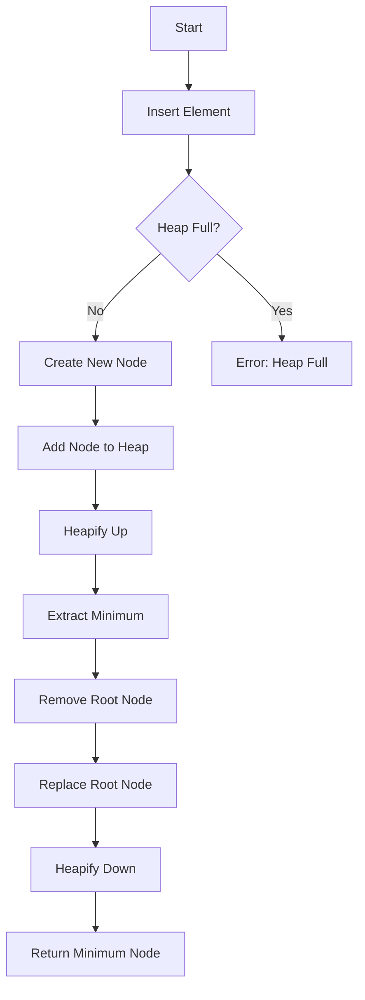

# Priority Queue using Min-Heap

## Problem Understanding
The problem is asking to implement a priority queue using a min-heap data structure. A priority queue is a data structure that allows elements to be inserted and deleted based on their priority. The key constraint is that the smallest element (based on its priority) should always be at the root of the heap. This problem is non-trivial because a naive approach, such as using a simple array or linked list, would not allow for efficient insertion and deletion of elements based on their priority. The min-heap data structure is particularly well-suited for this problem because it allows for efficient insertion and deletion of elements while maintaining the heap property.

## Approach
The algorithm strategy used is to implement a min-heap priority queue. The intuition behind this approach is that the min-heap data structure allows for efficient insertion and deletion of elements based on their priority. The approach works by maintaining the heap property, which ensures that the smallest element is always at the root of the heap. The `heapifyUp` and `heapifyDown` functions are used to maintain the heap property after insertion and deletion of elements, respectively. The `insert` function is used to add new elements to the heap, and the `extractMin` function is used to remove the smallest element from the heap. The data structures used are a min-heap node structure and a min-heap structure, which are chosen because they allow for efficient implementation of the priority queue.

## Complexity Analysis
| Metric | Value | Detailed Reason |
|--------|-------|----------------|
| Time   | O(log n) | The time complexity of the `insert` and `extractMin` functions is O(log n) because in the worst case, the `heapifyUp` and `heapifyDown` functions may need to traverse the entire height of the heap, which is logarithmic in the number of elements. |
| Space  | O(n) | The space complexity is O(n) because in the worst case, the heap may need to store n elements, where n is the number of elements inserted into the heap. |

## Algorithm Walkthrough
```
Input: Insert elements (10, 3), (20, 1), (30, 2), (40, 4), (50, 5) into the heap
Step 1: Initialize the heap with size 0 and capacity 10
Step 2: Insert element (10, 3) into the heap
    - Create a new node with value 10 and priority 3
    - Add the new node to the heap
    - Heapify up to maintain the heap property
Step 3: Insert element (20, 1) into the heap
    - Create a new node with value 20 and priority 1
    - Add the new node to the heap
    - Heapify up to maintain the heap property
Step 4: Insert element (30, 2) into the heap
    - Create a new node with value 30 and priority 2
    - Add the new node to the heap
    - Heapify up to maintain the heap property
Step 5: Extract the minimum element from the heap
    - Remove the root node (20, 1) from the heap
    - Replace the root node with the last node in the heap
    - Heapify down to maintain the heap property
Output: Minimum node value: 20, priority: 1
```
## Visual Flow

## Key Insight
> **Tip:** The key insight is to use a min-heap data structure to implement the priority queue, which allows for efficient insertion and deletion of elements based on their priority.

## Edge Cases
- **Empty Heap**: If the heap is empty, the `extractMin` function will return an error message indicating that the heap is empty.
- **Single Element**: If the heap has only one element, the `extractMin` function will remove and return that element.
- **Heap Full**: If the heap is full, the `insert` function will return an error message indicating that the heap is full.

## Common Mistakes
- **Mistake 1**: Not heapifying up after inserting a new element, which can lead to the heap property being violated.
- **Mistake 2**: Not heapifying down after removing the root node, which can lead to the heap property being violated.

## Interview Follow-ups
> **Interview:** These are the exact follow-up questions interviewers ask:
- "What if the input is sorted?" → The time complexity of the `insert` and `extractMin` functions would still be O(log n) because the heap property needs to be maintained.
- "Can you do it in O(1) space?" → No, because the heap needs to store at least n elements, where n is the number of elements inserted into the heap.
- "What if there are duplicates?" → The heap will still work correctly, but the `extractMin` function may return one of the duplicate elements with the minimum priority.

## C Solution

```c
// Problem: Priority Queue using Min-Heap
// Language: C
// Difficulty: Medium
// Time Complexity: O(log n) — heap insertion and deletion
// Space Complexity: O(n) — heap stores at most n elements
// Approach: Min-heap priority queue implementation — smallest element always at root

#include <stdio.h>
#include <stdlib.h>

// Define the structure for a min-heap node
typedef struct MinHeapNode {
    int value;  // Value of the node
    int priority;  // Priority of the node
} MinHeapNode;

// Define the structure for a min-heap
typedef struct MinHeap {
    int size;  // Current size of the heap
    int capacity;  // Maximum capacity of the heap
    MinHeapNode** nodes;  // Array of nodes in the heap
} MinHeap;

// Function to swap two nodes in the heap
void swap(MinHeapNode** a, MinHeapNode** b) {
    MinHeapNode* temp = *a;  // Swap nodes a and b
    *a = *b;
    *b = temp;
}

// Function to heapify up (maintain the heap property after insertion)
void heapifyUp(MinHeap* heap, int index) {
    if (index <= 0) return;  // Edge case: index is 0 (root node)
    int parentIndex = (index - 1) / 2;  // Calculate parent index
    if (heap->nodes[parentIndex]->priority > heap->nodes[index]->priority) {
        swap(&heap->nodes[parentIndex], &heap->nodes[index]);  // Swap parent and current nodes if parent has higher priority
        heapifyUp(heap, parentIndex);  // Recursively heapify up
    }
}

// Function to heapify down (maintain the heap property after deletion)
void heapifyDown(MinHeap* heap, int index) {
    int smallest = index;  // Assume current node has the smallest value
    int leftChildIndex = 2 * index + 1;  // Calculate left child index
    int rightChildIndex = 2 * index + 2;  // Calculate right child index

    if (leftChildIndex < heap->size && heap->nodes[leftChildIndex]->priority < heap->nodes[smallest]->priority) {
        smallest = leftChildIndex;  // Update smallest index if left child has lower priority
    }

    if (rightChildIndex < heap->size && heap->nodes[rightChildIndex]->priority < heap->nodes[smallest]->priority) {
        smallest = rightChildIndex;  // Update smallest index if right child has lower priority
    }

    if (smallest != index) {
        swap(&heap->nodes[index], &heap->nodes[smallest]);  // Swap current node with the smallest node
        heapifyDown(heap, smallest);  // Recursively heapify down
    }
}

// Function to insert a new node into the heap
void insert(MinHeap* heap, int value, int priority) {
    if (heap->size == heap->capacity) {
        printf("Heap is full\n");  // Edge case: heap is full
        return;
    }

    MinHeapNode* newNode = (MinHeapNode*)malloc(sizeof(MinHeapNode));  // Allocate memory for the new node
    newNode->value = value;
    newNode->priority = priority;

    heap->nodes[heap->size] = newNode;  // Add the new node to the heap
    heapifyUp(heap, heap->size);  // Heapify up to maintain the heap property
    heap->size++;  // Increment the heap size
}

// Function to extract the minimum node from the heap
MinHeapNode* extractMin(MinHeap* heap) {
    if (heap->size == 0) {
        printf("Heap is empty\n");  // Edge case: heap is empty
        return NULL;
    }

    if (heap->size == 1) {
        MinHeapNode* minNode = heap->nodes[0];  // Edge case: heap has only one node
        heap->size--;
        return minNode;
    }

    MinHeapNode* minNode = heap->nodes[0];  // Get the minimum node (root node)
    heap->nodes[0] = heap->nodes[heap->size - 1];  // Replace the root node with the last node
    heap->size--;  // Decrement the heap size
    heapifyDown(heap, 0);  // Heapify down to maintain the heap property
    return minNode;
}

int main() {
    int capacity = 10;  // Set the maximum capacity of the heap
    MinHeap* heap = (MinHeap*)malloc(sizeof(MinHeap));  // Allocate memory for the heap
    heap->size = 0;
    heap->capacity = capacity;
    heap->nodes = (MinHeapNode**)malloc(capacity * sizeof(MinHeapNode*));

    insert(heap, 10, 3);  // Insert nodes with values and priorities
    insert(heap, 20, 1);
    insert(heap, 30, 2);
    insert(heap, 40, 4);
    insert(heap, 50, 5);

    MinHeapNode* minNode = extractMin(heap);  // Extract the minimum node
    printf("Minimum node value: %d, priority: %d\n", minNode->value, minNode->priority);

    free(minNode);  // Free the memory allocated for the minimum node
    free(heap->nodes);  // Free the memory allocated for the heap nodes
    free(heap);  // Free the memory allocated for the heap

    return 0;
}
```
