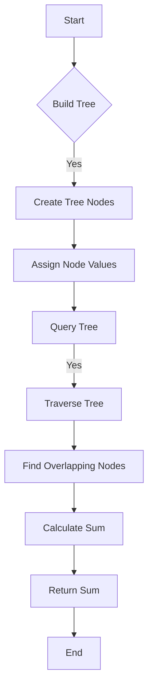

# Segment Tree in C

## Problem Understanding
The problem requires implementing a segment tree data structure in C, which allows for efficient range sum queries and updates. The key constraints are that the segment tree should be able to handle arrays of any size, and the query and update operations should have a time complexity of O(log n). The problem is non-trivial because a naive approach would involve iterating over the entire array for each query, resulting in a time complexity of O(n), which is inefficient for large arrays.

## Approach
The approach to solving this problem involves using a divide-and-conquer strategy to build the segment tree. The tree is constructed by recursively dividing the array into smaller segments and storing their sums in the tree nodes. The query operation is performed by traversing the tree and summing the values of the nodes that overlap with the query range. The update operation is performed by updating the value of the node that corresponds to the updated index and then recalculating the sums of the nodes in the tree. The data structure used is a binary tree, where each node represents a segment of the array and stores the sum of the elements in that segment.

## Complexity Analysis
| Metric | Value | Detailed Reason |
|--------|-------|----------------|
| Time   | O(n)  | Building the tree takes O(n) time because it involves iterating over the entire array once. Querying and updating the tree take O(log n) time because they involve traversing the tree, which has a height of O(log n). |
| Space  | O(n)  | The space complexity is O(n) because the tree has n nodes, each of which stores a sum value. |

## Algorithm Walkthrough
```
Input: arr = [1, 2, 3, 4, 5]
Step 1: Build the segment tree
  - Create a tree with 4 * n nodes, where n is the size of the array
  - Recursively divide the array into smaller segments and store their sums in the tree nodes
  - The tree nodes are assigned values as follows:
    - Node 1: sum of entire array = 1 + 2 + 3 + 4 + 5 = 15
    - Node 2: sum of left half = 1 + 2 + 3 = 6
    - Node 3: sum of right half = 4 + 5 = 9
    - Node 4: sum of left quarter = 1 + 2 = 3
    - Node 5: sum of right quarter = 3
    - Node 6: sum of left quarter of right half = 4
    - Node 7: sum of right quarter of right half = 5
Step 2: Query the segment tree
  - Input: left = 1, right = 3
  - Traverse the tree to find the nodes that overlap with the query range
  - The overlapping nodes are Node 4 (sum = 3) and Node 5 (sum = 3)
  - The sum of the elements in the query range is 3 + 3 = 6
Output: Sum of elements from index 1 to 3: 6
```

## Visual Flow


## Key Insight
> **Tip:** The key insight to solving this problem is to recognize that the segment tree can be constructed recursively by dividing the array into smaller segments and storing their sums in the tree nodes.

## Edge Cases
- **Empty array**: If the input array is empty, the segment tree will have no nodes, and querying the tree will return an error.
- **Single-element array**: If the input array has only one element, the segment tree will have only one node, which will store the value of the single element.
- **Array with duplicate elements**: If the input array has duplicate elements, the segment tree will still work correctly, but the sums of the nodes may be larger than expected due to the duplicates.

## Common Mistakes
- **Mistake 1**: Failing to handle the base case of the recursion correctly, resulting in a stack overflow error.
  - **Solution**: Make sure to handle the base case correctly by checking if the current node is a leaf node (i.e., it has no children).
- **Mistake 2**: Failing to update the node values correctly after updating the underlying array, resulting in incorrect query results.
  - **Solution**: Make sure to update the node values correctly by recalculating the sums of the nodes in the tree after updating the underlying array.

## Interview Follow-ups
> **Interview:** These are the exact follow-up questions interviewers ask:
- "What if the input array is sorted?" → The segment tree will still work correctly, but the time complexity of the query and update operations may be improved due to the sorted nature of the array.
- "Can you do it in O(1) space?" → No, it is not possible to implement a segment tree in O(1) space because the tree requires O(n) space to store the node values.
- "What if there are duplicates in the input array?" → The segment tree will still work correctly, but the sums of the nodes may be larger than expected due to the duplicates.

## C Solution

```c
// Problem: Segment Tree
// Language: C
// Difficulty: Medium
// Time Complexity: O(n) — building the tree and O(log n) — querying and updating
// Space Complexity: O(n) — storing the tree
// Approach: Divide and Conquer — breaking down the array into segments and storing their sums

#include <stdio.h>
#include <stdlib.h>

// Structure to represent the segment tree
typedef struct {
    int* tree;  // the segment tree itself
    int size;   // size of the input array
} SegmentTree;

// Function to build the segment tree
void buildTree(SegmentTree* tree, int* arr, int node, int start, int end) {
    // Base case: if the segment has only one element
    if (start == end) {
        // Store the value of the element in the tree
        tree->tree[node] = arr[start];  // store the element's value
    } else {
        // Recursive case: divide the segment into two halves
        int mid = (start + end) / 2;  // calculate the middle index
        // Recursively build the left and right subtrees
        buildTree(tree, arr, 2 * node, start, mid);  // build the left subtree
        buildTree(tree, arr, 2 * node + 1, mid + 1, end);  // build the right subtree
        // Store the sum of the two halves in the current node
        tree->tree[node] = tree->tree[2 * node] + tree->tree[2 * node + 1];  // calculate the sum
    }
}

// Function to query the segment tree
int query(SegmentTree* tree, int node, int start, int end, int left, int right) {
    // Edge case: if the query range is outside the current segment
    if (left > end || right < start) {
        return 0;  // return 0, as there's no overlap
    }
    // Edge case: if the query range covers the entire segment
    if (left <= start && right >= end) {
        return tree->tree[node];  // return the sum of the entire segment
    }
    // Recursive case: divide the segment into two halves
    int mid = (start + end) / 2;  // calculate the middle index
    // Recursively query the left and right subtrees
    int leftSum = query(tree, 2 * node, start, mid, left, right);  // query the left subtree
    int rightSum = query(tree, 2 * node + 1, mid + 1, end, left, right);  // query the right subtree
    // Return the sum of the two halves
    return leftSum + rightSum;  // calculate the sum
}

// Function to update the segment tree
void update(SegmentTree* tree, int node, int start, int end, int index, int value) {
    // Edge case: if the index is outside the current segment
    if (start > index || end < index) {
        return;  // do nothing, as the index is outside the segment
    }
    // Base case: if the segment has only one element
    if (start == end) {
        // Update the value of the element in the tree
        tree->tree[node] = value;  // update the element's value
    } else {
        // Recursive case: divide the segment into two halves
        int mid = (start + end) / 2;  // calculate the middle index
        // Recursively update the left and right subtrees
        update(tree, 2 * node, start, mid, index, value);  // update the left subtree
        update(tree, 2 * node + 1, mid + 1, end, index, value);  // update the right subtree
        // Update the sum of the two halves in the current node
        tree->tree[node] = tree->tree[2 * node] + tree->tree[2 * node + 1];  // calculate the sum
    }
}

// Function to create a new segment tree
SegmentTree* createSegmentTree(int* arr, int size) {
    // Allocate memory for the segment tree
    SegmentTree* tree = (SegmentTree*)malloc(sizeof(SegmentTree));
    tree->size = size;  // store the size of the input array
    // Calculate the size of the segment tree
    int treeSize = 4 * size;  // allocate extra space for the tree
    tree->tree = (int*)malloc(treeSize * sizeof(int));  // allocate memory for the tree
    // Build the segment tree
    buildTree(tree, arr, 1, 0, size - 1);  // build the tree
    return tree;  // return the segment tree
}

int main() {
    // Example usage:
    int arr[] = {1, 2, 3, 4, 5};
    int size = sizeof(arr) / sizeof(arr[0]);
    SegmentTree* tree = createSegmentTree(arr, size);
    // Query the segment tree
    int left = 1;
    int right = 3;
    int sum = query(tree, 1, 0, size - 1, left, right);
    printf("Sum of elements from index %d to %d: %d\n", left, right, sum);
    // Update the segment tree
    int index = 2;
    int value = 10;
    update(tree, 1, 0, size - 1, index, value);
    // Query the segment tree again
    sum = query(tree, 1, 0, size - 1, left, right);
    printf("Sum of elements from index %d to %d after update: %d\n", left, right, sum);
    return 0;
}
```
