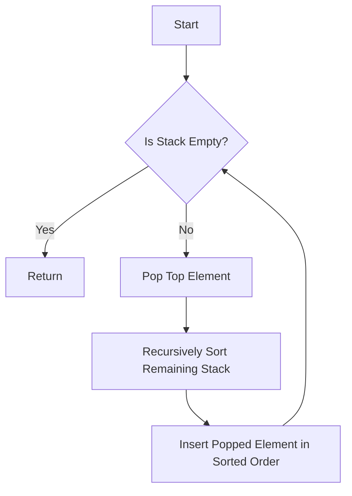

# Sort a Stack using Recursion

## Problem Understanding
The problem requires sorting a stack using recursion. The key constraint is that we can only use recursive calls to sort the stack, and we cannot use any additional data structures like arrays or linked lists. The implication of this constraint is that we need to use the stack itself to store the temporary results of the recursive calls. This problem is non-trivial because the naive approach of simply popping all elements from the stack and then pushing them back in sorted order would require an additional data structure to store the popped elements.

## Approach
The algorithm strategy is to use a recursive insertion sort approach. The intuition behind this approach is to pop each element from the stack, recursively sort the remaining stack, and then insert the popped element in sorted order. We use a stack as the primary data structure to store the elements, and we use recursive function calls to sort the stack. The approach handles the key constraint of not using any additional data structures by using the stack itself to store the temporary results of the recursive calls.

## Complexity Analysis
| Metric | Value | Detailed Reason |
|--------|-------|----------------|
| Time   | O(n^2) | The time complexity is O(n^2) because in the worst case, we are performing a recursive insertion sort. For each element, we are potentially scanning the entire stack to insert it in sorted order, resulting in a quadratic time complexity. |
| Space  | O(n)  | The space complexity is O(n) because of the recursive call stack. In the worst case, the maximum depth of the recursion tree is n, where n is the number of elements in the stack. |

## Algorithm Walkthrough
```
Input: Stack with elements [5, 3, 8, 1, 4]
Step 1: Pop the top element (5) and recursively sort the remaining stack
Step 2: Recursively sort the stack [3, 8, 1, 4]
Step 3: Pop the top element (3) and recursively sort the remaining stack
Step 4: Recursively sort the stack [8, 1, 4]
Step 5: Pop the top element (8) and recursively sort the remaining stack
Step 6: Recursively sort the stack [1, 4]
Step 7: Pop the top element (1) and recursively sort the remaining stack
Step 8: Recursively sort the stack [4]
Step 9: Insert the popped element (1) in sorted order
Step 10: Insert the popped element (4) in sorted order
Step 11: Insert the popped element (8) in sorted order
Step 12: Insert the popped element (3) in sorted order
Step 13: Insert the popped element (5) in sorted order
Output: Sorted Stack [1, 3, 4, 5, 8]
```

## Visual Flow


## Key Insight
> **Tip:** The key insight is to use the recursive insertion sort approach to sort the stack, which allows us to avoid using any additional data structures.

## Edge Cases
- **Empty Stack**: If the input stack is empty, the algorithm simply returns without performing any operations.
- **Single Element**: If the input stack has only one element, the algorithm returns the same stack as it is already sorted.
- **Duplicate Elements**: If the input stack has duplicate elements, the algorithm treats them as distinct elements and sorts them accordingly.

## Common Mistakes
- **Mistake 1**: Not handling the edge case of an empty stack, which can result in a runtime error.
- **Mistake 2**: Not properly inserting the popped element in sorted order, which can result in an incorrect sorted stack.

## Interview Follow-ups
> **Interview:** These are the exact follow-up questions interviewers ask:
- "What if the input is sorted?" → The algorithm still works correctly, but it has a time complexity of O(n^2) even for a sorted input.
- "Can you do it in O(1) space?" → No, the algorithm requires O(n) space due to the recursive call stack.
- "What if there are duplicates?" → The algorithm treats duplicates as distinct elements and sorts them accordingly.

## C Solution

```c
// Problem: Sort a Stack using Recursion
// Language: C
// Difficulty: Medium
// Time Complexity: O(n^2) — due to recursive insertion sort
// Space Complexity: O(n) — recursive call stack
// Approach: Recursive insertion sort — insert each element in sorted order

#include <stdio.h>
#include <stdlib.h>

// Define the structure for a stack node
typedef struct StackNode {
    int data;
    struct StackNode* next;
} StackNode;

// Function to create a new stack node
StackNode* createStackNode(int data) {
    // Allocate memory for the new node
    StackNode* newNode = (StackNode*) malloc(sizeof(StackNode));
    // Initialize the node with the given data
    newNode->data = data;
    // Set the next pointer to NULL
    newNode->next = NULL;
    return newNode;
}

// Function to check if the stack is empty
int isEmpty(StackNode* top) {
    // If the top is NULL, the stack is empty
    return top == NULL;
}

// Function to push an element onto the stack
void push(StackNode** top, int data) {
    // Create a new node with the given data
    StackNode* newNode = createStackNode(data);
    // If the stack is empty, set the new node as the top
    if (isEmpty(*top)) {
        *top = newNode;
    } else {
        // Otherwise, set the new node's next pointer to the current top
        newNode->next = *top;
        // Update the top pointer to the new node
        *top = newNode;
    }
}

// Function to pop an element from the stack
int pop(StackNode** top) {
    // Edge case: empty stack → return -1
    if (isEmpty(*top)) {
        return -1;
    }
    // Store the data of the top node
    int data = (*top)->data;
    // Store the next node
    StackNode* temp = *top;
    // Update the top pointer to the next node
    *top = (*top)->next;
    // Free the memory of the popped node
    free(temp);
    return data;
}

// Function to sort the stack using recursion
void sortStack(StackNode** top) {
    // Edge case: empty stack → return
    if (isEmpty(*top)) {
        return;
    }
    // Pop the top element
    int temp = pop(top);
    // Recursively sort the remaining stack
    sortStack(top);
    // Insert the popped element in sorted order
    insertInSortedOrder(top, temp);
}

// Function to insert an element in sorted order
void insertInSortedOrder(StackNode** top, int data) {
    // Edge case: empty stack or data is less than the top element → push
    if (isEmpty(*top) || data <= (*top)->data) {
        push(top, data);
    } else {
        // Pop the top element
        int temp = pop(top);
        // Recursively insert the data in sorted order
        insertInSortedOrder(top, data);
        // Push the popped element back onto the stack
        push(top, temp);
    }
}

// Function to print the stack elements
void printStack(StackNode* top) {
    // Traverse the stack and print each element
    while (!isEmpty(top)) {
        printf("%d ", top->data);
        top = top->next;
    }
    printf("\n");
}

int main() {
    // Create a sample stack
    StackNode* top = NULL;
    push(&top, 5);
    push(&top, 3);
    push(&top, 8);
    push(&top, 1);
    push(&top, 4);
    
    // Print the original stack
    printf("Original Stack: ");
    printStack(top);
    
    // Sort the stack using recursion
    sortStack(&top);
    
    // Print the sorted stack
    printf("Sorted Stack: ");
    printStack(top);
    
    return 0;
}
```
