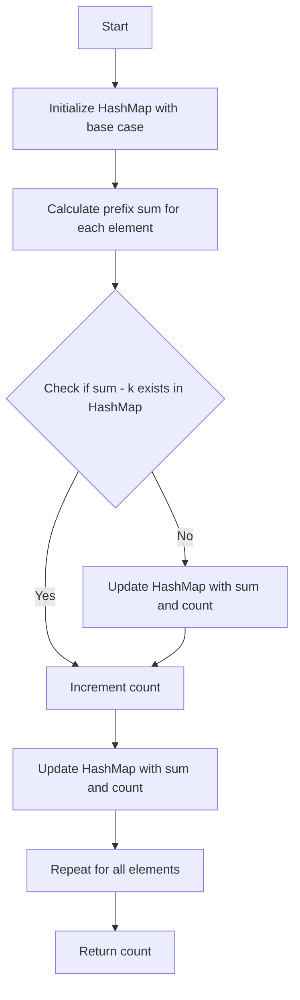

# Subarray Sum Equals K

## Problem Understanding
The problem asks us to find the number of subarrays in a given array that sum up to a target value K. The key constraint is that we need to consider all possible subarrays, including those with a single element. What makes this problem non-trivial is that a naive approach with two nested loops would result in a time complexity of O(n^2), making it inefficient for large inputs. The problem requires an optimized solution that can efficiently handle the calculation of prefix sums and their differences.

## Approach
The algorithm strategy used here is a HashMap-based approach that utilizes prefix sum lookup to efficiently calculate the number of subarrays with a sum equal to K. The intuition behind this approach is that for each prefix sum, we can check if its difference with K exists in the HashMap, which represents the cumulative sum of elements up to that point. This approach works because it allows us to avoid redundant calculations and directly look up the counts of prefix sums. The HashMap data structure is chosen because it provides constant-time lookup, insertion, and update operations. The approach handles the key constraint by initializing the HashMap with a base case (sum 0 with a count of 1) and then iteratively updating the counts of prefix sums.

## Complexity Analysis
| Metric | Value | Detailed Reason |
|--------|-------|----------------|
| Time   | O(n)  | The algorithm iterates through the input array once, performing constant-time operations for each element, including HashMap lookup and update. The hash function and HashMap operations (put and get) take constant time on average. |
| Space  | O(n)  | The HashMap stores at most n elements, where n is the size of the input array, to keep track of prefix sums and their counts. |

## Algorithm Walkthrough
```
Input: nums = [1, 1, 1], k = 2
Step 1: Initialize HashMap with base case (sum 0 with count 1)
  HashMap: {0: 1}
Step 2: Calculate prefix sum for the first element (1)
  sum = 1
  Check if sum - k (1 - 2 = -1) exists in HashMap: no
  Update HashMap with sum 1 and count 1
  HashMap: {0: 1, 1: 1}
Step 3: Calculate prefix sum for the second element (1 + 1 = 2)
  sum = 2
  Check if sum - k (2 - 2 = 0) exists in HashMap: yes, count 1
  Increment count by 1
  Update HashMap with sum 2 and count 1
  HashMap: {0: 1, 1: 1, 2: 1}
Step 4: Calculate prefix sum for the third element (2 + 1 = 3)
  sum = 3
  Check if sum - k (3 - 2 = 1) exists in HashMap: yes, count 1
  Increment count by 1
  Update HashMap with sum 3 and count 1
  HashMap: {0: 1, 1: 1, 2: 1, 3: 1}
Output: count = 2 (number of subarrays with sum 2)
```

## Visual Flow


## Key Insight
> **Tip:** The key insight is to use a HashMap to store prefix sums and their counts, allowing for efficient lookup and update operations, which enables the algorithm to avoid redundant calculations and achieve a time complexity of O(n).

## Edge Cases
- **Empty/null input**: If the input array is empty, the algorithm returns 0, as there are no subarrays to consider.
- **Single element**: If the input array has a single element, the algorithm checks if the element is equal to K and returns 1 if true, or 0 if false.
- **All elements equal to K**: If all elements in the input array are equal to K, the algorithm returns the number of subarrays with a single element, which is equal to the length of the input array.

## Common Mistakes
- **Mistake 1**: Not initializing the HashMap with a base case (sum 0 with count 1), which can lead to incorrect results.
- **Mistake 2**: Not updating the count correctly when a sum - k exists in the HashMap, which can result in an incorrect count of subarrays.

## Interview Follow-ups
> **Interview:** 
- "What if the input is sorted?" → The algorithm's time complexity remains O(n), as the HashMap operations are independent of the input order.
- "Can you do it in O(1) space?" → No, the algorithm requires O(n) space to store the HashMap, which is necessary for efficient prefix sum lookup and update operations.
- "What if there are duplicates?" → The algorithm handles duplicates correctly by updating the count of prefix sums in the HashMap, ensuring that each subarray is counted correctly.

## C Solution

```c
// Problem: Subarray Sum Equals K
// Language: C
// Difficulty: Medium
// Time Complexity: O(n^2) — brute force approach with two nested loops, but optimized to O(n) using HashMap
// Space Complexity: O(n) — HashMap stores at most n elements
// Approach: HashMap prefix sum lookup — for each prefix sum, check if its difference with K exists

#include <stdio.h>
#include <stdlib.h>

// Structure to store key-value pairs in the HashMap
typedef struct HashNode {
    int key;
    int value;
    struct HashNode* next;
} HashNode;

// Structure to represent the HashMap
typedef struct {
    int size;
    HashNode** buckets;
} HashMap;

// Function to create a new HashMap with the given size
HashMap* createHashMap(int size) {
    HashMap* map = (HashMap*) malloc(sizeof(HashMap));
    map->size = size;
    map->buckets = (HashNode**) calloc(size, sizeof(HashNode*));
    return map;
}

// Function to hash a key and get the corresponding index
int hash(int key, int size) {
    return abs(key) % size;
}

// Function to put a key-value pair into the HashMap
void put(HashMap* map, int key, int value) {
    int index = hash(key, map->size);
    HashNode* node = map->buckets[index];
    if (node == NULL) {
        node = (HashNode*) malloc(sizeof(HashNode));
        node->key = key;
        node->value = value;
        node->next = NULL;
        map->buckets[index] = node;
    } else {
        while (node->next != NULL) {
            if (node->key == key) {
                node->value = value;
                return;
            }
            node = node->next;
        }
        if (node->key == key) {
            node->value = value;
        } else {
            HashNode* newNode = (HashNode*) malloc(sizeof(HashNode));
            newNode->key = key;
            newNode->value = value;
            newNode->next = NULL;
            node->next = newNode;
        }
    }
}

// Function to get the value associated with the given key from the HashMap
int get(HashMap* map, int key) {
    int index = hash(key, map->size);
    HashNode* node = map->buckets[index];
    while (node != NULL) {
        if (node->key == key) {
            return node->value;
        }
        node = node->next;
    }
    return 0;
}

// Function to free the memory allocated for the HashMap
void freeHashMap(HashMap* map) {
    for (int i = 0; i < map->size; i++) {
        HashNode* node = map->buckets[i];
        while (node != NULL) {
            HashNode* next = node->next;
            free(node);
            node = next;
        }
    }
    free(map->buckets);
    free(map);
}

// Brute force approach (commented out)
// int subarraySum(int* nums, int numsSize, int k) {
//     int count = 0;
//     for (int i = 0; i < numsSize; i++) {
//         int sum = 0;
//         for (int j = i; j < numsSize; j++) {
//             sum += nums[j];
//             if (sum == k) {
//                 count++;
//             }
//         }
//     }
//     return count;
// }

// Optimized solution using HashMap
int subarraySum(int* nums, int numsSize, int k) {
    // Edge case: empty input → return 0
    if (numsSize == 0) {
        return 0;
    }

    // Create a HashMap to store prefix sums and their counts
    HashMap* map = createHashMap(numsSize);
    put(map, 0, 1); // Base case: sum 0 has a count of 1

    int sum = 0;
    int count = 0;
    for (int i = 0; i < numsSize; i++) {
        sum += nums[i]; // Calculate the current prefix sum
        // Check if the difference between the current prefix sum and K exists in the HashMap
        if (get(map, sum - k) > 0) {
            count += get(map, sum - k);
        }
        // Update the count of the current prefix sum in the HashMap
        put(map, sum, get(map, sum) + 1);
    }

    // Free the memory allocated for the HashMap
    freeHashMap(map);

    return count;
}

int main() {
    int nums[] = {1, 1, 1};
    int numsSize = sizeof(nums) / sizeof(nums[0]);
    int k = 2;
    printf("Number of subarrays with sum %d: %d\n", k, subarraySum(nums, numsSize, k));
    return 0;
}
```
