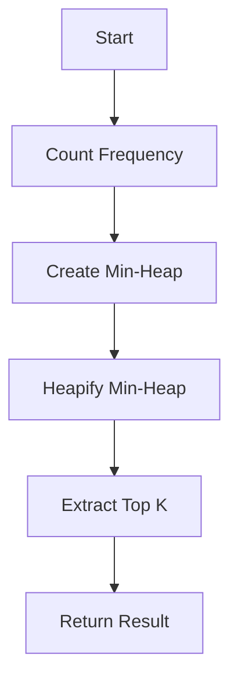

# Top K Frequent Elements

## Problem Understanding
The problem of Top K Frequent Elements is asking to find the top k frequent elements in a given array of integers. The key constraints are that the input array can be of any size, and k is a positive integer. What makes this problem non-trivial is that the naive approach of simply counting the frequency of each element and then sorting them would have a time complexity of O(n log n), which can be improved upon. Another challenge is handling the case where there are multiple elements with the same frequency, in which case the solution should return the elements with the highest values first.

## Approach
The algorithm strategy used here is a combination of HashMap frequency counting and min-heap extraction. The intuition behind this approach is to first count the frequency of each element using a HashMap, and then extract the top k frequent elements using a min-heap. The HashMap is used to store the frequency of each element, and the min-heap is used to store the top k frequent elements. The approach works by first counting the frequency of each element, then adding the elements to the min-heap, and finally extracting the top k elements from the min-heap. The time complexity of this approach is O(n log k), which is an improvement over the naive approach.

## Complexity Analysis
| Metric | Value | Detailed Reason |
|--------|-------|----------------|
| Time   | O(n log k) | The time complexity is dominated by the heap operations, which take O(log k) time. Since we perform these operations n times, the overall time complexity is O(n log k). |
| Space  | O(n) | The space complexity is dominated by the storage required for the HashMap and the min-heap, which takes O(n) space. |

## Algorithm Walkthrough
```
Input: nums = [1, 1, 1, 2, 2, 3], k = 2
Step 1: Count the frequency of each element using a HashMap
  - freqMap = {1: 3, 2: 2, 3: 1}
Step 2: Create a min-heap to store the top k frequent elements
  - heap = [(1, 3), (2, 2), (3, 1)]
Step 3: Heapify the min-heap
  - heap = [(3, 1), (2, 2), (1, 3)]
Step 4: Extract the top k frequent elements from the min-heap
  - result = [1, 2]
Output: [1, 2]
```
This walkthrough demonstrates the main logic path of the algorithm, which involves counting the frequency of each element, creating a min-heap, heapifying the min-heap, and extracting the top k frequent elements.

## Visual Flow

This visual flowchart shows the high-level steps involved in the algorithm, including counting the frequency of each element, creating a min-heap, heapifying the min-heap, extracting the top k frequent elements, and returning the result.

## Key Insight
> **Tip:** The key insight in this solution is to use a min-heap to store the top k frequent elements, which allows for efficient extraction of the top k elements in O(log k) time.

## Edge Cases
- **Empty input**: If the input array is empty, the algorithm returns NULL.
- **Single element**: If the input array contains only one element, the algorithm returns an array containing that single element.
- **Tied frequencies**: If there are multiple elements with the same frequency, the algorithm returns the elements with the highest values first.

## Common Mistakes
- **Mistake 1**: Not handling the case where the input array is empty, which can lead to a null pointer exception.
- **Mistake 2**: Not heapifying the min-heap after extracting an element, which can lead to incorrect results.

## Interview Follow-ups
> **Interview:** These are the exact follow-up questions interviewers ask:
- "What if the input is sorted?" → The algorithm still works correctly, but the time complexity remains O(n log k) because the heap operations dominate the time complexity.
- "Can you do it in O(1) space?" → No, because we need to store the frequency of each element and the top k frequent elements, which requires O(n) space.
- "What if there are duplicates?" → The algorithm handles duplicates correctly by counting the frequency of each element and extracting the top k frequent elements based on their frequencies.

## C Solution

```c
// Problem: Top K Frequent Elements
// Language: C
// Difficulty: Medium
// Time Complexity: O(n log k) — heap operations
// Space Complexity: O(n) — HashMap and heap storage
// Approach: HashMap frequency counting and min-heap extraction — count frequency, then extract top k

#include <stdio.h>
#include <stdlib.h>

// Structure for a heap node
typedef struct HeapNode {
    int val;
    int freq;
} HeapNode;

// Compare function for heap nodes
int compare(const void *a, const void *b) {
    HeapNode *nodeA = (HeapNode*)a;
    HeapNode *nodeB = (HeapNode*)b;
    // If frequencies are equal, compare values in descending order
    if (nodeA->freq == nodeB->freq) {
        return nodeB->val - nodeA->val; // Higher values first
    }
    // Otherwise, compare frequencies in ascending order
    return nodeA->freq - nodeB->freq; // Lower frequencies first
}

// Function to swap two heap nodes
void swap(HeapNode *a, HeapNode *b) {
    HeapNode temp = *a;
    *a = *b;
    *b = temp;
}

// Function to heapify a subtree
void heapify(HeapNode *heap, int size, int index) {
    int smallest = index;
    int left = 2 * index + 1;
    int right = 2 * index + 2;
    
    // If left child is smaller, update smallest
    if (left < size && heap[left].freq < heap[smallest].freq) {
        smallest = left;
    }
    // If right child is smaller, update smallest
    if (right < size && heap[right].freq < heap[smallest].freq) {
        smallest = right;
    }
    // If smallest is not the root, swap and heapify
    if (smallest != index) {
        swap(&heap[index], &heap[smallest]);
        heapify(heap, size, smallest);
    }
}

// Function to extract the top k frequent elements
int* topKFrequent(int* nums, int numsSize, int k, int* returnSize) {
    // Edge case: empty input → return NULL
    if (numsSize == 0) {
        *returnSize = 0;
        return NULL;
    }
    
    // Create a HashMap to store frequency of each number
    int *freqMap = (int*)calloc(numsSize, sizeof(int));
    for (int i = 0; i < numsSize; i++) {
        // Check if number is already in the map
        int found = 0;
        for (int j = 0; j < i; j++) {
            if (nums[j] == nums[i]) {
                freqMap[j]++;
                found = 1;
                break;
            }
        }
        // If not, add it to the map with frequency 1
        if (!found) {
            freqMap[i] = 1;
        }
    }
    
    // Create a min-heap to store the top k frequent elements
    HeapNode *heap = (HeapNode*)calloc(numsSize, sizeof(HeapNode));
    int heapSize = 0;
    for (int i = 0; i < numsSize; i++) {
        // If frequency is greater than 0, add it to the heap
        if (freqMap[i] > 0) {
            heap[heapSize].val = nums[i];
            heap[heapSize].freq = freqMap[i];
            heapSize++;
        }
    }
    
    // Heapify the heap
    for (int i = heapSize / 2 - 1; i >= 0; i--) {
        heapify(heap, heapSize, i);
    }
    
    // Extract the top k frequent elements
    int *result = (int*)calloc(k, sizeof(int));
    *returnSize = k;
    for (int i = 0; i < k; i++) {
        // If heap is empty, break
        if (heapSize == 0) {
            *returnSize = i;
            break;
        }
        // Extract the top element from the heap
        result[i] = heap[0].val;
        // Replace the top element with the last element
        heap[0] = heap[heapSize - 1];
        heapSize--;
        // Heapify the heap
        heapify(heap, heapSize, 0);
    }
    
    free(freqMap);
    free(heap);
    return result;
}

int main() {
    int nums[] = {1, 1, 1, 2, 2, 3};
    int numsSize = sizeof(nums) / sizeof(nums[0]);
    int k = 2;
    int returnSize;
    int *result = topKFrequent(nums, numsSize, k, &returnSize);
    for (int i = 0; i < returnSize; i++) {
        printf("%d ", result[i]);
    }
    printf("\n");
    free(result);
    return 0;
}
```
