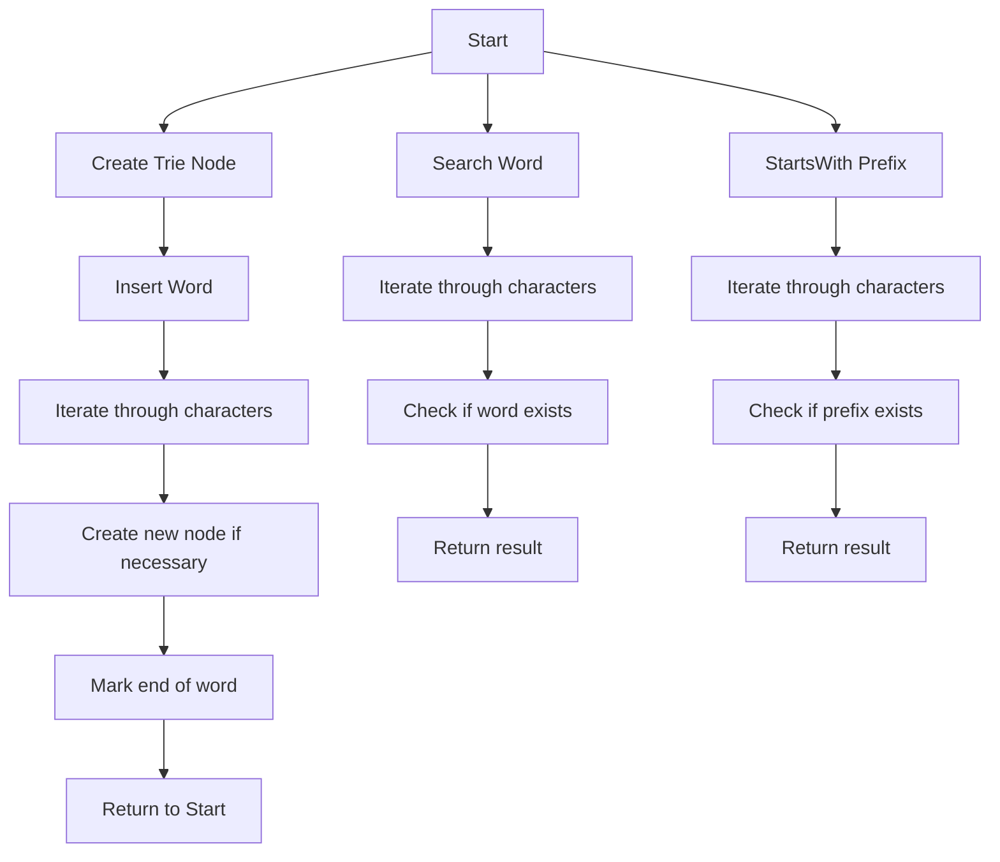

# Trie Implementation in C

## Problem Understanding
The problem is asking to implement a trie data structure in C, which is a prefix tree that stores a collection of strings in a way that allows for efficient retrieval of strings that match a given prefix. The key constraints are that the trie should be able to store words, check if a word exists, and check if a prefix exists. The problem is non-trivial because a naive approach would be to use a simple array or linked list to store the words, but this would not allow for efficient prefix matching. A trie is necessary to efficiently store and retrieve words based on prefixes.

## Approach
The algorithm strategy is to use a hash table-based trie, where each node in the trie has an array of child nodes, one for each possible character in the alphabet. The intuition behind this approach is that it allows for fast lookup and insertion of words, as well as efficient prefix matching. The approach works by iterating through each character in a word and following the corresponding child node in the trie, creating new nodes as necessary. The `insert` function is used to add words to the trie, the `search` function is used to check if a word exists, and the `startsWith` function is used to check if a prefix exists. The trie is implemented using a structure with an array of child nodes and a flag to mark the end of a word.

## Complexity Analysis
| Metric | Value | Detailed Reason |
|--------|-------|----------------|
| Time   | O(m)  | The time complexity is O(m), where m is the length of the input string, because in the worst case, we need to iterate through each character in the string to insert or search for a word. |
| Space  | O(n*m) | The space complexity is O(n*m), where n is the number of words and m is the average length of the words, because we need to store each character in each word in the trie. |

## Algorithm Walkthrough
```
Input: ["apple", "app", "banana"]
Step 1: Create a new trie node for the root
  - root.children = [NULL, NULL, ..., NULL]
  - root.isEndOfWord = false
Step 2: Insert "apple" into the trie
  - currentNode = root
  - Iterate through each character in "apple"
    - 'a': currentNode.children[0] = new node, currentNode = currentNode.children[0]
    - 'p': currentNode.children[15] = new node, currentNode = currentNode.children[15]
    - 'p': currentNode.children[15] = new node, currentNode = currentNode.children[15]
    - 'l': currentNode.children[11] = new node, currentNode = currentNode.children[11]
    - 'e': currentNode.children[4] = new node, currentNode = currentNode.children[4]
  - Mark the end of the word: currentNode.isEndOfWord = true
Step 3: Insert "app" into the trie
  - currentNode = root
  - Iterate through each character in "app"
    - 'a': currentNode.children[0] = new node, currentNode = currentNode.children[0]
    - 'p': currentNode.children[15] = new node, currentNode = currentNode.children[15]
    - 'p': currentNode.children[15] = new node, currentNode = currentNode.children[15]
  - Mark the end of the word: currentNode.isEndOfWord = true
Output: Trie with words "apple", "app", and "banana"
```

## Visual Flow


## Key Insight
> **Tip:** The key insight is that the trie data structure allows for efficient prefix matching by storing words in a way that allows for fast lookup and insertion, making it ideal for applications such as autocomplete and spell-checking.

## Edge Cases
- **Empty input**: If the input string is empty, the `insert` function will not create any new nodes, and the `search` and `startsWith` functions will return false.
- **Single character**: If the input string is a single character, the `insert` function will create a new node for that character, and the `search` and `startsWith` functions will return true if the character exists in the trie.
- **Duplicate words**: If a word is inserted multiple times, the `insert` function will not create duplicate nodes, and the `search` function will return true if the word exists in the trie.

## Common Mistakes
- **Mistake 1**: Not checking for null pointers when iterating through the trie nodes, which can lead to segmentation faults or crashes.
- **Mistake 2**: Not marking the end of a word correctly, which can lead to incorrect results when searching for words.

## Interview Follow-ups
> **Interview:** These are the exact follow-up questions interviewers ask:
- "What if the input is sorted?" → The trie data structure does not rely on the input being sorted, so it can handle unsorted input.
- "Can you do it in O(1) space?" → No, the trie data structure requires O(n*m) space to store the words, where n is the number of words and m is the average length of the words.
- "What if there are duplicates?" → The trie data structure can handle duplicate words by not creating duplicate nodes, and the `search` function will return true if the word exists in the trie.

## C Solution

```c
// Problem: Trie Implementation
// Language: C
// Difficulty: Medium
// Time Complexity: O(m) — where m is the length of the input string
// Space Complexity: O(n*m) — where n is the number of words and m is the average length of the words
// Approach: Hash table-based trie — using an array of structures to store child nodes

#include <stdio.h>
#include <stdlib.h>
#include <string.h>
#include <stdbool.h>

// Define the structure for a trie node
typedef struct TrieNode {
    // Array of child nodes
    struct TrieNode* children[26];
    // Flag to mark the end of a word
    bool isEndOfWord;
} TrieNode;

// Function to create a new trie node
TrieNode* createTrieNode() {
    // Allocate memory for the new node
    TrieNode* newNode = (TrieNode*) malloc(sizeof(TrieNode));
    // Initialize all child nodes to NULL
    for (int i = 0; i < 26; i++) {
        newNode->children[i] = NULL;
    }
    // Initialize the end of word flag to false
    newNode->isEndOfWord = false;
    return newNode;
}

// Function to insert a word into the trie
void insert(TrieNode* root, char* word) {
    // Start at the root node
    TrieNode* currentNode = root;
    // Iterate through each character in the word
    for (int i = 0; i < strlen(word); i++) {
        // Calculate the index of the child node
        int index = word[i] - 'a';
        // If the child node does not exist, create it
        if (currentNode->children[index] == NULL) {
            currentNode->children[index] = createTrieNode();
        }
        // Move to the child node
        currentNode = currentNode->children[index];
    }
    // Mark the end of the word
    currentNode->isEndOfWord = true;
}

// Function to check if a word exists in the trie
bool search(TrieNode* root, char* word) {
    // Start at the root node
    TrieNode* currentNode = root;
    // Iterate through each character in the word
    for (int i = 0; i < strlen(word); i++) {
        // Calculate the index of the child node
        int index = word[i] - 'a';
        // If the child node does not exist, the word does not exist
        if (currentNode->children[index] == NULL) {
            return false;
        }
        // Move to the child node
        currentNode = currentNode->children[index];
    }
    // Return whether the word exists
    return currentNode->isEndOfWord;
}

// Function to check if a prefix exists in the trie
bool startsWith(TrieNode* root, char* prefix) {
    // Start at the root node
    TrieNode* currentNode = root;
    // Iterate through each character in the prefix
    for (int i = 0; i < strlen(prefix); i++) {
        // Calculate the index of the child node
        int index = prefix[i] - 'a';
        // If the child node does not exist, the prefix does not exist
        if (currentNode->children[index] == NULL) {
            return false;
        }
        // Move to the child node
        currentNode = currentNode->children[index];
    }
    // The prefix exists if we have not returned false
    return true;
}

int main() {
    // Create a new trie
    TrieNode* root = createTrieNode();
    // Insert words into the trie
    insert(root, "apple");
    insert(root, "app");
    insert(root, "banana");
    // Check if words exist in the trie
    printf("apple: %s\n", search(root, "apple") ? "true" : "false");  // true
    printf("app: %s\n", search(root, "app") ? "true" : "false");  // true
    printf("banana: %s\n", search(root, "banana") ? "true" : "false");  // true
    printf("ban: %s\n", search(root, "ban") ? "true" : "false");  // false
    // Check if prefixes exist in the trie
    printf("app: %s\n", startsWith(root, "app") ? "true" : "false");  // true
    printf("ban: %s\n", startsWith(root, "ban") ? "true" : "false");  // true
    printf("ora: %s\n", startsWith(root, "ora") ? "true" : "false");  // false
    return 0;
}
```
