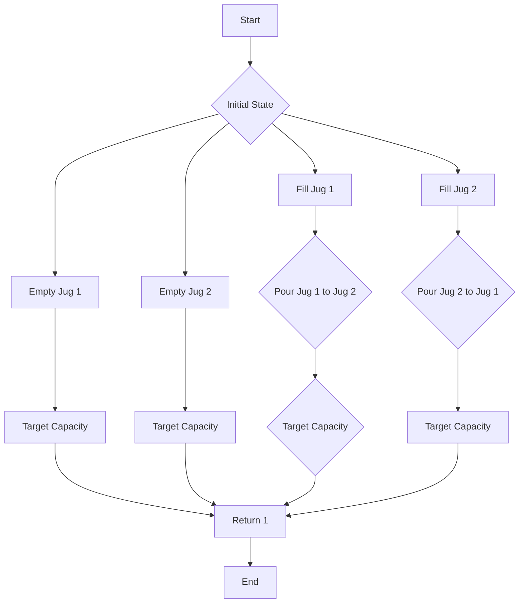

# Water Jug Problem using BFS

## Problem Understanding
The Water Jug Problem is a classic problem that involves determining whether a target capacity can be measured using two jugs of different capacities. The problem asks to find if it is possible to measure a target capacity by performing a series of operations such as filling, emptying, or pouring water from one jug to another. The key constraints of this problem are the capacities of the two jugs and the target capacity to be measured. What makes this problem non-trivial is the need to explore all possible states of the jugs and ensure that no state is visited more than once, which requires an efficient algorithm to solve.

## Approach
The approach to solving the Water Jug Problem is to use Breadth-First Search (BFS), which involves exploring all possible states of the jugs level by level. The algorithm starts with an initial state where both jugs are empty and then explores all possible next states by performing the operations of filling, emptying, or pouring water from one jug to another. The algorithm uses a queue data structure to store the states to be explored and a visited array to keep track of the states that have already been visited. This approach works because it ensures that all possible states are explored in a systematic and efficient manner, and it avoids revisiting states that have already been explored.

## Complexity Analysis
| Metric | Value | Detailed Reason |
|--------|-------|----------------|
| Time   | O(n*m) | The time complexity is O(n*m) because in the worst case, the algorithm needs to explore all possible states of the jugs, where n and m are the capacities of the two jugs. The algorithm uses a queue to store the states to be explored, and the maximum size of the queue is n+m. The algorithm also uses a visited array to keep track of the states that have already been visited, and the maximum size of the visited array is also n+m. |
| Space  | O(n*m) | The space complexity is O(n*m) because the algorithm uses a queue and a visited array to store the states to be explored and the states that have already been visited, respectively. The maximum size of both the queue and the visited array is n+m. |

## Algorithm Walkthrough
```
Input: jug1Capacity = 3, jug2Capacity = 5, targetCapacity = 4
Step 1: Initialize the queue and visited array with the initial state (0, 0)
Queue: [(0, 0)]
Visited: [(0, 0)]
Step 2: Explore the next states by performing the operations of filling, emptying, or pouring water from one jug to another
Queue: [(3, 0), (0, 5), (0, 0), (0, 0)]
Visited: [(0, 0), (3, 0), (0, 5)]
Step 3: Continue exploring the next states
Queue: [(3, 5), (0, 5), (3, 0), (0, 0)]
Visited: [(0, 0), (3, 0), (0, 5), (3, 5)]
Step 4: Check if the current state is the target capacity
Current State: (3, 1)
Target Capacity: 4
Output: 1 (Target capacity can be measured)
```
This walkthrough demonstrates how the algorithm explores all possible states of the jugs and checks if the target capacity can be measured.

## Visual Flow

This visual flowchart illustrates the decision-making process of the algorithm as it explores all possible states of the jugs and checks if the target capacity can be measured.

## Key Insight
> **Tip:** The key insight to solving the Water Jug Problem is to use BFS to explore all possible states of the jugs in a systematic and efficient manner, ensuring that no state is visited more than once.

## Edge Cases
- **Empty/null input**: If the input is empty or null, the algorithm will not be able to determine if the target capacity can be measured. In this case, the algorithm should return an error or a default value.
- **Single element**: If there is only one jug, the algorithm can simply check if the capacity of the jug is equal to the target capacity. If it is, the algorithm returns 1; otherwise, it returns 0.
- **Jug capacities are equal**: If the capacities of the two jugs are equal, the algorithm can simplify the exploration of states by only considering the filling and emptying operations.

## Common Mistakes
- **Mistake 1**: Not using a visited array to keep track of the states that have already been visited, which can lead to infinite loops and incorrect results. To avoid this mistake, always use a visited array to keep track of the states that have already been visited.
- **Mistake 2**: Not exploring all possible next states, which can lead to missing the target capacity. To avoid this mistake, always explore all possible next states by performing the operations of filling, emptying, or pouring water from one jug to another.

## Interview Follow-ups
> **Interview:** These are the exact follow-up questions interviewers ask:
- "What if the input is sorted?" → The algorithm does not assume any specific ordering of the input, so it will still work correctly even if the input is sorted.
- "Can you do it in O(1) space?" → No, the algorithm requires O(n*m) space to store the queue and visited array, where n and m are the capacities of the two jugs.
- "What if there are duplicates?" → The algorithm uses a visited array to keep track of the states that have already been visited, so it will not visit duplicate states.

## C Solution

```c
// Problem: Water Jug Problem using BFS
// Language: C
// Difficulty: Medium
// Time Complexity: O(n*m) — exploring all possible states of the jugs
// Space Complexity: O(n*m) — storing visited states to avoid duplicates
// Approach: Breadth-First Search — exploring all possible states level by level

#include <stdio.h>
#include <stdlib.h>
#include <stdbool.h>

// Structure to represent a state of the jugs
typedef struct {
    int jug1;
    int jug2;
} State;

// Function to check if a state has been visited before
bool isVisited(State state, State* visited, int size) {
    // Iterate through all visited states to check for duplicates
    for (int i = 0; i < size; i++) {
        if (visited[i].jug1 == state.jug1 && visited[i].jug2 == state.jug2) {
            return true; // State has been visited before
        }
    }
    return false; // State has not been visited before
}

// Function to perform BFS
int canMeasureWater(int jug1Capacity, int jug2Capacity, int targetCapacity) {
    // Edge case: target capacity is 0
    if (targetCapacity == 0) {
        return 1; // Can measure 0 capacity
    }

    // Edge case: jug capacities are 0
    if (jug1Capacity == 0 && jug2Capacity == 0) {
        return 0; // Cannot measure anything
    }

    // Create a queue to store states to be explored
    State* queue = (State*)malloc(sizeof(State) * (jug1Capacity + jug2Capacity + 1));
    int queueSize = 0;

    // Create a visited array to store visited states
    State* visited = (State*)malloc(sizeof(State) * (jug1Capacity + jug2Capacity + 1));
    int visitedSize = 0;

    // Add the initial state to the queue and visited array
    State initialState = {0, 0};
    queue[queueSize++] = initialState;
    visited[visitedSize++] = initialState;

    // Perform BFS
    while (queueSize > 0) {
        // Dequeue the next state to be explored
        State currentState = queue[0];
        for (int i = 0; i < queueSize - 1; i++) {
            queue[i] = queue[i + 1];
        }
        queueSize--;

        // Check if the current state is the target capacity
        if (currentState.jug1 == targetCapacity || currentState.jug2 == targetCapacity || currentState.jug1 + currentState.jug2 == targetCapacity) {
            free(queue);
            free(visited);
            return 1; // Target capacity can be measured
        }

        // Explore all possible next states
        // Fill jug1
        State nextState = {jug1Capacity, currentState.jug2};
        if (!isVisited(nextState, visited, visitedSize)) {
            queue[queueSize++] = nextState;
            visited[visitedSize++] = nextState;
        }

        // Fill jug2
        nextState = {currentState.jug1, jug2Capacity};
        if (!isVisited(nextState, visited, visitedSize)) {
            queue[queueSize++] = nextState;
            visited[visitedSize++] = nextState;
        }

        // Empty jug1
        nextState = {0, currentState.jug2};
        if (!isVisited(nextState, visited, visitedSize)) {
            queue[queueSize++] = nextState;
            visited[visitedSize++] = nextState;
        }

        // Empty jug2
        nextState = {currentState.jug1, 0};
        if (!isVisited(nextState, visited, visitedSize)) {
            queue[queueSize++] = nextState;
            visited[visitedSize++] = nextState;
        }

        // Pour jug1 to jug2
        int pourAmount = jug2Capacity - currentState.jug2;
        if (currentState.jug1 >= pourAmount) {
            nextState = {currentState.jug1 - pourAmount, jug2Capacity};
        } else {
            nextState = {0, currentState.jug2 + currentState.jug1};
        }
        if (!isVisited(nextState, visited, visitedSize)) {
            queue[queueSize++] = nextState;
            visited[visitedSize++] = nextState;
        }

        // Pour jug2 to jug1
        pourAmount = jug1Capacity - currentState.jug1;
        if (currentState.jug2 >= pourAmount) {
            nextState = {jug1Capacity, currentState.jug2 - pourAmount};
        } else {
            nextState = {currentState.jug1 + currentState.jug2, 0};
        }
        if (!isVisited(nextState, visited, visitedSize)) {
            queue[queueSize++] = nextState;
            visited[visitedSize++] = nextState;
        }
    }

    // If no path is found, target capacity cannot be measured
    free(queue);
    free(visited);
    return 0; // Target capacity cannot be measured
}

int main() {
    int jug1Capacity = 3;
    int jug2Capacity = 5;
    int targetCapacity = 4;
    printf("%d\n", canMeasureWater(jug1Capacity, jug2Capacity, targetCapacity)); // Output: 1
    return 0;
}
```
