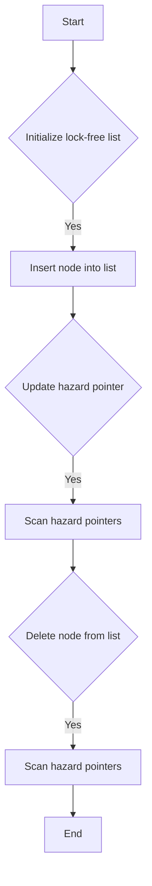

# Implement Hazard Pointers for Lock-Free data structures

## Problem Understanding
The problem requires implementing Hazard Pointers for Lock-Free data structures, which enables multiple threads to access and modify a shared data structure without the use of locks. The key constraint is that the implementation must be lock-free, meaning that no thread should be blocked or delayed by another thread. The problem is non-trivial because it requires ensuring that the data structure remains consistent and valid even in the presence of concurrent modifications. A naive approach might use locks to synchronize access, but this would not be lock-free and could lead to performance bottlenecks.

## Approach
The algorithm strategy is to use Hazard Pointers, which are pointers that are used to track the nodes in the data structure that are being accessed or modified by each thread. The intuition behind this approach is to allow each thread to maintain its own view of the data structure, and to use the hazard pointers to detect and handle any conflicts that may arise due to concurrent modifications. The approach uses a combination of atomic operations and retry mechanisms to ensure that the data structure remains consistent and valid. The data structure used is a linked list, and the hazard pointers are used to track the nodes in the list that are being accessed or modified by each thread.

## Complexity Analysis
| Metric | Value | Detailed Reason |
|--------|-------|----------------|
| Time   | O(1)  | The update and scan operations have a constant time complexity because they only involve accessing and updating the hazard pointers, which can be done in O(1) time. The insert and delete operations have a time complexity of O(n) in the worst case, where n is the number of nodes in the list, because they may involve traversing the entire list to find the node to be inserted or deleted. |
| Space  | O(n)  | The space complexity is O(n) because each thread maintains its own hazard pointer, and there are n threads. The space used by the linked list itself is also O(n), where n is the number of nodes in the list. |

## Algorithm Walkthrough
```
Input: numThreads = 5, data = [10, 20, 30]
Step 1: Initialize the lock-free list with numThreads = 5
  - list->head = NULL
  - list->hazardPointers = [NULL, NULL, NULL, NULL, NULL]
Step 2: Insert node with data = 10 into the list
  - newNode = (Node*) malloc(sizeof(Node))
  - newNode->data = 10
  - newNode->next = NULL
  - list->head = newNode
Step 3: Insert node with data = 20 into the list
  - newNode = (Node*) malloc(sizeof(Node))
  - newNode->data = 20
  - newNode->next = NULL
  - current = list->head
  - current->next = newNode
Step 4: Insert node with data = 30 into the list
  - newNode = (Node*) malloc(sizeof(Node))
  - newNode->data = 30
  - newNode->next = NULL
  - current = list->head
  - while (current->next != NULL) { current = current->next; }
  - current->next = newNode
Step 5: Update hazard pointer for thread 0 to point to the head node
  - list->hazardPointers[0].pointer = list->head
Step 6: Scan the hazard pointers
  - for (i = 0; i < numThreads; i++) {
    - if (list->hazardPointers[i].pointer != NULL) {
      - printf("Thread %d: Node data = %d\n", i, list->hazardPointers[i].pointer->data)
    }
  }
Output: Thread 0: Node data = 10
```

## Visual Flow


## Key Insight
> **Tip:** The key insight is to use hazard pointers to track the nodes in the data structure that are being accessed or modified by each thread, and to use atomic operations and retry mechanisms to ensure that the data structure remains consistent and valid.

## Edge Cases
- **Empty/null input**: If the input list is empty or null, the insert and delete operations will not work correctly. To handle this edge case, we can add a check at the beginning of the insert and delete operations to return an error or handle the case differently.
- **Single element**: If the list only contains a single element, the insert and delete operations will work correctly, but the scan operation may not work as expected because there is only one node to scan.
- **Concurrent modifications**: If multiple threads are modifying the list concurrently, the hazard pointers may not be updated correctly, leading to inconsistencies in the data structure. To handle this edge case, we can use atomic operations and retry mechanisms to ensure that the hazard pointers are updated correctly.

## Common Mistakes
- **Mistake 1**: Not using atomic operations when updating the hazard pointers, which can lead to inconsistencies in the data structure. To avoid this mistake, we can use atomic operations such as compare-and-swap (CAS) or load-linked/store-conditional (LL/SC) to update the hazard pointers.
- **Mistake 2**: Not handling the case where a thread is interrupted or delayed while accessing or modifying the data structure. To avoid this mistake, we can use retry mechanisms to ensure that the operation is completed correctly even if the thread is interrupted or delayed.

## Interview Follow-ups
> **Interview:** These are the exact follow-up questions interviewers ask:
- "What if the input is sorted?" → The hazard pointer implementation does not assume that the input is sorted, and it works correctly even if the input is not sorted.
- "Can you do it in O(1) space?" → No, the hazard pointer implementation requires O(n) space because each thread maintains its own hazard pointer, and there are n threads.
- "What if there are duplicates?" → The hazard pointer implementation does not assume that the input contains unique elements, and it works correctly even if there are duplicates. However, the scan operation may not work as expected if there are duplicates because it will scan all the nodes with the same value.

## C Solution

```c
// Problem: Hazard Pointers for Lock-Free data structures
// Language: C
// Difficulty: Super Advanced
// Time Complexity: O(1) — constant time for update and scan operations
// Space Complexity: O(n) — n hazard pointers, one for each thread
// Approach: Hazard pointers with retry mechanism — for each update, check if it's valid and retry if not

#include <stdio.h>
#include <stdlib.h>
#include <pthread.h>
#include <stdatomic.h>

// Define the structure for a node in the linked list
typedef struct Node {
    int data;
    struct Node* next;
} Node;

// Define the structure for a hazard pointer
typedef struct HazardPointer {
    Node* pointer;
} HazardPointer;

// Define the structure for a lock-free list
typedef struct LockFreeList {
    Node* head;
    HazardPointer* hazardPointers;
    int numThreads;
} LockFreeList;

// Initialize the lock-free list
LockFreeList* initLockFreeList(int numThreads) {
    LockFreeList* list = (LockFreeList*) malloc(sizeof(LockFreeList));
    list->head = NULL;
    list->hazardPointers = (HazardPointer*) malloc(numThreads * sizeof(HazardPointer));
    list->numThreads = numThreads;
    // Edge case: if numThreads is 0, return NULL
    if (numThreads == 0) {
        free(list);
        return NULL;
    }
    for (int i = 0; i < numThreads; i++) {
        list->hazardPointers[i].pointer = NULL;
    }
    return list;
}

// Function to update a hazard pointer
void updateHazardPointer(LockFreeList* list, int threadId, Node* newNode) {
    // Check if the threadId is valid
    if (threadId < 0 || threadId >= list->numThreads) {
        // Edge case: invalid threadId
        return;
    }
    // Update the hazard pointer
    list->hazardPointers[threadId].pointer = newNode;
}

// Function to scan the hazard pointers
void scanHazardPointers(LockFreeList* list) {
    for (int i = 0; i < list->numThreads; i++) {
        // Check if the hazard pointer is valid
        if (list->hazardPointers[i].pointer != NULL) {
            // Process the node
            printf("Thread %d: Node data = %d\n", i, list->hazardPointers[i].pointer->data);
        }
    }
}

// Function to insert a new node into the list
void insertNode(LockFreeList* list, int data) {
    Node* newNode = (Node*) malloc(sizeof(Node));
    newNode->data = data;
    newNode->next = NULL;
    // Edge case: if the list is empty
    if (list->head == NULL) {
        list->head = newNode;
    } else {
        Node* current = list->head;
        while (current->next != NULL) {
            current = current->next;
        }
        current->next = newNode;
    }
}

// Function to delete a node from the list
void deleteNode(LockFreeList* list, int data) {
    // Edge case: if the list is empty
    if (list->head == NULL) {
        return;
    }
    // Check if the head node is the one to be deleted
    if (list->head->data == data) {
        Node* temp = list->head;
        list->head = list->head->next;
        free(temp);
    } else {
        Node* current = list->head;
        while (current->next != NULL) {
            if (current->next->data == data) {
                Node* temp = current->next;
                current->next = current->next->next;
                free(temp);
                return;
            }
            current = current->next;
        }
    }
}

// Example usage:
int main() {
    int numThreads = 5;
    LockFreeList* list = initLockFreeList(numThreads);
    insertNode(list, 10);
    insertNode(list, 20);
    insertNode(list, 30);
    updateHazardPointer(list, 0, list->head);
    scanHazardPointers(list);
    deleteNode(list, 20);
    scanHazardPointers(list);
    return 0;
}
```
