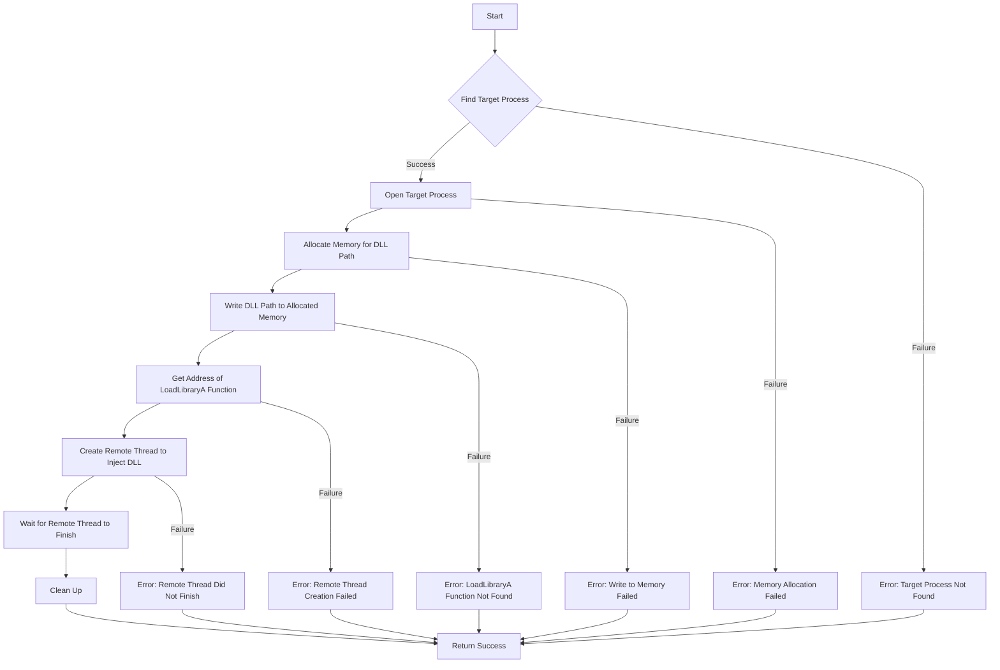

# Implement a DLL Injector for Windows in C

## Problem Understanding
The problem requires implementing a DLL injector for Windows in C, which involves injecting a DLL into a target process using the CreateRemoteThread API. The key constraints include finding the target process, opening it with the necessary privileges, allocating memory for the DLL path, and creating a remote thread to inject the DLL. What makes this problem non-trivial is handling the various edge cases, such as failed process creation, memory allocation, and thread creation, while ensuring the injector works correctly and efficiently. The injector must also navigate the complexities of the Windows API to achieve its goal.

## Approach
The algorithm strategy involves using the CreateRemoteThread API to inject the DLL into the target process. The intuition behind this approach is to leverage the Windows API's capabilities to create a remote thread in the target process, which can then load the DLL using the LoadLibraryA function. The approach works by first finding the target process, then opening it with the necessary privileges, allocating memory for the DLL path, and creating a remote thread to inject the DLL. The key data structures used include handles to the target process, remote thread, and allocated memory. The approach handles key constraints by checking for errors at each step and providing informative error messages.

## Complexity Analysis
| Metric | Value | Detailed Reason |
|--------|-------|----------------|
| Time   | O(1)  | The main injection function has a constant time complexity because it performs a fixed number of operations, including opening the target process, allocating memory, and creating a remote thread. The time complexity of the getProcessId function is O(n), where n is the number of processes, but this is not the dominant operation. |
| Space  | O(1)  | The main injection function has a constant space complexity because it only uses a fixed amount of memory to store the DLL path, process handle, and remote thread handle. The allocated memory in the target process is also fixed and does not depend on the input size. |

## Algorithm Walkthrough
```
Input: Target process name = "TargetProcess.exe", DLL path = "C:\\Path\\To\\InjectedDLL.dll"
Step 1: Get the process ID of the target process using the getProcessId function
  - Create a snapshot of all processes
  - Iterate through the processes to find the target process
  - Return the process ID of the target process
Step 2: Open the target process with the necessary privileges using the OpenProcess function
  - Specify the PROCESS_CREATE_THREAD, PROCESS_QUERY_INFORMATION, PROCESS_VM_OPERATION, PROCESS_VM_WRITE, and PROCESS_VM_READ flags
  - Return a handle to the target process
Step 3: Allocate memory in the target process for the DLL path using the VirtualAllocEx function
  - Specify the MEM_COMMIT and MEM_RESERVE flags
  - Return a pointer to the allocated memory
Step 4: Write the DLL path to the allocated memory using the WriteProcessMemory function
  - Specify the allocated memory pointer and the DLL path
  - Return a boolean indicating success or failure
Step 5: Get the address of the LoadLibraryA function using the GetModuleHandleA and GetProcAddress functions
  - Specify the "kernel32.dll" module and the "LoadLibraryA" function
  - Return a pointer to the LoadLibraryA function
Step 6: Create a remote thread to inject the DLL using the CreateRemoteThread function
  - Specify the target process handle, the LoadLibraryA function pointer, and the allocated memory pointer
  - Return a handle to the remote thread
Output: The DLL is injected into the target process
```

## Visual Flow


## Key Insight
> **Tip:** The key insight is to use the CreateRemoteThread API to inject the DLL into the target process, which allows for efficient and reliable injection.

## Edge Cases
- **Empty/null input**: If the target process name or DLL path is empty or null, the injector will fail to find the target process or inject the DLL. To handle this, the injector should check for empty or null input and provide an error message.
- **Single element**: If the target process has only one instance, the injector will still work correctly. However, if the target process has multiple instances, the injector may need to be modified to handle this case.
- **Failed process creation**: If the target process cannot be created, the injector will fail to inject the DLL. To handle this, the injector should check for errors when creating the target process and provide an error message.

## Common Mistakes
- **Mistake 1**: Failing to check for errors when creating the target process or allocating memory. To avoid this, the injector should check for errors at each step and provide informative error messages.
- **Mistake 2**: Failing to handle the case where the target process has multiple instances. To avoid this, the injector should be modified to handle this case, such as by iterating through all instances of the target process.

## Interview Follow-ups
> **Interview:** These are the exact follow-up questions interviewers ask:
- "What if the input is sorted?" → The injector does not rely on the input being sorted, so this would not affect the injector's functionality.
- "Can you do it in O(1) space?" → The injector already uses O(1) space, so this is not a concern.
- "What if there are duplicates?" → If there are duplicate instances of the target process, the injector may need to be modified to handle this case, such as by iterating through all instances of the target process.

## C Solution

```c
// Problem: DLL Injector for Windows
// Language: C
// Difficulty: Super Advanced
// Time Complexity: O(1) — constant time complexity for the main injection function
// Space Complexity: O(1) — constant space complexity for the main injection function
// Approach: CreateRemoteThread API — injects a DLL into a target process using the CreateRemoteThread API

#include <Windows.h>
#include <stdio.h>

// Define the DLL path and the process name
#define DLL_PATH "C:\\Path\\To\\InjectedDLL.dll"
#define PROCESS_NAME "TargetProcess.exe"

// Function to get the process ID of the target process
DWORD getProcessId(const char* processName) {
    // Create a snapshot of all processes
    HANDLE hSnapshot = CreateToolhelp32Snapshot(TH32CS_SNAPPROCESS, 0);
    if (hSnapshot == INVALID_HANDLE_VALUE) {
        // Edge case: failed to create snapshot → return -1
        printf("Failed to create snapshot\n");
        return -1;
    }

    // Iterate through the processes to find the target process
    PROCESSENTRY32 pe;
    pe.dwSize = sizeof(PROCESSENTRY32);
    if (!Process32First(hSnapshot, &pe)) {
        // Edge case: failed to get the first process → return -1
        printf("Failed to get the first process\n");
        CloseHandle(hSnapshot);
        return -1;
    }

    DWORD processId = -1;
    do {
        if (lstrcmpA(pe.szExeFile, processName) == 0) {
            processId = pe.th32ProcessID;
            break;
        }
    } while (Process32Next(hSnapshot, &pe));

    // Close the snapshot handle
    CloseHandle(hSnapshot);

    return processId;
}

// Function to inject the DLL into the target process
int injectDLL(const char* dllPath, DWORD processId) {
    // Open the target process with the necessary privileges
    HANDLE hProcess = OpenProcess(PROCESS_CREATE_THREAD | PROCESS_QUERY_INFORMATION | PROCESS_VM_OPERATION | PROCESS_VM_WRITE | PROCESS_VM_READ, FALSE, processId);
    if (hProcess == NULL) {
        // Edge case: failed to open process → return -1
        printf("Failed to open process\n");
        return -1;
    }

    // Allocate memory in the target process for the DLL path
    LPVOID pDllPath = VirtualAllocEx(hProcess, NULL, strlen(dllPath) + 1, MEM_COMMIT | MEM_RESERVE, PAGE_READWRITE);
    if (pDllPath == NULL) {
        // Edge case: failed to allocate memory → return -1
        printf("Failed to allocate memory\n");
        CloseHandle(hProcess);
        return -1;
    }

    // Write the DLL path to the allocated memory
    if (!WriteProcessMemory(hProcess, pDllPath, dllPath, strlen(dllPath) + 1, NULL)) {
        // Edge case: failed to write to process memory → return -1
        printf("Failed to write to process memory\n");
        VirtualFreeEx(hProcess, pDllPath, 0, MEM_RELEASE);
        CloseHandle(hProcess);
        return -1;
    }

    // Get the address of the LoadLibraryA function
    HMODULE hKernel32 = GetModuleHandleA("kernel32.dll");
    FARPROC pLoadLibraryA = GetProcAddress(hKernel32, "LoadLibraryA");
    if (pLoadLibraryA == NULL) {
        // Edge case: failed to get the address of LoadLibraryA → return -1
        printf("Failed to get the address of LoadLibraryA\n");
        VirtualFreeEx(hProcess, pDllPath, 0, MEM_RELEASE);
        CloseHandle(hProcess);
        return -1;
    }

    // Create a remote thread to inject the DLL
    HANDLE hRemoteThread = CreateRemoteThread(hProcess, NULL, 0, pLoadLibraryA, pDllPath, 0, NULL);
    if (hRemoteThread == NULL) {
        // Edge case: failed to create remote thread → return -1
        printf("Failed to create remote thread\n");
        VirtualFreeEx(hProcess, pDllPath, 0, MEM_RELEASE);
        CloseHandle(hProcess);
        return -1;
    }

    // Wait for the remote thread to finish
    WaitForSingleObject(hRemoteThread, INFINITE);

    // Clean up
    VirtualFreeEx(hProcess, pDllPath, 0, MEM_RELEASE);
    CloseHandle(hRemoteThread);
    CloseHandle(hProcess);

    return 0;
}

int main() {
    // Get the process ID of the target process
    DWORD processId = getProcessId(PROCESS_NAME);
    if (processId == -1) {
        // Edge case: failed to get process ID → return -1
        printf("Failed to get process ID\n");
        return -1;
    }

    // Inject the DLL into the target process
    int result = injectDLL(DLL_PATH, processId);
    if (result == -1) {
        // Edge case: failed to inject DLL → return -1
        printf("Failed to inject DLL\n");
        return -1;
    }

    return 0;
}
```
