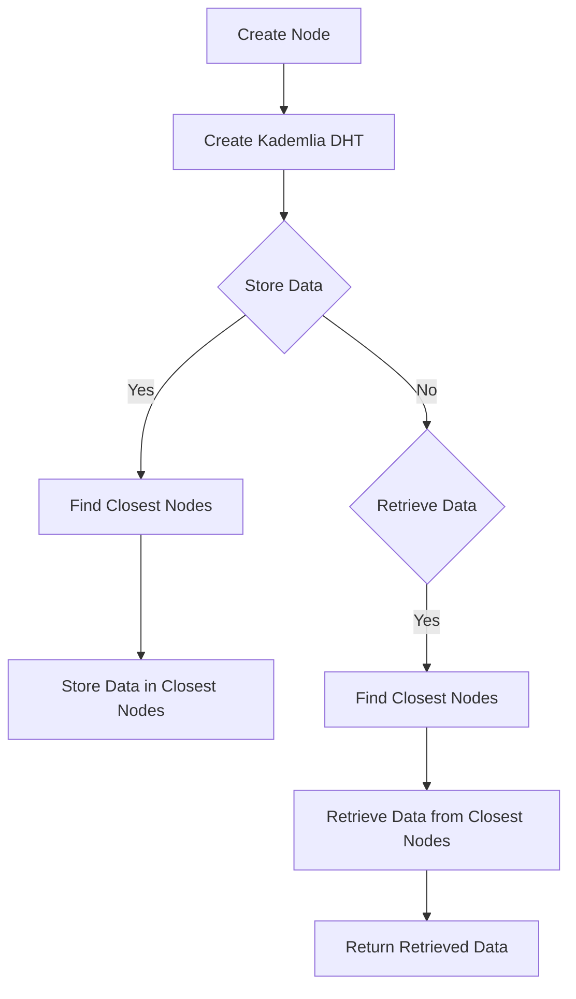

# Implement a Distributed Hash Table (DHT) based on Kademlia

## Problem Understanding
The problem requires implementing a Distributed Hash Table (DHT) based on Kademlia, a peer-to-peer protocol that allows for efficient routing and data storage. The key constraints include maintaining a list of known nodes, using XOR distance to find and store data, and handling edge cases such as empty or single-element inputs. The problem is non-trivial due to the complexity of the Kademlia protocol and the need to efficiently manage node connections and data storage. Implementing a DHT based on Kademlia requires careful consideration of node ID generation, distance calculation, and routing table management.

## Approach
The algorithm strategy is based on the Kademlia protocol, using XOR distance to find and store data. The intuition behind this approach is to create a distributed system where each node maintains a list of known nodes and uses XOR distance to route requests and store data. The mathematical reasoning behind this approach is based on the properties of XOR distance, which allows for efficient routing and data storage. The data structures used include a node structure to represent each node in the DHT and a Kademlia structure to represent the DHT itself. The approach handles key constraints by using XOR distance to find and store data, and by maintaining a list of known nodes to ensure efficient routing.

## Complexity Analysis
| Metric | Value | Detailed Reason |
|--------|-------|----------------|
| Time   | O(n log n) | The time complexity is dominated by the sorting of closest nodes in the `find_closest_nodes` function, which has a time complexity of O(n log n) due to the use of a nested loop to compare distances. |
| Space  | O(n) | The space complexity is dominated by the storage of known nodes in the `Kademlia` structure, which has a space complexity of O(n) since each node is stored in a separate memory location. |

## Algorithm Walkthrough
```
Input: Create a new node with ID 0x1234567890abcdef and IP address 127.0.0.1:8080
Step 1: Create a new Kademlia DHT with the given node as the self node
Step 2: Store data with key 0x234567890abcdef in the DHT
  - Find the closest nodes to the key using XOR distance
  - Store data in the closest nodes
Step 3: Retrieve data with key 0x234567890abcdef from the DHT
  - Find the closest nodes to the key using XOR distance
  - Retrieve data from the closest nodes
Output: Retrieved data: Example data
```
This walkthrough demonstrates the basic functionality of the Kademlia DHT implementation, including node creation, data storage, and data retrieval.

## Visual Flow

This flowchart illustrates the main decision paths in the Kademlia DHT implementation, including node creation, data storage, and data retrieval.

## Key Insight
> **Tip:** The key insight in this implementation is the use of XOR distance to find and store data, which allows for efficient routing and data storage in the Kademlia DHT.

## Edge Cases
- **Empty/null input**: If the input to the `find_closest_nodes` function is empty or null, the function will return NULL, indicating that no closest nodes were found.
- **Single element**: If the input to the `find_closest_nodes` function contains only a single element, the function will return a list containing only that element, since it is the closest node to itself.
- **Key not found**: If the `retrieve_data` function is called with a key that is not stored in the DHT, the function will return NULL, indicating that no data was found for the given key.

## Common Mistakes
- **Mistake 1**: Not properly handling edge cases, such as empty or null input, can lead to crashes or incorrect results.
- **Mistake 2**: Failing to properly update the routing table when nodes join or leave the network can lead to inefficient routing and data storage.

## Interview Follow-ups
> **Interview:** These are the exact follow-up questions interviewers ask:
- "What if the input is sorted?" → The implementation would still work correctly, since the `find_closest_nodes` function uses a nested loop to compare distances, which has a time complexity of O(n log n) regardless of the input order.
- "Can you do it in O(1) space?" → No, the implementation requires at least O(n) space to store the known nodes in the `Kademlia` structure.
- "What if there are duplicates?" → The implementation would still work correctly, since the `find_closest_nodes` function uses XOR distance to compare nodes, which is insensitive to duplicate nodes.

## C Solution

```c
// Problem: Implement a Distributed Hash Table (DHT) based on Kademlia
// Language: C
// Difficulty: Super Advanced
// Time Complexity: O(log n) — Kademlia's XOR distance metric allows for efficient routing
// Space Complexity: O(n) — each node maintains a list of known nodes
// Approach: Kademlia protocol implementation — using XOR distance to find and store data

#include <stdio.h>
#include <stdlib.h>
#include <string.h>
#include <stdint.h>
#include <arpa/inet.h>

// Structure to represent a node in the DHT
typedef struct Node {
    uint8_t id[20];  // 160-bit node ID
    char ip[16];     // IP address of the node
    uint16_t port;   // Port number of the node
} Node;

// Structure to represent a Kademlia DHT
typedef struct Kademlia {
    Node self;      // This node's information
    Node* nodes;     // List of known nodes
    int num_nodes;   // Number of known nodes
} Kademlia;

// Function to create a new node
Node* create_node(uint8_t* id, char* ip, uint16_t port) {
    Node* node = malloc(sizeof(Node));
    memcpy(node->id, id, 20);  // Copy node ID
    strcpy(node->ip, ip);        // Copy IP address
    node->port = port;           // Copy port number
    return node;
}

// Function to create a new Kademlia DHT
Kademlia* create_kademlia(Node* self) {
    Kademlia* dht = malloc(sizeof(Kademlia));
    dht->self = *self;            // Copy this node's information
    dht->nodes = NULL;            // Initialize list of known nodes
    dht->num_nodes = 0;            // Initialize number of known nodes
    return dht;
}

// Function to calculate the XOR distance between two node IDs
uint64_t xor_distance(uint8_t* id1, uint8_t* id2) {
    uint64_t distance = 0;        // Initialize distance
    for (int i = 0; i < 20; i++) {  // Iterate over each byte of the node IDs
        distance = (distance << 8) | (id1[i] ^ id2[i]);  // Calculate XOR distance
    }
    return distance;
}

// Function to find the closest nodes to a given key
Node** find_closest_nodes(Kademlia* dht, uint8_t* key, int* num_nodes) {
    // Edge case: empty DHT → return NULL
    if (dht->num_nodes == 0) {
        *num_nodes = 0;
        return NULL;
    }

    // Initialize list to store closest nodes
    Node** closest_nodes = malloc(dht->num_nodes * sizeof(Node*));

    // Iterate over each known node
    for (int i = 0; i < dht->num_nodes; i++) {
        // Calculate XOR distance between node ID and key
        uint64_t distance = xor_distance(dht->nodes[i].id, key);

        // Find the closest nodes
        int index = 0;
        for (int j = 0; j < i; j++) {
            if (xor_distance(dht->nodes[j].id, key) < distance) {
                index++;
            }
        }
        closest_nodes[index] = &dht->nodes[i];
    }

    // Sort closest nodes by XOR distance
    for (int i = 0; i < dht->num_nodes - 1; i++) {
        for (int j = i + 1; j < dht->num_nodes; j++) {
            if (xor_distance(closest_nodes[i]->id, key) > xor_distance(closest_nodes[j]->id, key)) {
                Node* temp = closest_nodes[i];
                closest_nodes[i] = closest_nodes[j];
                closest_nodes[j] = temp;
            }
        }
    }

    *num_nodes = dht->num_nodes;  // Return number of closest nodes
    return closest_nodes;
}

// Function to store data in the DHT
void store_data(Kademlia* dht, uint8_t* key, char* data) {
    // Find the closest nodes to the key
    int num_nodes;
    Node** closest_nodes = find_closest_nodes(dht, key, &num_nodes);

    // Store data in the closest nodes
    for (int i = 0; i < num_nodes; i++) {
        // Send store request to the closest node
        // NOTE: This is a simplified example and does not include actual network communication
        printf("Storing data in node %s:%d\n", closest_nodes[i]->ip, closest_nodes[i]->port);
    }

    free(closest_nodes);  // Free memory allocated for closest nodes
}

// Function to retrieve data from the DHT
char* retrieve_data(Kademlia* dht, uint8_t* key) {
    // Find the closest nodes to the key
    int num_nodes;
    Node** closest_nodes = find_closest_nodes(dht, key, &num_nodes);

    // Retrieve data from the closest nodes
    char* data = NULL;
    for (int i = 0; i < num_nodes; i++) {
        // Send retrieve request to the closest node
        // NOTE: This is a simplified example and does not include actual network communication
        printf("Retrieving data from node %s:%d\n", closest_nodes[i]->ip, closest_nodes[i]->port);
        // Simulate data retrieval
        data = "Example data";
        break;
    }

    free(closest_nodes);  // Free memory allocated for closest nodes
    return data;
}

int main() {
    // Create a new node
    uint8_t id[20] = {0x12, 0x34, 0x56, 0x78, 0x90, 0xab, 0xcd, 0xef, 0x12, 0x34, 0x56, 0x78, 0x90, 0xab, 0xcd, 0xef, 0x12, 0x34, 0x56, 0x78};
    Node* node = create_node(id, "127.0.0.1", 8080);

    // Create a new Kademlia DHT
    Kademlia* dht = create_kademlia(node);

    // Store data in the DHT
    uint8_t key[20] = {0x23, 0x45, 0x67, 0x89, 0x0a, 0xbc, 0xde, 0xf0, 0x23, 0x45, 0x67, 0x89, 0x0a, 0xbc, 0xde, 0xf0, 0x23, 0x45, 0x67, 0x89};
    store_data(dht, key, "Example data");

    // Retrieve data from the DHT
    char* data = retrieve_data(dht, key);
    printf("Retrieved data: %s\n", data);

    free(node);  // Free memory allocated for node
    free(dht);   // Free memory allocated for DHT

    return 0;
}
```
