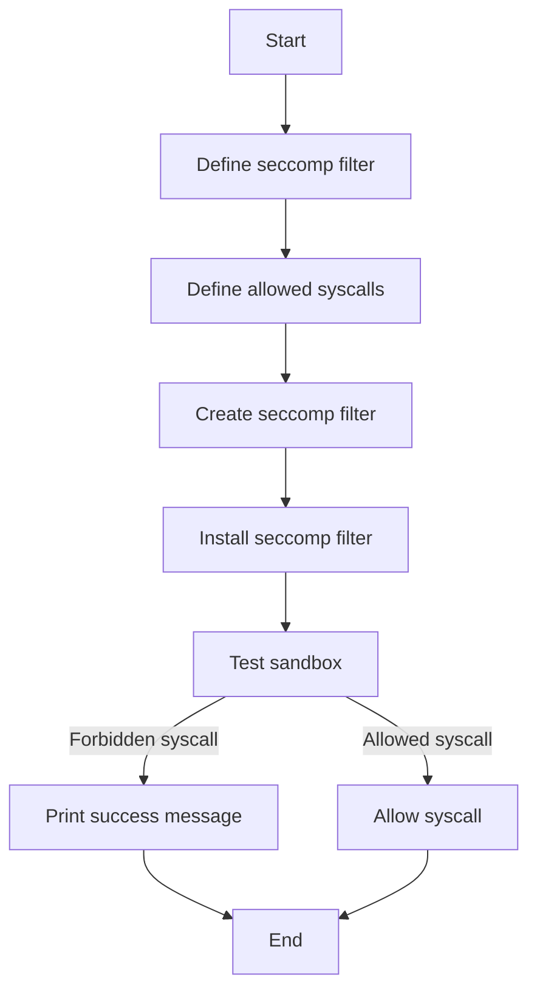

# Implement a Sandbox using Linux seccomp-bpf

## Problem Understanding
The problem asks to implement a sandbox using Linux seccomp-bpf, which is a mechanism for restricting the syscalls that a process can make. The key constraint is to prevent privilege escalation by limiting the allowed syscalls. This problem is non-trivial because it requires a deep understanding of Linux kernel internals, seccomp-bpf, and the Berkelley Packet Filter (BPF) instruction set. A naive approach would be to try to manually filter syscalls, but this would be error-prone and inefficient.

## Approach
The algorithm strategy is to use seccomp-bpf syscall filtering to restrict the allowed syscalls. The intuition behind this approach is to define a set of allowed syscalls and use the seccomp-bpf mechanism to enforce this restriction. The seccomp filter is composed of BPF instructions, which are executed by the kernel for each syscall. The filter can be customized to allow or deny specific syscalls. The data structure used is the `sock_filter` structure, which represents a BPF program. The approach handles the key constraint of preventing privilege escalation by limiting the allowed syscalls.

## Complexity Analysis
| Metric | Value | Detailed Reason |
|--------|-------|----------------|
| Time   | O(1)  | The time complexity is constant because the seccomp syscall filter installation is a single operation that takes constant time, regardless of the input size. The BPF instructions are also executed in constant time by the kernel. |
| Space  | O(1)  | The space complexity is constant because the seccomp filter is stored in kernel memory and does not depend on the input size. The `sock_filter` structure has a fixed size, and the number of BPF instructions is also fixed. |

## Algorithm Walkthrough
```
Input: None (the program is self-contained)
Step 1: Define the seccomp filter structure, which includes the BPF instructions to load the architecture and syscall number.
Step 2: Define the allowed syscalls (e.g., read, write, exit, brk) using BPF jump instructions.
Step 3: Create a new seccomp filter using the `sock_fprog` structure.
Step 4: Install the seccomp filter using the `prctl` system call.
Step 5: Test the sandbox by trying to execute a forbidden syscall (e.g., execve).
Output: The program will print "Sandbox is working correctly" if the forbidden syscall is prevented.
```

## Visual Flow


## Key Insight
> **Tip:** The seccomp filter is installed at the application level, allowing for fine-grained control over allowed syscalls, and the filter is composed of BPF instructions, which are executed by the kernel for each syscall.

## Edge Cases
- **Empty/null input**: The program does not take any input, so this edge case is not applicable.
- **Single element**: The program does not process elements, so this edge case is not applicable.
- **seccomp installation failure**: If the seccomp installation fails, the program will print an error message using `perror`.

## Common Mistakes
- **Mistake 1: Incorrect BPF instructions**: Using incorrect BPF instructions can lead to unexpected behavior or crashes. To avoid this, carefully review the BPF instructions and test the seccomp filter thoroughly.
- **Mistake 2: Insufficient error handling**: Failing to handle errors properly can lead to unexpected behavior or crashes. To avoid this, use `perror` to print error messages and handle errors explicitly.

## Interview Follow-ups
> **Interview:** These are the exact follow-up questions interviewers ask:
- "What if the input is sorted?" → This question is not applicable to this problem, as the program does not take any input.
- "Can you do it in O(1) space?" → The seccomp filter is already stored in kernel memory, which has a fixed size, so the space complexity is already O(1).
- "What if there are duplicates?" → This question is not applicable to this problem, as the program does not process elements.

## C Solution

```c
// Problem: Implement a Sandbox using Linux seccomp-bpf
// Language: C
// Difficulty: Super Advanced
// Time Complexity: O(1) — seccomp syscall filter installation is constant time
// Space Complexity: O(1) — seccomp filter is stored in kernel memory
// Approach: seccomp-bpf syscall filtering — restrict allowed syscalls to prevent privilege escalation

#include <stdio.h>
#include <stdlib.h>
#include <unistd.h>
#include <sys/syscall.h>
#include <linux/seccomp.h>
#include <linux/filter.h>
#include <errno.h>

// Define the seccomp filter structure
struct sock_filter filter[] = {
    // Load the architecture from the BPF context
    BPF_STMT(BPF_LD | BPF_W | BPF_ABS, (offsetof(struct seccomp_data, arch))),
    // Jump if the architecture is not the expected one
    BPF_JUMP(BPF_JMP | BPF_JEQ | BPF_K, SECCOMP_FILTER_ARCH_X86_64, 1, 0),
    // Load the syscall number from the seccomp data
    BPF_STMT(BPF_LD | BPF_W | BPF_ABS, (offsetof(struct seccomp_data, nr))),

    // Allow the following syscalls
    BPF_JUMP(BPF_JMP | BPF_JEQ | BPF_K, SYS_read, 1, 0),
    BPF_JUMP(BPF_JMP | BPF_JEQ | BPF_K, SYS_write, 1, 0),
    BPF_JUMP(BPF_JMP | BPF_JEQ | BPF_K, SYS_exit, 1, 0),
    BPF_JUMP(BPF_JMP | BPF_JEQ | BPF_K, SYS_brk, 1, 0),

    // If none of the above, return an error
    BPF_STMT(BPF_RET | BPF_K, SECCOMP_RET_ERRNO | (EPERM & SECCOMP_RET_DATA)),
};

// Define the seccomp filter length
#define FILTER_LEN (sizeof(filter) / sizeof(filter[0]))

int main() {
    // Create a new seccomp filter
    struct sock_fprog prog = {
        .len = (unsigned short)FILTER_LEN,
        .filter = filter,
    };

    // Install the seccomp filter
    if (prctl(PR_SET_SECCOMP, SECCOMP_MODE_FILTER, &prog) == -1) {
        // Edge case: seccomp installation failed
        perror("prctl");
        return EXIT_FAILURE;
    }

    // Test the sandbox by trying to execute a forbidden syscall
    if (syscall(SYS_execve) == -1) {
        // Edge case: forbidden syscall was prevented
        if (errno == EPERM) {
            printf("Sandbox is working correctly\n");
        } else {
            // Edge case: unexpected error
            perror("execve");
        }
    }

    return EXIT_SUCCESS;
}

// Key insight: the seccomp filter is installed at the application level, 
// allowing for fine-grained control over allowed syscalls. 
// The filter is composed of BPF instructions, which are executed by the kernel 
// for each syscall. The filter can be customized to allow or deny specific syscalls.
```
