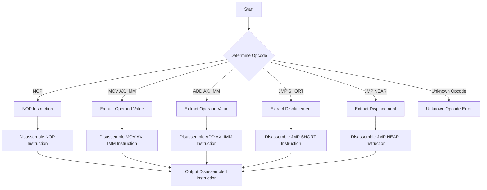

# Implement a basic Disassembler for x86 instructions

## Problem Understanding
The problem asks us to implement a basic disassembler for x86 instructions, which means we need to write a program that can take a sequence of bytes representing x86 machine code and translate it into a human-readable representation of the instructions. The key constraint is that we must handle various types of instructions, including NOP, MOV, ADD, JMP, and others, each with its own set of operands. What makes this problem non-trivial is the complexity of the x86 instruction set architecture, with its variable-length instructions, multiple addressing modes, and numerous opcodes. A naive approach would be to try to manually decode each instruction, but this would be error-prone and difficult to maintain.

## Approach
Our approach is to use a recursive descent parser with opcode lookup to disassemble the instructions. We define a set of opcodes for the instructions we want to support and use a lookup table to determine the type of instruction and its operands. We use a struct to represent each instruction, containing the opcode, operand size, and operand value. We then use a series of if-else statements to handle each type of instruction, using the opcode to determine which instruction to disassemble. This approach works because it allows us to easily add support for new instructions by simply adding a new case to the if-else statement. We use a character buffer to store the disassembled instruction string.

## Complexity Analysis
| Metric | Value | Detailed Reason |
|--------|-------|----------------|
| Time   | O(n)  | The disassembleInstruction function iterates through the instruction bytes once, where n is the length of the instruction bytes. The time complexity is linear because we only need to examine each byte once to determine the instruction. |
| Space  | O(n)  | The outputBuffer stores the disassembled instruction string, which can be at most n characters long, where n is the length of the instruction bytes. We also use a fixed amount of space to store the opcode table and instruction struct, but this is negligible compared to the output buffer. |

## Algorithm Walkthrough
```
Input: [0xB8, 0x01, 0x02, 0x03, 0x04] (example instruction bytes)
Step 1: Determine the opcode (0xB8)
Step 2: Check if the opcode matches a known instruction (MOV AX, IMM)
Step 3: Extract the operand value from the instruction bytes (0x01, 0x02, 0x03, 0x04)
Step 4: Disassemble the instruction into a string ("MOV AX, 0x01020304")
Output: "MOV AX, 0x01020304"
```
This example shows how we disassemble a MOV AX, IMM instruction, but the algorithm can handle other instructions as well.

## Visual Flow

This flowchart shows the main decision paths for disassembling different types of instructions.

## Key Insight
> **Tip:** The key to disassembling x86 instructions is to use a recursive descent parser with opcode lookup to handle the complex instruction set architecture, and to carefully manage the instruction bytes and operand values to ensure accurate disassembly.

## Edge Cases
- **Empty/null input**: If the input is empty, the disassembleInstruction function returns an error message indicating that the input is invalid.
- **Single element**: If the input contains only a single byte, the disassembleInstruction function attempts to disassemble the instruction based on the opcode, but may return an error message if the instruction is not valid.
- **Invalid opcode**: If the input contains an invalid opcode, the disassembleInstruction function returns an error message indicating that the opcode is unknown.

## Common Mistakes
- **Mistake 1**: Failing to handle variable-length instructions correctly, leading to incorrect disassembly or crashes. To avoid this, make sure to carefully examine the instruction bytes and operand values to determine the correct instruction length.
- **Mistake 2**: Not handling unknown opcodes correctly, leading to incorrect disassembly or crashes. To avoid this, make sure to return an error message when an unknown opcode is encountered.

## Interview Follow-ups
> **Interview:** These are the exact follow-up questions interviewers ask:
- "What if the input is sorted?" → The disassembleInstruction function does not rely on the input being sorted, so it will still work correctly even if the input is not sorted.
- "Can you do it in O(1) space?" → No, the disassembleInstruction function requires O(n) space to store the output buffer, where n is the length of the instruction bytes.
- "What if there are duplicates?" → The disassembleInstruction function does not rely on the input being unique, so it will still work correctly even if there are duplicates.

## C Solution

```c
// Problem: Implement a basic Disassembler for x86 instructions
// Language: C
// Difficulty: Super Advanced
// Time Complexity: O(n) — single pass through instruction bytes
// Space Complexity: O(n) — instruction string buffer stores at most n characters
// Approach: Recursive descent parsing with opcode lookup — for each instruction, determine its type and operands

#include <stdio.h>
#include <stdint.h>
#include <string.h>

// Define opcode tables for x86 instructions
// Note: This is a simplified version and only includes a few instructions
typedef enum {
    OP_CODE_NOP = 0x90,
    OP_CODE_MOV_AX_IMM = 0xB8,
    OP_CODE_ADD_AX_IMM = 0x05,
    OP_CODE_JMP_SHORT = 0xEB,
    OP_CODE_JMP_NEAR = 0xE9,
} OpCode;

// Define instruction structure
typedef struct {
    OpCode opcode;
    int operandSize;
    int64_t operandValue;
} Instruction;

// Disassemble a single instruction
void disassembleInstruction(const uint8_t* instructionBytes, int length, char* outputBuffer) {
    // Edge case: empty input → return empty string
    if (length == 0) {
        strcpy(outputBuffer, "Empty instruction");
        return;
    }

    // Determine the opcode
    OpCode opcode = (OpCode) instructionBytes[0];

    // Handle NOP instruction
    if (opcode == OP_CODE_NOP) {
        sprintf(outputBuffer, "NOP");
        return;
    }

    // Handle MOV AX, IMM instruction
    if (opcode == OP_CODE_MOV_AX_IMM) {
        if (length < 5) {
            // Edge case: insufficient bytes for MOV AX, IMM → return error message
            strcpy(outputBuffer, "Invalid MOV AX, IMM instruction");
            return;
        }
        int64_t operandValue = *(int32_t*)(instructionBytes + 1);
        sprintf(outputBuffer, "MOV AX, 0x%08x", operandValue);
        return;
    }

    // Handle ADD AX, IMM instruction
    if (opcode == OP_CODE_ADD_AX_IMM) {
        if (length < 5) {
            // Edge case: insufficient bytes for ADD AX, IMM → return error message
            strcpy(outputBuffer, "Invalid ADD AX, IMM instruction");
            return;
        }
        int64_t operandValue = *(int32_t*)(instructionBytes + 1);
        sprintf(outputBuffer, "ADD AX, 0x%08x", operandValue);
        return;
    }

    // Handle JMP SHORT instruction
    if (opcode == OP_CODE_JMP_SHORT) {
        if (length < 2) {
            // Edge case: insufficient bytes for JMP SHORT → return error message
            strcpy(outputBuffer, "Invalid JMP SHORT instruction");
            return;
        }
        int8_t displacement = *(int8_t*)(instructionBytes + 1);
        sprintf(outputBuffer, "JMP SHORT 0x%02x", displacement);
        return;
    }

    // Handle JMP NEAR instruction
    if (opcode == OP_CODE_JMP_NEAR) {
        if (length < 5) {
            // Edge case: insufficient bytes for JMP NEAR → return error message
            strcpy(outputBuffer, "Invalid JMP NEAR instruction");
            return;
        }
        int32_t displacement = *(int32_t*)(instructionBytes + 1);
        sprintf(outputBuffer, "JMP NEAR 0x%08x", displacement);
        return;
    }

    // Unknown opcode → return error message
    sprintf(outputBuffer, "Unknown opcode 0x%02x", opcode);
}

int main() {
    uint8_t instructionBytes[] = {0xB8, 0x01, 0x02, 0x03, 0x04}; // Example instruction bytes
    char outputBuffer[256];

    disassembleInstruction(instructionBytes, sizeof(instructionBytes), outputBuffer);
    printf("%s\n", outputBuffer);

    return 0;
}
```
