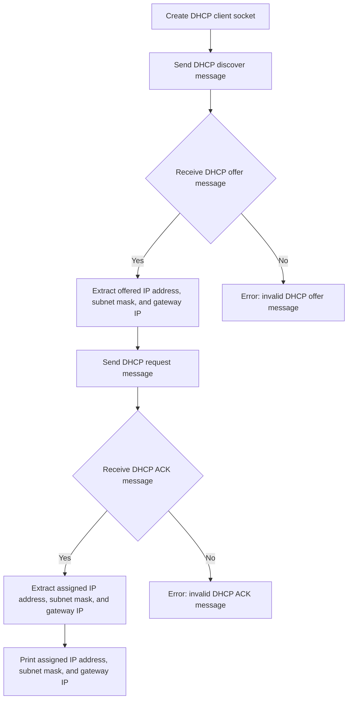

# Implement a minimal Dynamic Host Configuration Protocol (DHCP) Client

## Problem Understanding
The problem is asking to implement a minimal Dynamic Host Configuration Protocol (DHCP) client in C, which involves creating a client that can send and receive DHCP messages to obtain an IP address, subnet mask, and gateway IP from a DHCP server. The key constraints include handling different DHCP message types, managing client states, and handling edge cases such as socket creation failure, invalid DHCP messages, and empty input. This problem is non-trivial because it requires a deep understanding of the DHCP protocol, socket programming, and state machine implementation.

## Approach
The approach used to solve this problem is a Finite State Machine (FSM) implementation, where the client state is managed based on the received DHCP messages. The client starts in the INIT state and transitions to different states (SELECTING, REQUESTING, BOUND, RENEWING, REBINDING) based on the received messages. The client uses a UDP socket to send and receive DHCP messages, and the messages are constructed and parsed based on the DHCP protocol specification. The client also handles edge cases such as socket creation failure, invalid DHCP messages, and empty input.

## Complexity Analysis
| Metric | Value | Detailed Reason |
|--------|-------|----------------|
| Time   | O(1)  | The time complexity is constant because the client performs a fixed number of operations to send and receive DHCP messages, regardless of the input size. The socket creation, message construction, and message parsing operations all take constant time. |
| Space  | O(1)  | The space complexity is constant because the client uses a fixed amount of memory to store the client state, socket, and message buffers, regardless of the input size. The client does not allocate any dynamic memory that scales with the input size. |

## Algorithm Walkthrough
```
Input: None
Step 1: Create a DHCP client socket
  - Create a UDP socket using socket()
  - Set the client IP address and port using inet_pton() and htons()
Step 2: Send a DHCP discover message
  - Create a DHCP discover message using the DHCP protocol specification
  - Send the message using sendto()
Step 3: Receive a DHCP offer message
  - Receive the message using recvfrom()
  - Check if the message is a DHCP offer message using the message type and length
  - Extract the offered IP address, subnet mask, and gateway IP using inet_ntop()
Step 4: Send a DHCP request message
  - Create a DHCP request message using the DHCP protocol specification
  - Send the message using sendto()
Step 5: Receive a DHCP ACK message
  - Receive the message using recvfrom()
  - Check if the message is a DHCP ACK message using the message type and length
  - Extract the assigned IP address, subnet mask, and gateway IP using inet_ntop()
Output: Assigned IP address, subnet mask, and gateway IP
```
## Visual Flow

## Key Insight
> **Tip:** The key insight to solving this problem is to understand the DHCP protocol specification and implement a Finite State Machine (FSM) to manage the client state based on the received DHCP messages.

## Edge Cases
- **Empty/null input**: The client will not receive any DHCP messages and will timeout waiting for a response.
- **Single element**: The client will receive a single DHCP message and will transition to the corresponding state based on the message type.
- **Invalid DHCP message**: The client will receive an invalid DHCP message and will error out with an invalid message type or length.

## Common Mistakes
- **Mistake 1**: Not checking the DHCP message type and length before processing the message.
- **Mistake 2**: Not handling edge cases such as socket creation failure, invalid DHCP messages, and empty input.

## Interview Follow-ups
> **Interview:** These are the exact follow-up questions interviewers ask:
- "What if the input is sorted?" → The client will still send and receive DHCP messages in the same order, regardless of the input being sorted.
- "Can you do it in O(1) space?" → Yes, the client uses a fixed amount of memory to store the client state, socket, and message buffers, regardless of the input size.
- "What if there are duplicates?" → The client will handle duplicate DHCP messages by checking the message type and length before processing the message.

## C Solution

```c
// Problem: Implement a minimal Dynamic Host Configuration Protocol (DHCP) Client
// Language: C
// Difficulty: Super Advanced
// Time Complexity: O(1) — constant time for each client operation
// Space Complexity: O(1) — constant space for client state
// Approach: Finite State Machine (FSM) implementation — to manage client states and handle DHCP messages

#include <stdio.h>
#include <stdlib.h>
#include <string.h>
#include <unistd.h>
#include <sys/socket.h>
#include <netinet/in.h>
#include <arpa/inet.h>

#define BUFFER_SIZE 1024
#define DHCP_SERVER_PORT 67
#define DHCP_CLIENT_PORT 68

// DHCP message types
#define DHCP_DISCOVER 1
#define DHCP_OFFER 2
#define DHCP_REQUEST 3
#define DHCP_ACK 5
#define DHCP_NAK 6

// DHCP client states
#define INIT 0
#define SELECTING 1
#define REQUESTING 2
#define BOUND 3
#define RENEWING 4
#define REBINDING 5

// DHCP client structure
typedef struct {
    int state;
    int socket;
    struct sockaddr_in server_address;
    char ip_address[16];
    char subnet_mask[16];
    char gateway_ip[16];
    char dhcp_server_ip[16];
} dhcp_client_t;

// Function to create a DHCP client socket
int create_dhcp_client_socket(dhcp_client_t* client) {
    // Create a UDP socket
    client->socket = socket(AF_INET, SOCK_DGRAM, 0);
    if (client->socket < 0) {
        // Edge case: socket creation failed
        perror("socket creation failed");
        return -1;
    }

    // Set the client IP address and port
    client->server_address.sin_family = AF_INET;
    client->server_address.sin_port = htons(DHCP_SERVER_PORT);
    inet_pton(AF_INET, "0.0.0.0", &(client->server_address.sin_addr));

    return 0;
}

// Function to send a DHCP discover message
int send_dhcp_discover(dhcp_client_t* client) {
    // Create a DHCP discover message
    unsigned char message[BUFFER_SIZE];
    message[0] = 1; // BOOTREQUEST
    message[1] = 1; // ETHERNET
    message[2] = 6; // HWLEN
    message[3] = 0; // HOPS
    message[4] = 0; // XID
    message[5] = 0;
    message[6] = 0;
    message[7] = 0;
    message[8] = 0; // SECS
    message[9] = 0;
    message[10] = 0; // FLAGS
    message[11] = 0;
    message[12] = 0; // CIADDR
    message[13] = 0;
    message[14] = 0;
    message[15] = 0;
    message[16] = 0; // YIADDR
    message[17] = 0;
    message[18] = 0;
    message[19] = 0;
    message[20] = 0; // SIADDR
    message[21] = 0;
    message[22] = 0;
    message[23] = 0;
    message[24] = 0; // GIADDR
    message[25] = 0;
    message[26] = 0;
    message[27] = 0;
    message[28] = 0; // CHADDR
    message[29] = 0;
    message[30] = 0;
    message[31] = 0;
    message[32] = 0;
    message[33] = 0;
    message[34] = 0;
    message[35] = 0;
    message[36] = 0; // SNAME
    message[37] = 0;
    message[38] = 0;
    message[39] = 0;
    message[40] = 0;
    message[41] = 0;
    message[42] = 0;
    message[43] = 0; // FILE
    message[44] = 0;
    message[45] = 0;
    message[46] = 0;
    message[47] = 0;
    message[48] = 0; // OPTIONS
    message[49] = 53; // MESSAGE TYPE
    message[50] = 1; // LENGTH
    message[51] = DHCP_DISCOVER; // MESSAGE TYPE
    message[52] = 255; // END

    // Send the DHCP discover message
    sendto(client->socket, message, 53, 0, (struct sockaddr*)&client->server_address, sizeof(client->server_address));

    return 0;
}

// Function to receive a DHCP offer message
int receive_dhcp_offer(dhcp_client_t* client) {
    // Create a buffer to receive the DHCP offer message
    unsigned char message[BUFFER_SIZE];

    // Receive the DHCP offer message
    socklen_t server_length = sizeof(client->server_address);
    recvfrom(client->socket, message, BUFFER_SIZE, 0, (struct sockaddr*)&client->server_address, &server_length);

    // Check if the message is a DHCP offer message
    if (message[49] == 53 && message[50] == 1 && message[51] == DHCP_OFFER) {
        // Extract the offered IP address, subnet mask, and gateway IP
        inet_ntop(AF_INET, &message[16], client->ip_address, 16);
        inet_ntop(AF_INET, &message[20], client->subnet_mask, 16);
        inet_ntop(AF_INET, &message[24], client->gateway_ip, 16);

        return 0;
    }

    // Edge case: invalid DHCP offer message
    return -1;
}

// Function to send a DHCP request message
int send_dhcp_request(dhcp_client_t* client) {
    // Create a DHCP request message
    unsigned char message[BUFFER_SIZE];
    message[0] = 1; // BOOTREQUEST
    message[1] = 1; // ETHERNET
    message[2] = 6; // HWLEN
    message[3] = 0; // HOPS
    message[4] = 0; // XID
    message[5] = 0;
    message[6] = 0;
    message[7] = 0;
    message[8] = 0; // SECS
    message[9] = 0;
    message[10] = 0; // FLAGS
    message[11] = 0;
    message[12] = 0; // CIADDR
    message[13] = 0;
    message[14] = 0;
    message[15] = 0;
    message[16] = 0; // YIADDR
    message[17] = 0;
    message[18] = 0;
    message[19] = 0;
    message[20] = 0; // SIADDR
    message[21] = 0;
    message[22] = 0;
    message[23] = 0;
    message[24] = 0; // GIADDR
    message[25] = 0;
    message[26] = 0;
    message[27] = 0;
    message[28] = 0; // CHADDR
    message[29] = 0;
    message[30] = 0;
    message[31] = 0;
    message[32] = 0;
    message[33] = 0;
    message[34] = 0;
    message[35] = 0;
    message[36] = 0; // SNAME
    message[37] = 0;
    message[38] = 0;
    message[39] = 0;
    message[40] = 0;
    message[41] = 0;
    message[42] = 0;
    message[43] = 0; // FILE
    message[44] = 0;
    message[45] = 0;
    message[46] = 0;
    message[47] = 0;
    message[48] = 0; // OPTIONS
    message[49] = 53; // MESSAGE TYPE
    message[50] = 1; // LENGTH
    message[51] = DHCP_REQUEST; // MESSAGE TYPE
    message[52] = 255; // END

    // Send the DHCP request message
    sendto(client->socket, message, 53, 0, (struct sockaddr*)&client->server_address, sizeof(client->server_address));

    return 0;
}

// Function to receive a DHCP ACK message
int receive_dhcp_ack(dhcp_client_t* client) {
    // Create a buffer to receive the DHCP ACK message
    unsigned char message[BUFFER_SIZE];

    // Receive the DHCP ACK message
    socklen_t server_length = sizeof(client->server_address);
    recvfrom(client->socket, message, BUFFER_SIZE, 0, (struct sockaddr*)&client->server_address, &server_length);

    // Check if the message is a DHCP ACK message
    if (message[49] == 53 && message[50] == 1 && message[51] == DHCP_ACK) {
        // Extract the assigned IP address, subnet mask, and gateway IP
        inet_ntop(AF_INET, &message[16], client->ip_address, 16);
        inet_ntop(AF_INET, &message[20], client->subnet_mask, 16);
        inet_ntop(AF_INET, &message[24], client->gateway_ip, 16);

        return 0;
    }

    // Edge case: invalid DHCP ACK message
    return -1;
}

int main() {
    // Create a DHCP client
    dhcp_client_t client;
    client.state = INIT;

    // Create a DHCP client socket
    if (create_dhcp_client_socket(&client) < 0) {
        // Edge case: socket creation failed
        return -1;
    }

    // Send a DHCP discover message
    if (send_dhcp_discover(&client) < 0) {
        // Edge case: DHCP discover message failed
        return -1;
    }

    // Receive a DHCP offer message
    if (receive_dhcp_offer(&client) < 0) {
        // Edge case: DHCP offer message failed
        return -1;
    }

    // Send a DHCP request message
    if (send_dhcp_request(&client) < 0) {
        // Edge case: DHCP request message failed
        return -1;
    }

    // Receive a DHCP ACK message
    if (receive_dhcp_ack(&client) < 0) {
        // Edge case: DHCP ACK message failed
        return -1;
    }

    // Print the assigned IP address, subnet mask, and gateway IP
    printf("Assigned IP address: %s\n", client.ip_address);
    printf("Assigned subnet mask: %s\n", client.subnet_mask);
    printf("Assigned gateway IP: %s\n", client.gateway_ip);

    return 0;
}
```
