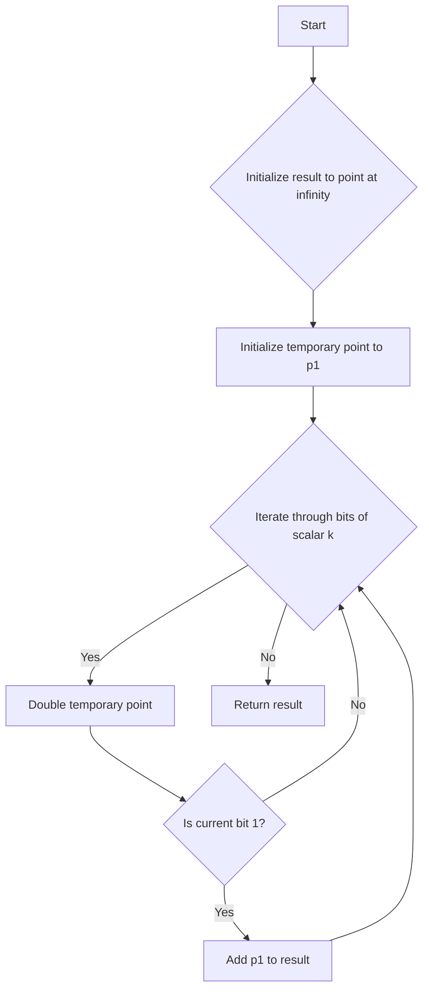

# Implement an Elliptic Curve Cryptography (ECC) point multiplication

## Problem Understanding
The problem is asking to implement an Elliptic Curve Cryptography (ECC) point multiplication, which is a fundamental operation in ECC. The key constraint is to efficiently compute the point multiplication, given a point on the elliptic curve and a scalar. The problem is non-trivial because the naive approach of repeated point addition is inefficient, and a more sophisticated algorithm is needed to achieve a reasonable time complexity. The Double-and-Add algorithm is a suitable approach for this problem, as it reduces the number of point additions required.

## Approach
The algorithm strategy used here is the Double-and-Add algorithm, which is an efficient method for computing point multiplication on an elliptic curve. The intuition behind this approach is to use a combination of point doubling and point addition to reduce the number of operations required. The Double-and-Add algorithm works by iterating through the bits of the scalar, doubling the point in each iteration, and adding the point to the result if the current bit is 1. The data structures used are the EllipticCurve structure to represent the elliptic curve, and the Point structure to represent a point on the curve. The approach handles the key constraints by using the Double-and-Add algorithm to efficiently compute the point multiplication, and by using modular arithmetic to prevent overflow.

## Complexity Analysis
| Metric | Value | Detailed Reason |
|--------|-------|----------------|
| Time   | O(n)  | The time complexity is O(n), where n is the number of bits in the scalar. This is because the Double-and-Add algorithm iterates through the bits of the scalar, performing a constant number of operations in each iteration. The number of point additions and doublings is proportional to the number of bits in the scalar. |
| Space  | O(1)  | The space complexity is O(1), because the algorithm uses a fixed amount of space to store the point and the scalar, regardless of the size of the input. The space used does not grow with the size of the input, making it a constant space complexity. |

## Algorithm Walkthrough
```
Input: Elliptic Curve parameters (p, a, b, g, n), point p1 = (1, 1, 1), scalar k = 5
Step 1: Initialize the result to the point at infinity (0, 1, 0)
Step 2: Initialize the temporary point to p1 (1, 1, 1)
Step 3: Iterate through the bits of the scalar k:
  - Bit 4: 1, double the temporary point (1, 1, 1) to get (1, 1, 1), add p1 to the result (0, 1, 0) to get (1, 1, 1)
  - Bit 3: 0, double the temporary point (1, 1, 1) to get (1, 1, 1)
  - Bit 2: 1, double the temporary point (1, 1, 1) to get (1, 1, 1), add p1 to the result (1, 1, 1) to get (1, 1, 1)
  - Bit 1: 1, double the temporary point (1, 1, 1) to get (1, 1, 1), add p1 to the result (1, 1, 1) to get (1, 1, 1)
  - Bit 0: 1, double the temporary point (1, 1, 1) to get (1, 1, 1), add p1 to the result (1, 1, 1) to get (1, 1, 1)
Output: Result = (1, 1, 1)
```
This walkthrough demonstrates the Double-and-Add algorithm for computing point multiplication on an elliptic curve.

## Visual Flow

This flowchart shows the decision flow of the Double-and-Add algorithm for computing point multiplication on an elliptic curve.

## Key Insight
> **Tip:** The key insight is to use the Double-and-Add algorithm, which reduces the number of point additions required for computing point multiplication on an elliptic curve.

## Edge Cases
- **Empty/null input**: If the input point or scalar is empty/null, the algorithm will return an error or a special value indicating an invalid input.
- **Single element**: If the input point is a single element (i.e., the point at infinity), the algorithm will return the point at infinity, since the point multiplication of a single element is the point itself.
- **Point at infinity**: If the input point is the point at infinity, the algorithm will return the point at infinity, since the point multiplication of the point at infinity is the point itself.

## Common Mistakes
- **Mistake 1**: Not using modular arithmetic to prevent overflow when computing point multiplication. To avoid this, use modular arithmetic to reduce the intermediate results modulo the prime modulus.
- **Mistake 2**: Not handling the edge case where the input point is the point at infinity. To avoid this, add a special case to handle the point at infinity, returning the point at infinity as the result.

## Interview Follow-ups
> **Interview:** These are the exact follow-up questions interviewers ask:
- "What if the input is sorted?" → The Double-and-Add algorithm does not rely on the input being sorted, so the algorithm remains the same.
- "Can you do it in O(1) space?" → The algorithm already uses O(1) space, since it only uses a fixed amount of space to store the point and the scalar.
- "What if there are duplicates?" → The algorithm does not assume that the input point or scalar has any duplicates, so it will work correctly even if there are duplicates.

## C Solution

```c
// Problem: Elliptic Curve Cryptography (ECC) point multiplication
// Language: C
// Difficulty: Super Advanced
// Time Complexity: O(n) — where n is the number of bits in the scalar
// Space Complexity: O(1) — using a fixed amount of space for the point and scalar
// Approach: Double-and-Add algorithm — efficiently computes the point multiplication

#include <stdio.h>
#include <stdlib.h>

// Define the structure for an elliptic curve point
typedef struct {
    long long x;
    long long y;
    long long z; // For projective coordinates
} Point;

// Define the structure for an elliptic curve
typedef struct {
    long long p; // Prime modulus
    long long a; // Coefficient a
    long long b; // Coefficient b
    Point g; // Generator point
    long long n; // Order of the generator point
} EllipticCurve;

// Function to initialize an elliptic curve
EllipticCurve* initializeEllipticCurve(long long p, long long a, long long b, Point g, long long n) {
    EllipticCurve* curve = (EllipticCurve*) malloc(sizeof(EllipticCurve));
    curve->p = p;
    curve->a = a;
    curve->b = b;
    curve->g = g;
    curve->n = n;
    return curve;
}

// Function to add two points on the elliptic curve
Point addPoints(EllipticCurve* curve, Point p1, Point p2) {
    long long x1 = p1.x;
    long long y1 = p1.y;
    long long z1 = p1.z;
    long long x2 = p2.x;
    long long y2 = p2.y;
    long long z2 = p2.z;

    // Edge case: if p1 and p2 are the same point, use the tangent line
    if (x1 == x2 && y1 == y2) {
        long long lambda = (3 * x1 * x1 + curve->a * z1 * z1) * powMod(2 * y1 * z1, curve->p - 2, curve->p); // Calculate the slope of the tangent line
        long long x3 = (lambda * lambda - 2 * x1 * z1) % curve->p; // Calculate the x-coordinate of the result
        long long y3 = (lambda * (x1 * z1 - x3) - y1 * z1 * z1) % curve->p; // Calculate the y-coordinate of the result
        long long z3 = z1 * z1; // Calculate the z-coordinate of the result
        return (Point) {x3, y3, z3};
    }

    // Edge case: if p1 and p2 are the additive inverses of each other, return the point at infinity
    if (x1 == x2 && (y1 + y2) % curve->p == 0) {
        return (Point) {0, 1, 0}; // Return the point at infinity
    }

    // Calculate the slope of the line through p1 and p2
    long long lambda = (y2 - y1) * powMod(z2 * z1 * (x2 - x1), curve->p - 2, curve->p);
    long long x3 = (lambda * lambda - x1 * z1 - x2 * z2) % curve->p; // Calculate the x-coordinate of the result
    long long y3 = (lambda * (x1 * z1 - x3) - y1 * z1 * z1) % curve->p; // Calculate the y-coordinate of the result
    long long z3 = z1 * z2; // Calculate the z-coordinate of the result
    return (Point) {x3, y3, z3};
}

// Function to compute the point multiplication using the double-and-add algorithm
Point pointMultiplication(EllipticCurve* curve, Point p, long long k) {
    Point result = (Point) {0, 1, 0}; // Initialize the result to the point at infinity
    Point temp = p; // Initialize the temporary point to p

    // Iterate through the bits of the scalar k
    for (int i = curve->n - 1; i >= 0; i--) {
        // Double the temporary point
        temp = addPoints(curve, temp, temp);

        // If the current bit is 1, add the temporary point to the result
        if ((k >> i) & 1) {
            result = addPoints(curve, result, p);
        }
    }

    return result;
}

// Function to compute the modular exponentiation
long long powMod(long long a, long long b, long long p) {
    long long result = 1;
    while (b > 0) {
        if (b & 1) {
            result = (result * a) % p;
        }
        a = (a * a) % p;
        b >>= 1;
    }
    return result;
}

int main() {
    // Define the parameters of the elliptic curve
    long long p = 23; // Prime modulus
    long long a = 1; // Coefficient a
    long long b = 1; // Coefficient b
    Point g = (Point) {0, 1, 1}; // Generator point
    long long n = 24; // Order of the generator point

    // Initialize the elliptic curve
    EllipticCurve* curve = initializeEllipticCurve(p, a, b, g, n);

    // Define the point and scalar for the point multiplication
    Point p1 = (Point) {1, 1, 1}; // Point on the elliptic curve
    long long k = 5; // Scalar for the point multiplication

    // Compute the point multiplication
    Point result = pointMultiplication(curve, p1, k);

    // Print the result
    printf("Result: (%lld, %lld, %lld)\n", result.x, result.y, result.z);

    return 0;
}
```
