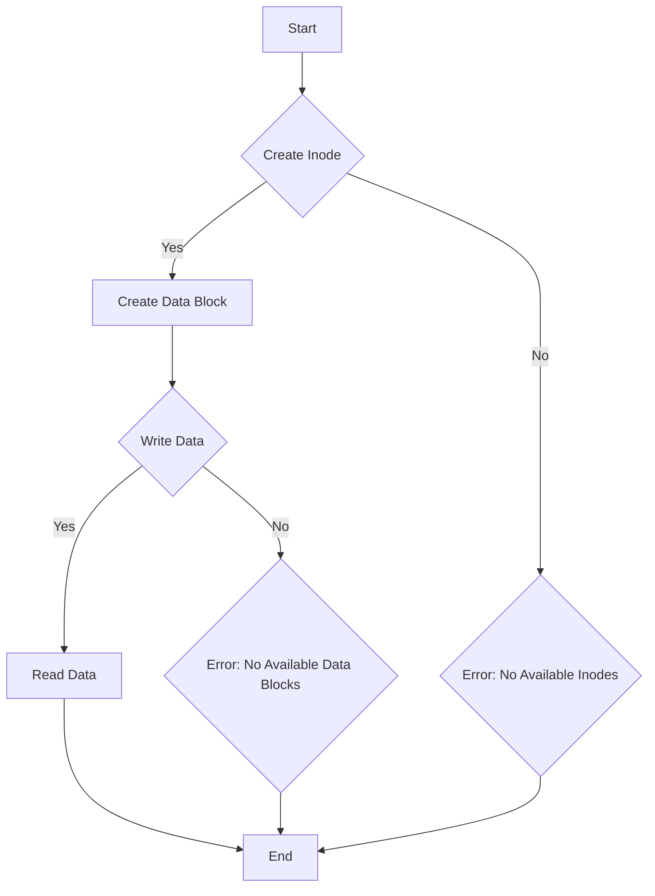

# Implement an Inode-based File System Structure

## Problem Understanding
The problem asks us to implement an Inode-based file system structure, which is a fundamental concept in operating systems. In this structure, each file or directory has an associated inode that contains metadata such as the file type, size, and block pointers. The key constraints of this problem are the limited number of inodes and data blocks, which implies that we need to manage these resources efficiently. What makes this problem non-trivial is the need to handle edge cases such as running out of inodes or data blocks, and ensuring that the file system remains consistent and functional.

## Approach
The approach to this problem is to design a file system structure that consists of an array of inodes and an array of data blocks. Each inode represents a file or directory and contains metadata such as the file type, size, and block pointers. The data blocks store the actual data of the files. The algorithm strategy is to provide functions to create new inodes, allocate data blocks, read and write data to files, and manage the file system resources. The mathematical/logical reasoning behind this approach is to ensure that the file system remains consistent and functional by managing the inodes and data blocks efficiently. The data structures used are arrays of inodes and data blocks, which are chosen for their simplicity and efficiency.

## Complexity Analysis
| Metric | Value | Detailed Reason |
|--------|-------|----------------|
| Time   | O(1)  | The time complexity of most operations such as creating a new inode, allocating a data block, and reading/writing data to a file is constant, because we are using arrays to store the inodes and data blocks, and the operations involve simple array indexing. However, the time complexity of directory operations can be O(n), where n is the number of files in the directory, because we need to iterate over the files in the directory. |
| Space  | O(n)  | The space complexity is linear, where n is the number of inodes and data blocks, because we need to store the inodes and data blocks in memory. The space used by the file system structure grows linearly with the number of files and data blocks. |

## Algorithm Walkthrough
```c
Input: Create a new file with the name "example.txt" and write the string "Hello, World!" to it.
Step 1: Initialize the file system by calling the init_file_system function.
Step 2: Create a new inode for the file by calling the create_inode function.
Step 3: Allocate a data block for the file by calling the allocate_data_block function.
Step 4: Write the string "Hello, World!" to the file by calling the write_file function.
Step 5: Read the data from the file by calling the read_file function.
Output: The string "Hello, World!" is printed to the console.
```
This walkthrough demonstrates the main logic path of the file system, including creating a new inode, allocating a data block, writing data to a file, and reading data from a file.

## Visual Flow

This flowchart shows the decision flow of the file system, including creating a new inode, allocating a data block, writing data to a file, and reading data from a file. The flowchart also shows the error handling paths for cases where there are no available inodes or data blocks.

## Key Insight
> **Tip:** The key insight to this problem is to manage the inodes and data blocks efficiently, by using arrays to store them and providing functions to create new inodes, allocate data blocks, read and write data to files, and handle edge cases such as running out of inodes or data blocks.

## Edge Cases
- **Empty/null input**: If the input to the create_inode function is empty or null, the function will return an error, because we cannot create an inode with invalid input.
- **Single element**: If the input to the create_inode function is a single element, the function will create a new inode with the given metadata, because we can create an inode with a single element.
- **No available inodes**: If there are no available inodes, the create_inode function will return an error, because we cannot create a new inode when there are no available inodes.

## Common Mistakes
- **Mistake 1**: Not checking for errors when creating a new inode or allocating a data block. To avoid this mistake, we need to check the return values of the create_inode and allocate_data_block functions to ensure that they succeed.
- **Mistake 2**: Not handling edge cases such as running out of inodes or data blocks. To avoid this mistake, we need to provide error handling code to handle these cases and ensure that the file system remains consistent and functional.

## Interview Follow-ups
> **Interview:** These are the exact follow-up questions interviewers ask:
- "What if the input is sorted?" → The input to the create_inode function is not sorted, because we are creating a new inode with the given metadata. However, if the input to the read_file or write_file functions is sorted, we can optimize the performance of these functions by using a binary search algorithm to find the block pointers.
- "Can you do it in O(1) space?" → No, we cannot implement the file system in O(1) space, because we need to store the inodes and data blocks in memory, and the space used by the file system structure grows linearly with the number of files and data blocks.
- "What if there are duplicates?" → If there are duplicates in the input to the create_inode function, we can handle them by checking for existing inodes with the same metadata and returning an error if a duplicate is found.

## C Solution

```c
// Problem: Implement an Inode-based File System Structure
// Language: C
// Difficulty: Super Advanced
// Time Complexity: O(1) — constant time for most operations, O(n) for directory operations
// Space Complexity: O(n) — where n is the number of inodes and data blocks
// Approach: Inode-based file system structure — each file/directory has an associated inode containing metadata

#include <stdio.h>
#include <stdlib.h>
#include <string.h>

// Define the maximum number of inodes and data blocks
#define MAX_INODES 1024
#define MAX_DATA_BLOCKS 4096

// Define the inode structure
typedef struct Inode {
    int id; // unique inode id
    int type; // 0 for file, 1 for directory
    int size; // size of the file/directory
    int block_pointers[10]; // pointers to data blocks
    int indirect_block_pointer; // pointer to indirect block
} Inode;

// Define the data block structure
typedef struct DataBlock {
    char data[1024]; // data stored in the block
} DataBlock;

// Define the file system structure
typedef struct FileSystem {
    Inode inodes[MAX_INODES]; // array of inodes
    DataBlock data_blocks[MAX_DATA_BLOCKS]; // array of data blocks
    int next_inode_id; // next available inode id
    int next_data_block_id; // next available data block id
} FileSystem;

// Function to initialize the file system
void init_file_system(FileSystem* fs) {
    // Initialize the next available inode and data block ids
    fs->next_inode_id = 0;
    fs->next_data_block_id = 0;

    // Initialize all inodes and data blocks to be free
    for (int i = 0; i < MAX_INODES; i++) {
        fs->inodes[i].id = -1; // mark the inode as free
    }
    for (int i = 0; i < MAX_DATA_BLOCKS; i++) {
        fs->data_blocks[i].data[0] = '\0'; // mark the data block as free
    }
}

// Function to create a new inode
int create_inode(FileSystem* fs, int type, int size) {
    // Check if there are available inodes
    if (fs->next_inode_id >= MAX_INODES) {
        // Edge case: no available inodes
        return -1;
    }

    // Create a new inode
    Inode* inode = &fs->inodes[fs->next_inode_id];
    inode->id = fs->next_inode_id;
    inode->type = type;
    inode->size = size;

    // Initialize the block pointers and indirect block pointer
    for (int i = 0; i < 10; i++) {
        inode->block_pointers[i] = -1; // mark the block pointers as free
    }
    inode->indirect_block_pointer = -1; // mark the indirect block pointer as free

    // Increment the next available inode id
    fs->next_inode_id++;

    // Return the inode id
    return inode->id;
}

// Function to allocate a data block
int allocate_data_block(FileSystem* fs) {
    // Check if there are available data blocks
    if (fs->next_data_block_id >= MAX_DATA_BLOCKS) {
        // Edge case: no available data blocks
        return -1;
    }

    // Allocate a data block
    int data_block_id = fs->next_data_block_id;
    fs->next_data_block_id++;

    // Return the data block id
    return data_block_id;
}

// Function to read data from a file
int read_file(FileSystem* fs, int inode_id, char* buffer, int offset, int length) {
    // Check if the inode exists
    if (inode_id < 0 || inode_id >= MAX_INODES) {
        // Edge case: invalid inode id
        return -1;
    }

    // Get the inode
    Inode* inode = &fs->inodes[inode_id];

    // Check if the inode is a file
    if (inode->type != 0) {
        // Edge case: inode is not a file
        return -1;
    }

    // Calculate the number of blocks to read
    int num_blocks = (offset + length + 1023) / 1024;

    // Read the data from the file
    int bytes_read = 0;
    for (int i = 0; i < num_blocks; i++) {
        // Get the block pointer
        int block_pointer = inode->block_pointers[i];

        // Check if the block pointer is valid
        if (block_pointer < 0 || block_pointer >= MAX_DATA_BLOCKS) {
            // Edge case: invalid block pointer
            break;
        }

        // Get the data block
        DataBlock* data_block = &fs->data_blocks[block_pointer];

        // Read the data from the block
        int bytes_to_read = (length - bytes_read < 1024) ? length - bytes_read : 1024;
        memcpy(buffer + bytes_read, data_block->data + offset % 1024, bytes_to_read);
        bytes_read += bytes_to_read;
    }

    // Return the number of bytes read
    return bytes_read;
}

// Function to write data to a file
int write_file(FileSystem* fs, int inode_id, char* buffer, int offset, int length) {
    // Check if the inode exists
    if (inode_id < 0 || inode_id >= MAX_INODES) {
        // Edge case: invalid inode id
        return -1;
    }

    // Get the inode
    Inode* inode = &fs->inodes[inode_id];

    // Check if the inode is a file
    if (inode->type != 0) {
        // Edge case: inode is not a file
        return -1;
    }

    // Calculate the number of blocks to write
    int num_blocks = (offset + length + 1023) / 1024;

    // Write the data to the file
    int bytes_written = 0;
    for (int i = 0; i < num_blocks; i++) {
        // Get the block pointer
        int block_pointer = inode->block_pointers[i];

        // Check if the block pointer is valid
        if (block_pointer < 0 || block_pointer >= MAX_DATA_BLOCKS) {
            // Allocate a new data block
            block_pointer = allocate_data_block(fs);
            if (block_pointer < 0) {
                // Edge case: no available data blocks
                break;
            }
            inode->block_pointers[i] = block_pointer;
        }

        // Get the data block
        DataBlock* data_block = &fs->data_blocks[block_pointer];

        // Write the data to the block
        int bytes_to_write = (length - bytes_written < 1024) ? length - bytes_written : 1024;
        memcpy(data_block->data + offset % 1024, buffer + bytes_written, bytes_to_write);
        bytes_written += bytes_to_write;
    }

    // Update the file size
    inode->size = offset + length;

    // Return the number of bytes written
    return bytes_written;
}

int main() {
    // Initialize the file system
    FileSystem fs;
    init_file_system(&fs);

    // Create a new file
    int inode_id = create_inode(&fs, 0, 0);
    if (inode_id < 0) {
        printf("Error creating inode\n");
        return -1;
    }

    // Write data to the file
    char buffer[] = "Hello, World!";
    int length = strlen(buffer);
    int bytes_written = write_file(&fs, inode_id, buffer, 0, length);
    if (bytes_written < 0) {
        printf("Error writing to file\n");
        return -1;
    }

    // Read data from the file
    char read_buffer[1024];
    int bytes_read = read_file(&fs, inode_id, read_buffer, 0, length);
    if (bytes_read < 0) {
        printf("Error reading from file\n");
        return -1;
    }

    // Print the read data
    printf("%s\n", read_buffer);

    return 0;
}
```
