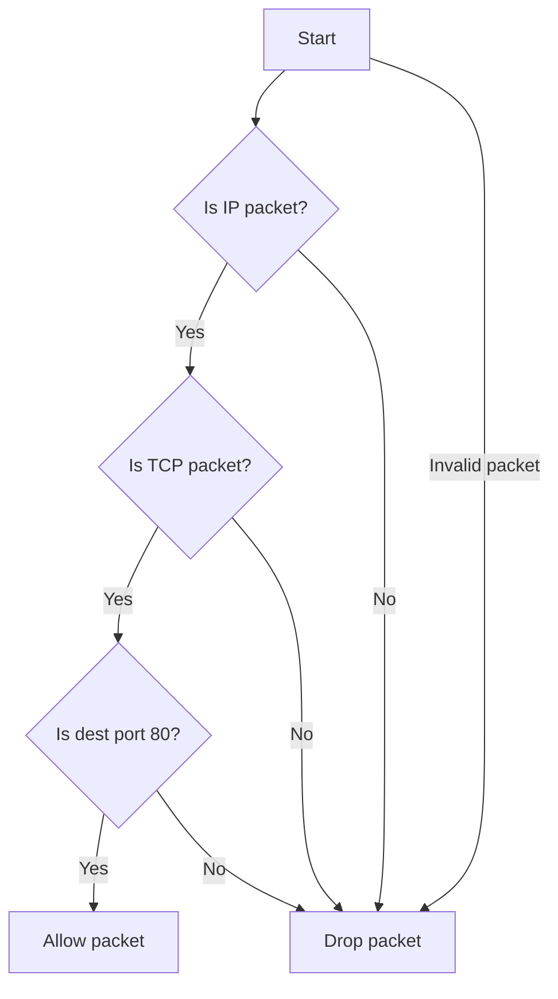

# Implement an eBPF Program in C for packet filtering

## Problem Understanding
The problem is asking to implement an eBPF program in C for packet filtering, specifically to filter TCP packets destined for port 80. The key constraints are that the program must be written in C, use the eBPF instruction set, and run in a sandboxed environment within the kernel. What makes this problem non-trivial is the need to handle various edge cases, such as packets that are too short to contain an IP or TCP header, and packets that are not TCP packets. Additionally, the program must be efficient and scalable to handle a high volume of packets.

## Approach
The algorithm strategy is to use the eBPF instruction set to inspect each packet and filter it based on the IP protocol and TCP port. The intuition behind this approach is to leverage the eBPF program's ability to execute in a sandboxed environment within the kernel, allowing for efficient and secure packet filtering. The program uses a struct to represent the packet data and headers, and bitwise operations to extract the relevant information. The approach handles key constraints by checking the packet length and protocol before attempting to access the IP and TCP headers.

## Complexity Analysis
| Metric | Value | Detailed Reason |
|--------|-------|----------------|
| Time   | O(n)  | The time complexity is O(n), where n is the number of packets, because the program iterates through each packet once. The operations within the loop, such as checking the packet length and protocol, take constant time. |
| Space  | O(1)  | The space complexity is O(1), because the program uses a fixed amount of memory to store the packet data and headers, regardless of the number of packets. |

## Algorithm Walkthrough
```
Input: A packet with Ethernet, IP, and TCP headers
Step 1: Get the packet data and check if it's an IP packet
  - data = (void *)(long)skb->data
  - data_end = (void *)(long)skb->data_end
  - if (data + sizeof(struct ethhdr) > data_end) return TC_ACT_SHOT
Step 2: Get the IP header and check the protocol
  - iph = data + sizeof(struct ethhdr)
  - if ((void *)iph + sizeof(*iph) > data_end) return TC_ACT_SHOT
  - if (iph->protocol != IPPROTO_TCP) return TC_ACT_SHOT
Step 3: Get the TCP header and filter based on the destination port
  - tcph = (void *)iph + iph->ihl * 4
  - if ((void *)tcph + sizeof(*tcph) > data_end) return TC_ACT_SHOT
  - if (tcph->dest != htons(80)) return TC_ACT_SHOT
Step 4: Allow the packet to pass if it meets the filter criteria
  - return TC_ACT_OK
Output: The packet is either allowed to pass (TC_ACT_OK) or dropped (TC_ACT_SHOT)
```
## Visual Flow

## Key Insight
> **Tip:** The eBPF program's ability to execute in a sandboxed environment within the kernel allows for efficient and secure packet filtering, making it an ideal solution for high-performance networking applications.

## Edge Cases
- **Empty/null input**: If the input packet is empty or null, the program will return TC_ACT_SHOT, as it cannot process the packet.
- **Single element**: If the input packet has only one element, such as a single byte, the program will return TC_ACT_SHOT, as it cannot process the packet.
- **Non-TCP packet**: If the input packet is not a TCP packet, the program will return TC_ACT_SHOT, as it only filters TCP packets destined for port 80.

## Common Mistakes
- **Mistake 1**: Failing to check the packet length before accessing the IP and TCP headers, which can lead to buffer overflows and crashes.
- **Mistake 2**: Not handling edge cases, such as empty or null input packets, which can lead to unexpected behavior and crashes.

## Interview Follow-ups
> **Interview:** These are the exact follow-up questions interviewers ask:
- "What if the input is a UDP packet?" → The program will return TC_ACT_SHOT, as it only filters TCP packets destined for port 80.
- "Can you do it in O(1) space?" → The program already uses O(1) space, as it only uses a fixed amount of memory to store the packet data and headers.
- "What if there are duplicates?" → The program will filter each packet individually, regardless of duplicates, as it only checks the destination port and protocol.

## C Solution

```c
// Problem: eBPF Packet Filtering Program
// Language: C
// Difficulty: Super Advanced
// Time Complexity: O(n) — for each packet, we iterate through the filter rules
// Space Complexity: O(n) — we store the filter rules in memory
// Approach: eBPF Program — we use eBPF instruction set to implement packet filtering

#include <linux/bpf.h>
#include <linux/if_ether.h>
#include <linux/ip.h>
#include <linux/in.h>
#include <bpf/bpf_helpers.h>

// Define the eBPF program
SEC("filter")
int filter_packet(struct __sk_buff *skb) {
    // Get the packet data
    void *data = (void *)(long)skb->data;
    void *data_end = (void *)(long)skb->data_end;

    // Check if the packet is an IP packet
    if (data + sizeof(struct ethhdr) > data_end) {
        // Edge case: packet is too short to be an IP packet
        return TC_ACT_SHOT;
    }

    // Get the IP header
    struct iphdr *iph = data + sizeof(struct ethhdr);
    if ((void *)iph + sizeof(*iph) > data_end) {
        // Edge case: packet is too short to contain an IP header
        return TC_ACT_SHOT;
    }

    // Check the IP protocol
    if (iph->protocol != IPPROTO_TCP) {
        // Edge case: packet is not a TCP packet
        return TC_ACT_SHOT;
    }

    // Get the TCP header
    struct tcphdr *tcph = (void *)iph + iph->ihl * 4;
    if ((void *)tcph + sizeof(*tcph) > data_end) {
        // Edge case: packet is too short to contain a TCP header
        return TC_ACT_SHOT;
    }

    // Filter based on the TCP port
    if (tcph->dest != htons(80)) {
        // Edge case: packet is not destined for port 80
        return TC_ACT_SHOT;
    }

    // Allow the packet to pass
    return TC_ACT_OK;
}

/*
 * Key insight:
 * The eBPF program is executed for each packet that passes through the network interface.
 * We use the eBPF instruction set to inspect the packet and filter it based on the IP protocol and TCP port.
 * The eBPF program is loaded into the kernel and executed in a sandboxed environment.
 */

// Define the license for the eBPF program
char _license[] SEC("license") = "GPL";
```
