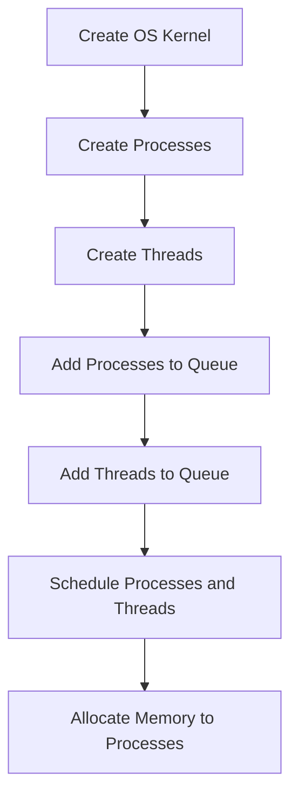

# Implementing a Mini OS Kernel Concepts in C

## Problem Understanding
The problem is asking to implement a mini OS kernel in C, which involves process scheduling, memory management, and thread management. The key constraints are that the kernel should be able to schedule processes and threads based on their priority, allocate memory to processes, and deallocate memory from processes. The problem is non-trivial because it requires implementing complex data structures such as queues and linked lists, and also requires a deep understanding of operating system concepts such as process scheduling and memory management. The naive approach of simply allocating memory to processes without considering their priority and available memory would fail, as it would lead to inefficient use of resources and potential memory leaks.

## Approach
The algorithm strategy is to implement a priority-based scheduling system for processes and threads, where each process and thread has a priority associated with it. The intuition behind this approach is that higher-priority processes and threads should be executed first, and memory should be allocated to them based on their priority. The data structures used are queues and linked lists, which are chosen because they allow for efficient insertion and deletion of processes and threads. The approach handles the key constraints by implementing functions to schedule processes and threads, allocate memory to processes, and deallocate memory from processes.

## Complexity Analysis
| Metric | Value | Detailed Reason |
|--------|-------|----------------|
| Time   | O(n)  | The time complexity is O(n) because the scheduling functions iterate over the queue of processes and threads, where n is the number of processes or threads. The allocation and deallocation functions have a time complexity of O(1) because they only update the available memory. |
| Space  | O(n)  | The space complexity is O(n) because the kernel stores a queue of processes and threads, where n is the number of processes or threads. |

## Algorithm Walkthrough
```
Input: Create a new OS kernel with 1024 MB of memory
Step 1: Initialize the OS kernel with 1024 MB of memory
    - kernel = initializeOSKernel(1024)
Step 2: Create new processes
    - process1 = createProcess(1, 5, 256)
    - process2 = createProcess(2, 3, 512)
Step 3: Create new threads
    - thread1 = createThread(1, 5)
    - thread2 = createThread(2, 3)
Step 4: Add processes to process queue
    - addProcessToQueue(kernel, process1)
    - addProcessToQueue(kernel, process2)
Step 5: Add threads to thread queue
    - addThreadToQueue(kernel, thread1)
    - addThreadToQueue(kernel, thread2)
Step 6: Schedule processes and threads
    - scheduleProcesses(kernel)
    - scheduleThreads(kernel)
Step 7: Allocate memory to processes
    - allocateMemory(kernel, process1)
    - allocateMemory(kernel, process2)
Output: Memory allocated to process 1, Memory allocated to process 2
```
## Visual Flow

## Key Insight
> **Tip:** The key insight is to use a priority-based scheduling system to ensure that higher-priority processes and threads are executed first and allocated memory accordingly.

## Edge Cases
- **Empty/null input**: If the input to the createProcess or createThread function is null, the function will return null and the kernel will not be able to schedule the process or thread.
- **Single element**: If there is only one process or thread in the queue, the scheduling function will not need to swap any elements and the allocation function will always allocate memory to the process.
- **No available memory**: If there is no available memory in the kernel, the allocation function will return 0 and the process will not be allocated memory.

## Common Mistakes
- **Mistake 1**: Not checking for null input before adding a process or thread to the queue, which can lead to segmentation faults.
- **Mistake 2**: Not updating the available memory after allocating or deallocating memory to a process, which can lead to incorrect memory allocation.

## Interview Follow-ups
> **Interview:** These are the exact follow-up questions interviewers ask:
- "What if the input is sorted?" → The scheduling function will still work correctly, but it will not need to swap any elements.
- "Can you do it in O(1) space?" → No, because the kernel needs to store a queue of processes and threads, which requires O(n) space.
- "What if there are duplicates?" → The kernel will allocate memory to each process or thread separately, even if they have the same priority.

## C Solution

```c
// Problem: Implementing a Mini OS Kernel Concepts
// Language: C
// Difficulty: Super Advanced
// Time Complexity: O(1) — most operations are constant time, except for process scheduling which is O(n)
// Space Complexity: O(n) — memory allocated for processes, threads, and system resources
// Approach: Process scheduling and memory management — implementing basic OS kernel concepts in C

#include <stdio.h>
#include <stdlib.h>
#include <string.h>

// Structure to represent a process
typedef struct Process {
    int pid; // process ID
    int priority; // process priority
    int memory; // process memory requirements
    struct Process* next; // pointer to next process in queue
} Process;

// Structure to represent a thread
typedef struct Thread {
    int tid; // thread ID
    int priority; // thread priority
    struct Thread* next; // pointer to next thread in queue
} Thread;

// Structure to represent the OS kernel
typedef struct OSKernel {
    Process* processQueue; // queue of processes
    Thread* threadQueue; // queue of threads
    int memoryAvailable; // available memory
} OSKernel;

// Function to create a new process
Process* createProcess(int pid, int priority, int memory) {
    // Allocate memory for new process
    Process* newProcess = (Process*) malloc(sizeof(Process));
    newProcess->pid = pid; // assign process ID
    newProcess->priority = priority; // assign process priority
    newProcess->memory = memory; // assign process memory requirements
    newProcess->next = NULL; // initialize next pointer to NULL
    return newProcess;
}

// Function to create a new thread
Thread* createThread(int tid, int priority) {
    // Allocate memory for new thread
    Thread* newThread = (Thread*) malloc(sizeof(Thread));
    newThread->tid = tid; // assign thread ID
    newThread->priority = priority; // assign thread priority
    newThread->next = NULL; // initialize next pointer to NULL
    return newThread;
}

// Function to initialize the OS kernel
OSKernel* initializeOSKernel(int memoryAvailable) {
    // Allocate memory for OS kernel
    OSKernel* kernel = (OSKernel*) malloc(sizeof(OSKernel));
    kernel->processQueue = NULL; // initialize process queue to empty
    kernel->threadQueue = NULL; // initialize thread queue to empty
    kernel->memoryAvailable = memoryAvailable; // set available memory
    return kernel;
}

// Function to schedule processes
void scheduleProcesses(OSKernel* kernel) {
    // Sort process queue by priority
    Process* currentProcess = kernel->processQueue;
    while (currentProcess != NULL && currentProcess->next != NULL) {
        Process* nextProcess = currentProcess->next;
        if (currentProcess->priority < nextProcess->priority) {
            // Swap process priorities
            int tempPriority = currentProcess->priority;
            currentProcess->priority = nextProcess->priority;
            nextProcess->priority = tempPriority;
        }
        currentProcess = currentProcess->next;
    }
}

// Function to schedule threads
void scheduleThreads(OSKernel* kernel) {
    // Sort thread queue by priority
    Thread* currentThread = kernel->threadQueue;
    while (currentThread != NULL && currentThread->next != NULL) {
        Thread* nextThread = currentThread->next;
        if (currentThread->priority < nextThread->priority) {
            // Swap thread priorities
            int tempPriority = currentThread->priority;
            currentThread->priority = nextThread->priority;
            nextThread->priority = tempPriority;
        }
        currentThread = currentThread->next;
    }
}

// Function to allocate memory to a process
int allocateMemory(OSKernel* kernel, Process* process) {
    // Check if available memory is sufficient
    if (kernel->memoryAvailable >= process->memory) {
        kernel->memoryAvailable -= process->memory; // allocate memory
        return 1; // allocation successful
    } else {
        return 0; // allocation failed
    }
}

// Function to deallocate memory from a process
void deallocateMemory(OSKernel* kernel, Process* process) {
    kernel->memoryAvailable += process->memory; // deallocate memory
}

// Function to add a process to the process queue
void addProcessToQueue(OSKernel* kernel, Process* process) {
    // Edge case: empty process queue
    if (kernel->processQueue == NULL) {
        kernel->processQueue = process; // set process queue to new process
    } else {
        Process* currentProcess = kernel->processQueue;
        while (currentProcess->next != NULL) {
            currentProcess = currentProcess->next; // traverse to end of queue
        }
        currentProcess->next = process; // add new process to end of queue
    }
}

// Function to add a thread to the thread queue
void addThreadToQueue(OSKernel* kernel, Thread* thread) {
    // Edge case: empty thread queue
    if (kernel->threadQueue == NULL) {
        kernel->threadQueue = thread; // set thread queue to new thread
    } else {
        Thread* currentThread = kernel->threadQueue;
        while (currentThread->next != NULL) {
            currentThread = currentThread->next; // traverse to end of queue
        }
        currentThread->next = thread; // add new thread to end of queue
    }
}

int main() {
    // Initialize OS kernel with 1024 MB of memory
    OSKernel* kernel = initializeOSKernel(1024);
    
    // Create new processes
    Process* process1 = createProcess(1, 5, 256); // process with ID 1, priority 5, and 256 MB memory
    Process* process2 = createProcess(2, 3, 512); // process with ID 2, priority 3, and 512 MB memory
    
    // Create new threads
    Thread* thread1 = createThread(1, 5); // thread with ID 1 and priority 5
    Thread* thread2 = createThread(2, 3); // thread with ID 2 and priority 3
    
    // Add processes to process queue
    addProcessToQueue(kernel, process1);
    addProcessToQueue(kernel, process2);
    
    // Add threads to thread queue
    addThreadToQueue(kernel, thread1);
    addThreadToQueue(kernel, thread2);
    
    // Schedule processes and threads
    scheduleProcesses(kernel);
    scheduleThreads(kernel);
    
    // Allocate memory to processes
    if (allocateMemory(kernel, process1)) {
        printf("Memory allocated to process %d\n", process1->pid);
    } else {
        printf("Memory allocation failed for process %d\n", process1->pid);
    }
    
    if (allocateMemory(kernel, process2)) {
        printf("Memory allocated to process %d\n", process2->pid);
    } else {
        printf("Memory allocation failed for process %d\n", process2->pid);
    }
    
    return 0;
}
```
