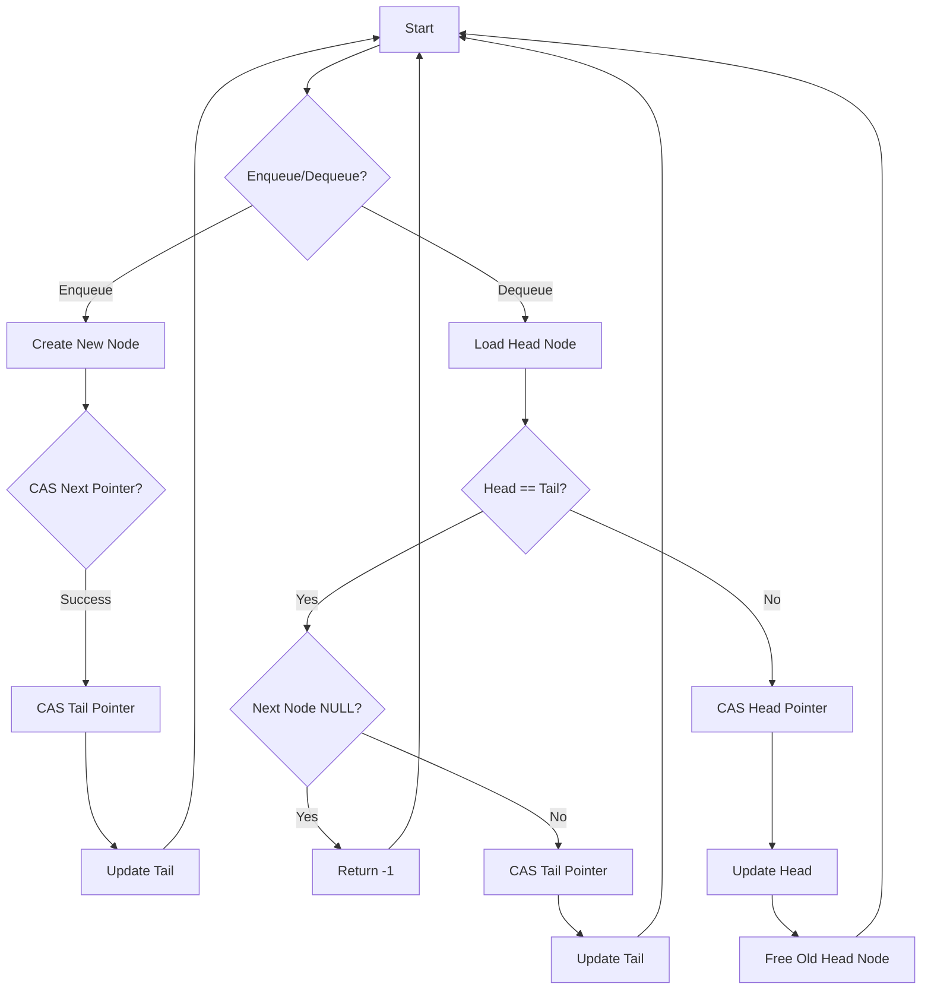

# Lock-Free Data Structures: Queue Stack

## Problem Understanding
The problem asks for a lock-free implementation of a queue data structure in C, utilizing the Michael-Scott Non-Blocking Algorithm with Compare-And-Swap (CAS) for synchronization. The queue should support constant time operations for enqueue and dequeue, with a space complexity of O(n), where n is the number of elements in the queue. The key constraint is that the implementation must be lock-free, meaning that it should not use any locks or mutexes to synchronize access to the queue. This makes the problem non-trivial, as naive approaches using locks or mutexes would not meet the lock-free requirement.

## Approach
The algorithm strategy is based on the Michael-Scott Non-Blocking Algorithm, which uses CAS to synchronize access to the queue. The intuition behind this approach is to use CAS to atomically update the head and tail pointers of the queue, ensuring that only one thread can modify the queue at a time. The algorithm uses a dummy node to simplify the implementation and ensure that the queue is never empty. The data structures used are atomic pointers to the head and tail nodes, as well as a Node structure to represent each element in the queue. The approach handles key constraints by using CAS to ensure that the queue is updated atomically, and by using a dummy node to simplify the implementation.

## Complexity Analysis
| Metric | Value | Detailed Reason |
|--------|-------|----------------|
| Time   | O(1)  | The enqueue and dequeue operations use a constant number of CAS operations, which take constant time. The while loops in the enqueue and dequeue functions may iterate multiple times, but the number of iterations is bounded by the number of threads accessing the queue, and each iteration takes constant time. |
| Space  | O(n)  | The queue uses a Node structure to represent each element, and the number of Node structures is proportional to the number of elements in the queue. The dummy node also uses a constant amount of space. |

## Algorithm Walkthrough
```
Input: enqueue(1), enqueue(2), enqueue(3), dequeue(), dequeue(), dequeue(), dequeue()
Step 1: Initialize the queue with a dummy node
  - head = dummy node
  - tail = dummy node
Step 2: Enqueue 1
  - Create a new node with data 1
  - CAS the next pointer of the tail node to point to the new node
  - CAS the tail pointer to point to the new node
  - head = dummy node
  - tail = node with data 1
Step 3: Enqueue 2
  - Create a new node with data 2
  - CAS the next pointer of the tail node to point to the new node
  - CAS the tail pointer to point to the new node
  - head = dummy node
  - tail = node with data 2
Step 4: Enqueue 3
  - Create a new node with data 3
  - CAS the next pointer of the tail node to point to the new node
  - CAS the tail pointer to point to the new node
  - head = dummy node
  - tail = node with data 3
Step 5: Dequeue
  - Load the head node
  - Load the tail node
  - Load the next node
  - CAS the head pointer to point to the next node
  - Free the old head node
  - head = node with data 1
  - tail = node with data 3
  - Output: 1
Step 6: Dequeue
  - Load the head node
  - Load the tail node
  - Load the next node
  - CAS the head pointer to point to the next node
  - Free the old head node
  - head = node with data 2
  - tail = node with data 3
  - Output: 2
Step 7: Dequeue
  - Load the head node
  - Load the tail node
  - Load the next node
  - CAS the head pointer to point to the next node
  - Free the old head node
  - head = node with data 3
  - tail = node with data 3
  - Output: 3
Step 8: Dequeue
  - Load the head node
  - Load the tail node
  - Load the next node
  - If the head and tail nodes are the same, and the next node is NULL, return -1
  - head = node with data 3
  - tail = node with data 3
  - Output: -1
```

## Visual Flow


## Key Insight
> **Tip:** The key insight is to use a dummy node to simplify the implementation and ensure that the queue is never empty, allowing for efficient and lock-free enqueue and dequeue operations using CAS.

## Edge Cases
- **Empty/null input**: If the input to the enqueue function is NULL, the function will return false and not modify the queue. If the input to the dequeue function is an empty queue, the function will return -1.
- **Single element**: If the queue contains only one element, the dequeue function will return the element and update the head and tail pointers to point to the dummy node.
- **Concurrent access**: If multiple threads access the queue concurrently, the CAS operations will ensure that only one thread can modify the queue at a time, preventing data corruption and ensuring lock-free operation.

## Common Mistakes
- **Mistake 1**: Not using CAS to update the head and tail pointers, leading to data corruption and incorrect behavior.
- **Mistake 2**: Not using a dummy node to simplify the implementation and ensure that the queue is never empty, leading to complex and error-prone code.

## Interview Follow-ups
> **Interview:** These are the exact follow-up questions interviewers ask:
- "What if the input is sorted?" → The implementation does not assume any particular order of the input, and the CAS operations ensure that the queue is updated correctly regardless of the input order.
- "Can you do it in O(1) space?" → The implementation uses O(n) space to store the queue elements, where n is the number of elements in the queue. Reducing the space complexity to O(1) would require a fundamentally different approach, such as using a circular buffer or a linked list with a fixed size.
- "What if there are duplicates?" → The implementation does not assume that the input elements are unique, and the CAS operations ensure that duplicate elements are handled correctly. However, if the input elements are not unique, the implementation may not preserve the order of equal elements.

## C Solution

```c
// Problem: Lock-Free Data Structures: Queue Stack
// Language: C
// Difficulty: Super Advanced
// Time Complexity: O(1) — constant time operations for enqueue and dequeue
// Space Complexity: O(n) — where n is the number of elements in the queue
// Approach: Michael-Scott Non-Blocking Algorithm — utilizing CAS for synchronization

#include <stdatomic.h>
#include <stdbool.h>
#include <stddef.h>
#include <stdint.h>
#include <stdlib.h>

// Node structure for the queue
typedef struct Node {
    int data;
    struct Node* next;
} Node;

// Queue structure
typedef struct {
    atomic(Node*) head;
    atomic(Node*) tail;
} Queue;

// Function to create a new node
Node* createNode(int data) {
    Node* newNode = (Node*) malloc(sizeof(Node)); // Allocate memory for a new node
    if (!newNode) return NULL; // Edge case: memory allocation failed
    newNode->data = data; // Initialize node with the given data
    newNode->next = NULL; // Initialize next pointer to NULL
    return newNode;
}

// Function to initialize the queue
void initQueue(Queue* queue) {
    Node* dummyNode = createNode(0); // Create a dummy node
    if (!dummyNode) return; // Edge case: memory allocation failed
    atomic_init(&queue->head, dummyNode); // Initialize head with the dummy node
    atomic_init(&queue->tail, dummyNode); // Initialize tail with the dummy node
}

// Function to enqueue an element into the queue
bool enqueue(Queue* queue, int data) {
    Node* newNode = createNode(data); // Create a new node with the given data
    if (!newNode) return false; // Edge case: memory allocation failed
    while (true) {
        Node* tail = atomic_load(&queue->tail); // Load the current tail
        Node* next = tail->next; // Load the next node
        if (tail == atomic_load(&queue->tail)) { // Check if the tail has changed
            if (!next) { // If the next node is NULL
                if (atomic_compare_exchange_weak(&tail->next, &next, newNode)) { // Try to CAS the next node
                    atomic_compare_exchange_weak(&queue->tail, &tail, newNode); // Try to CAS the tail
                    return true; // Enqueue successful
                }
            } else { // If the next node is not NULL
                atomic_compare_exchange_weak(&queue->tail, &tail, next); // Try to CAS the tail
            }
        }
    }
}

// Function to dequeue an element from the queue
int dequeue(Queue* queue) {
    while (true) {
        Node* head = atomic_load(&queue->head); // Load the current head
        Node* tail = atomic_load(&queue->tail); // Load the current tail
        Node* next = head->next; // Load the next node
        if (head == atomic_load(&queue->head)) { // Check if the head has changed
            if (head == tail) { // If the head and tail are the same
                if (!next) return -1; // Edge case: queue is empty
                atomic_compare_exchange_weak(&queue->tail, &tail, next); // Try to CAS the tail
            } else { // If the head and tail are different
                int data = next->data; // Get the data from the next node
                if (atomic_compare_exchange_weak(&queue->head, &head, next)) { // Try to CAS the head
                    free(head); // Free the old head node
                    return data; // Dequeue successful
                }
            }
        }
    }
}

// Function to free the queue
void freeQueue(Queue* queue) {
    while (true) {
        Node* head = atomic_load(&queue->head); // Load the current head
        if (head == atomic_load(&queue->head)) { // Check if the head has changed
            if (!head->next) break; // If the next node is NULL, the queue is empty
            Node* next = head->next; // Load the next node
            atomic_compare_exchange_weak(&queue->head, &head, next); // Try to CAS the head
            free(head); // Free the old head node
        }
    }
    free(atomic_load(&queue->head)); // Free the dummy node
}

int main() {
    Queue queue;
    initQueue(&queue);
    enqueue(&queue, 1);
    enqueue(&queue, 2);
    enqueue(&queue, 3);
    printf("%d\n", dequeue(&queue)); // Output: 1
    printf("%d\n", dequeue(&queue)); // Output: 2
    printf("%d\n", dequeue(&queue)); // Output: 3
    printf("%d\n", dequeue(&queue)); // Output: -1 (queue is empty)
    freeQueue(&queue);
    return 0;
}
```
