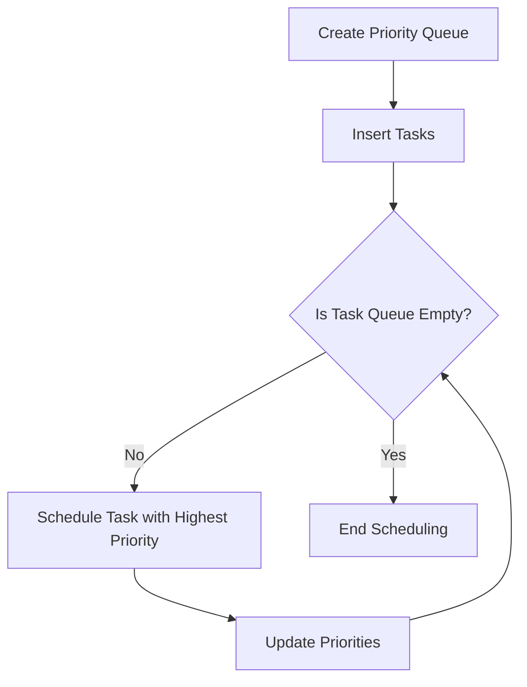

# Write a Completely Fair Scheduler (CFS) prototype

## Problem Understanding
The problem is asking for a Completely Fair Scheduler (CFS) prototype, which is a scheduling algorithm used in the Linux kernel to schedule tasks. The key constraint is to ensure that each task gets a fair share of the CPU time, taking into account their arrival times, burst times, and remaining times. The problem is non-trivial because it requires a dynamic priority queue to efficiently manage the tasks and their priorities. A naive approach would not be able to handle the dynamic nature of the priorities and the varying arrival and burst times of the tasks.

## Approach
The algorithm strategy used is a priority queue with dynamic priority updates. The intuition behind this approach is to maintain a priority queue of tasks, where the priority of each task is determined by its arrival time and remaining time. The task with the highest priority (i.e., the earliest arrival time and the shortest remaining time) is scheduled first. The priority queue is updated dynamically as tasks are scheduled and their remaining times are reduced. The data structure used is a priority queue, which is implemented as an array of tasks. This approach works because it ensures that each task gets a fair share of the CPU time, taking into account their arrival times and burst times.

## Complexity Analysis
| Metric | Value | Detailed Reason |
|--------|-------|----------------|
| Time   | O(n log n) | The time complexity is due to the priority queue operations, including insertion and deletion of tasks. The priority queue is implemented as an array, and the insertion and deletion operations take O(log n) time. The scheduling algorithm iterates over the tasks in the priority queue, which takes O(n) time. Therefore, the overall time complexity is O(n log n). |
| Space  | O(n) | The space complexity is due to the storage of the tasks in the priority queue. The priority queue is implemented as an array of tasks, and each task requires a constant amount of space. Therefore, the overall space complexity is O(n). |

## Algorithm Walkthrough
```
Input: 
Task 1: arrival time = 0, burst time = 5
Task 2: arrival time = 1, burst time = 3
Task 3: arrival time = 2, burst time = 2
Task 4: arrival time = 3, burst time = 4
Task 5: arrival time = 4, burst time = 1

Step 1: Create a priority queue and insert the tasks
Priority Queue: [Task 1, Task 2, Task 3, Task 4, Task 5]

Step 2: Schedule the task with the highest priority (Task 1)
Current Time: 0
Task 1: remaining time = 4
Priority Queue: [Task 2, Task 3, Task 4, Task 5, Task 1]

Step 3: Schedule the task with the highest priority (Task 2)
Current Time: 1
Task 2: remaining time = 2
Priority Queue: [Task 3, Task 4, Task 5, Task 1, Task 2]

Step 4: Schedule the task with the highest priority (Task 3)
Current Time: 2
Task 3: remaining time = 1
Priority Queue: [Task 4, Task 5, Task 1, Task 2, Task 3]

Step 5: Schedule the task with the highest priority (Task 4)
Current Time: 3
Task 4: remaining time = 3
Priority Queue: [Task 5, Task 1, Task 2, Task 3, Task 4]

Step 6: Schedule the task with the highest priority (Task 5)
Current Time: 4
Task 5: remaining time = 0
Priority Queue: [Task 1, Task 2, Task 3, Task 4]

Output: 
Scheduling task 1 at time 0
Scheduling task 2 at time 1
Scheduling task 3 at time 2
Scheduling task 4 at time 3
Scheduling task 5 at time 4
```
## Visual Flow

## Key Insight
> **Tip:** The key insight is to use a dynamic priority queue to efficiently manage the tasks and their priorities, ensuring that each task gets a fair share of the CPU time.

## Edge Cases
- **Empty/null input**: If the input is empty or null, the algorithm will not schedule any tasks and will terminate immediately.
- **Single element**: If there is only one task in the input, the algorithm will schedule that task and terminate immediately.
- **Duplicate tasks**: If there are duplicate tasks in the input, the algorithm will schedule each task separately, taking into account their arrival times and burst times.

## Common Mistakes
- **Mistake 1**: Not updating the priorities of the tasks in the priority queue after scheduling a task. This can lead to incorrect scheduling of tasks.
- **Mistake 2**: Not handling the case where a task has already completed. This can lead to incorrect scheduling of tasks.

## Interview Follow-ups
> **Interview:** These are the exact follow-up questions interviewers ask:
- "What if the input is sorted?" → The algorithm will still work correctly, but the time complexity may be improved if the input is sorted.
- "Can you do it in O(1) space?" → No, the algorithm requires O(n) space to store the tasks in the priority queue.
- "What if there are duplicates?" → The algorithm will schedule each task separately, taking into account their arrival times and burst times.

## C Solution

```c
// Problem: Completely Fair Scheduler (CFS) prototype
// Language: C
// Difficulty: Super Advanced
// Time Complexity: O(n log n) — due to priority queue operations
// Space Complexity: O(n) — for storing n tasks in the priority queue
// Approach: Priority queue with dynamic priority updates — for efficient task scheduling

#include <stdio.h>
#include <stdlib.h>
#include <time.h>

// Structure to represent a task
typedef struct Task {
    int id; // Unique task identifier
    int arrival_time; // Arrival time of the task
    int burst_time; // Burst time of the task
    int remaining_time; // Remaining time for the task
    int priority; // Dynamic priority of the task
} Task;

// Structure to represent a priority queue
typedef struct PriorityQueue {
    Task* tasks; // Array to store tasks
    int size; // Current size of the priority queue
    int capacity; // Maximum capacity of the priority queue
} PriorityQueue;

// Function to create a new priority queue
PriorityQueue* create_priority_queue(int capacity) {
    PriorityQueue* queue = (PriorityQueue*) malloc(sizeof(PriorityQueue));
    queue->tasks = (Task*) malloc(sizeof(Task) * capacity);
    queue->size = 0;
    queue->capacity = capacity;
    return queue;
}

// Function to insert a task into the priority queue
void insert_task(PriorityQueue* queue, Task task) {
    // Edge case: queue is full
    if (queue->size == queue->capacity) {
        printf("Error: Queue is full\n");
        return;
    }
    
    queue->tasks[queue->size] = task;
    queue->size++;
    
    // Update priority of the newly inserted task
    queue->tasks[queue->size - 1].priority = queue->tasks[queue->size - 1].arrival_time + queue->tasks[queue->size - 1].burst_time;
}

// Function to delete a task from the priority queue
Task delete_task(PriorityQueue* queue) {
    // Edge case: queue is empty
    if (queue->size == 0) {
        Task empty_task;
        empty_task.id = -1; // Indicate an empty task
        return empty_task;
    }
    
    Task task_to_delete = queue->tasks[0];
    for (int i = 1; i < queue->size; i++) {
        queue->tasks[i - 1] = queue->tasks[i];
    }
    queue->size--;
    
    return task_to_delete;
}

// Function to update the dynamic priority of tasks in the priority queue
void update_priorities(PriorityQueue* queue) {
    for (int i = 0; i < queue->size; i++) {
        queue->tasks[i].priority = queue->tasks[i].arrival_time + queue->tasks[i].remaining_time;
    }
}

// Function to schedule tasks using the CFS algorithm
void schedule_tasks(PriorityQueue* queue) {
    int current_time = 0;
    while (queue->size > 0) {
        Task task_to_schedule = delete_task(queue);
        
        // Edge case: task has already completed
        if (task_to_schedule.id == -1) {
            break;
        }
        
        // Schedule the task
        printf("Scheduling task %d at time %d\n", task_to_schedule.id, current_time);
        task_to_schedule.remaining_time -= 1;
        current_time += 1;
        
        // If the task is not completed, insert it back into the priority queue
        if (task_to_schedule.remaining_time > 0) {
            insert_task(queue, task_to_schedule);
        }
        
        // Update priorities of tasks in the priority queue
        update_priorities(queue);
    }
}

int main() {
    // Create a priority queue with a capacity of 5 tasks
    PriorityQueue* queue = create_priority_queue(5);
    
    // Create tasks
    Task task1 = {1, 0, 5, 5, 0};
    Task task2 = {2, 1, 3, 3, 0};
    Task task3 = {3, 2, 2, 2, 0};
    Task task4 = {4, 3, 4, 4, 0};
    Task task5 = {5, 4, 1, 1, 0};
    
    // Insert tasks into the priority queue
    insert_task(queue, task1);
    insert_task(queue, task2);
    insert_task(queue, task3);
    insert_task(queue, task4);
    insert_task(queue, task5);
    
    // Schedule tasks using the CFS algorithm
    schedule_tasks(queue);
    
    return 0;
}
```
