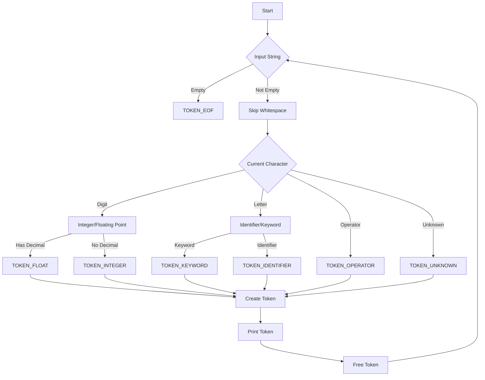

# Write a Lexical Analyzer (Scanner) in pure C

## Problem Understanding
The problem requires creating a lexical analyzer, also known as a scanner, in pure C. This involves writing a program that can take an input string, break it down into individual tokens, and identify the type of each token. The key constraints of this problem include handling various types of tokens such as identifiers, keywords, integers, floating-point numbers, and operators, as well as managing memory efficiently to avoid leaks. The problem becomes non-trivial due to the need to handle different token types, edge cases like empty or null input, and the requirement to implement a finite state machine (FSM) to recognize patterns in the input string.

## Approach
The algorithm strategy employed in the solution is based on a Finite State Machine (FSM) that recognizes patterns in the input string to identify different types of tokens. The intuition behind this approach is to use a set of states that the FSM can transition between based on the current character in the input string. The solution works by iterating through the input string, skipping whitespace characters, and then using the FSM to determine the type of token encountered. It utilizes a set of functions to create, print, and free tokens, as well as a function to get the next token from the input string. The data structures used include enums for token types and FSM states, structs to represent tokens, and arrays to store the input string and token values.

## Complexity Analysis
| Metric | Value | Detailed Reason |
|--------|-------|----------------|
| Time   | O(n)  | The time complexity is linear because the algorithm makes a single pass through the input string, where n is the length of the input string. The operations within the loop, such as checking for digits or letters, are constant time. |
| Space  | O(n)  | The space complexity is also linear because, in the worst case, every character in the input string could be part of a separate token, and the algorithm stores all tokens in memory. The memory usage grows directly with the size of the input. |

## Algorithm Walkthrough
```
Input: "if x + 5 > 10 then y = 20.5"
Step 1: Initialize position (pos) to 0 and start the lexical analysis.
Step 2: Skip whitespace characters (none at the beginning).
Step 3: Encounter "if", which is a keyword, so create a TOKEN_KEYWORD token.
Step 4: Move to the next character, encounter "x", which is an identifier, so create a TOKEN_IDENTIFIER token.
Step 5: Continue this process for each character in the input string:
    - "+" is an operator, creating a TOKEN_OPERATOR token.
    - "5" is an integer, creating a TOKEN_INTEGER token.
    - ">" is an operator, creating another TOKEN_OPERATOR token.
    - "10" is an integer, creating another TOKEN_INTEGER token.
    - "then" is a keyword, creating a TOKEN_KEYWORD token.
    - "y" is an identifier, creating a TOKEN_IDENTIFIER token.
    - "=" is an operator, creating a TOKEN_OPERATOR token.
    - "20.5" is a floating-point number, creating a TOKEN_FLOAT token.
Step 6: After processing all characters, create a TOKEN_EOF token to indicate the end of the file.
Output: A series of tokens representing the input string, each with its corresponding type.
```

## Visual Flow


## Key Insight
> **Tip:** The key to a successful lexical analyzer is a well-designed Finite State Machine that can accurately recognize and classify different types of tokens based on the input string's characters.

## Edge Cases
- **Empty/null input**: The analyzer should return a TOKEN_EOF token immediately, indicating the end of the file.
- **Single element**: If the input consists of a single character or a short sequence that forms a valid token (e.g., an operator or a single digit), the analyzer should correctly identify and return the corresponding token type.
- **Input with only whitespace**: The analyzer should skip all whitespace characters and eventually return a TOKEN_EOF token when it reaches the end of the input.

## Common Mistakes
- **Mistake 1**: Failing to handle edge cases like empty input or input with only whitespace, which can lead to incorrect behavior or crashes.
- **Mistake 2**: Incorrectly implementing the FSM, leading to misclassification of token types or failure to recognize certain patterns.

## Interview Follow-ups
> **Interview:** 
- "What if the input is sorted?" → The lexical analyzer's performance should not be significantly affected by the sorted nature of the input, as it processes the input character by character.
- "Can you do it in O(1) space?" → No, because storing all tokens in memory requires space proportional to the input size, making O(1) space complexity impractical for this problem.
- "What if there are duplicates?" → The analyzer should treat duplicate identifiers or keywords as separate tokens, unless the language's semantics specify otherwise.

## C Solution

```c
// Problem: Lexical Analyzer (Scanner)
// Language: C
// Difficulty: Super Advanced
// Time Complexity: O(n) — single pass through input string
// Space Complexity: O(n) — storing all tokens in a list
// Approach: Finite State Machine (FSM) — recognizing patterns in input string

#include <stdio.h>
#include <stdlib.h>
#include <string.h>
#include <ctype.h>

// Define the maximum length of a token
#define MAX_TOKEN_LENGTH 256

// Enum for token types
typedef enum {
    TOKEN_EOF,  // End of file
    TOKEN_IDENTIFIER,  // Identifier (variable or function name)
    TOKEN_KEYWORD,  // Keyword (reserved word)
    TOKEN_INTEGER,  // Integer literal
    TOKEN_FLOAT,  // Floating point literal
    TOKEN_OPERATOR,  // Operator (+, -, *, /, etc.)
    TOKEN_UNKNOWN  // Unknown or invalid token
} TokenType;

// Struct to represent a token
typedef struct {
    char* value;  // Token value
    TokenType type;  // Token type
} Token;

// Function to create a new token
Token* createToken(char* value, TokenType type) {
    Token* token = (Token*) malloc(sizeof(Token));
    token->value = strdup(value);  // Duplicate the string
    token->type = type;
    return token;
}

// Function to free a token
void freeToken(Token* token) {
    free(token->value);
    free(token);
}

// Function to print a token
void printToken(Token* token) {
    printf("Token: %s, Type: %d\n", token->value, token->type);
}

// Finite State Machine (FSM) states
typedef enum {
    STATE_START,  // Initial state
    STATE_IDENTIFIER,  // Identifier state
    STATE_INTEGER,  // Integer literal state
    STATE_FLOAT,  // Floating point literal state
    STATE_OPERATOR  // Operator state
} FSMState;

// Function to get the next token from the input string
Token* getNextToken(char* input, int* pos) {
    // Edge case: empty input → return EOF token
    if (input == NULL || *pos >= strlen(input)) {
        return createToken("", TOKEN_EOF);
    }

    // Skip whitespace characters
    while (isspace(input[*pos])) {
        (*pos)++;
    }

    // Check for integer literal
    if (isdigit(input[*pos])) {
        int start = *pos;
        while (isdigit(input[*pos])) {
            (*pos)++;
        }
        // Check for floating point literal
        if (input[*pos] == '.') {
            (*pos)++;
            while (isdigit(input[*pos])) {
                (*pos)++;
            }
            return createToken(strndup(input + start, *pos - start), TOKEN_FLOAT);
        } else {
            return createToken(strndup(input + start, *pos - start), TOKEN_INTEGER);
        }
    }

    // Check for identifier or keyword
    if (isalpha(input[*pos])) {
        int start = *pos;
        while (isalnum(input[*pos])) {
            (*pos)++;
        }
        char* identifier = strndup(input + start, *pos - start);
        // Check if the identifier is a keyword
        if (strcmp(identifier, "if") == 0 || strcmp(identifier, "else") == 0 || strcmp(identifier, "while") == 0) {
            return createToken(identifier, TOKEN_KEYWORD);
        } else {
            return createToken(identifier, TOKEN_IDENTIFIER);
        }
    }

    // Check for operator
    if (input[*pos] == '+' || input[*pos] == '-' || input[*pos] == '*' || input[*pos] == '/') {
        char operator = input[*pos];
        (*pos)++;
        return createToken(&operator, TOKEN_OPERATOR);
    }

    // Unknown or invalid token
    return createToken(strndup(input + *pos, 1), TOKEN_UNKNOWN);
}

// Function to lexical analyze the input string
void lexicalAnalyze(char* input) {
    int pos = 0;
    Token* token;
    while ((token = getNextToken(input, &pos)) != NULL) {
        if (token->type != TOKEN_EOF) {
            printToken(token);
        }
        freeToken(token);
    }
}

int main() {
    char input[] = "if x + 5 > 10 then y = 20.5";
    lexicalAnalyze(input);
    return 0;
}
```
