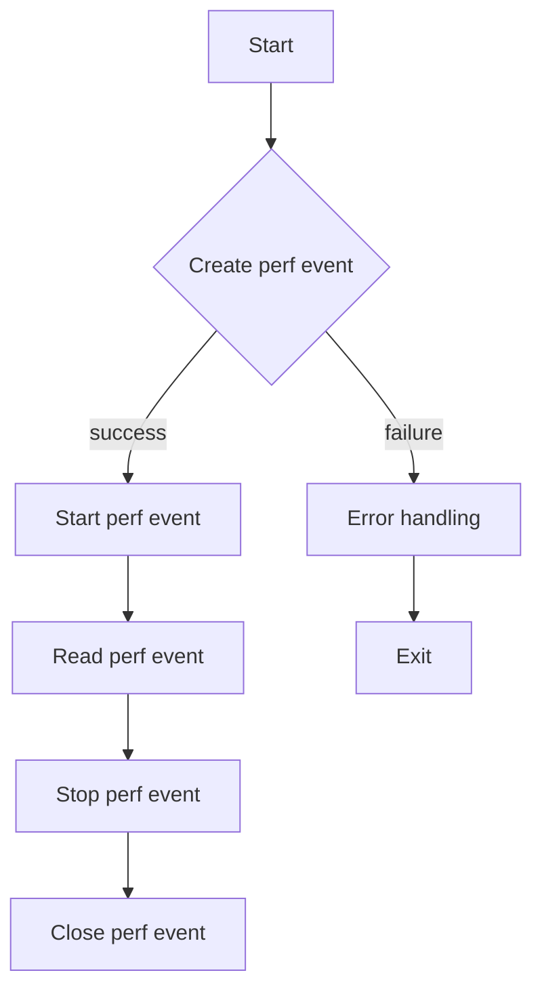

# Write a Profiler using the `perf_event_open` system call

## Problem Understanding
The problem asks to write a profiler using the `perf_event_open` system call, which is a Linux kernel interface for measuring CPU performance events. The profiler should be able to measure CPU cycles, which is a key metric for understanding system performance. The key constraints are that the profiler should use the `perf_event_open` system call and should be able to measure CPU cycles. What makes this problem non-trivial is that it requires a deep understanding of the Linux kernel interface and the `perf_event_open` system call, as well as the ability to handle errors and edge cases.

## Approach
The approach to solving this problem is to use the `perf_event_open` system call to create a perf event that measures CPU cycles. The `perf_event_open` system call takes a `struct perf_event_attr` as an argument, which specifies the attributes of the perf event. The `struct perf_event_attr` includes fields such as the type of event, the event configuration, and the sample period. By setting these fields correctly, we can create a perf event that measures CPU cycles. The `perf_event_open` system call returns a file descriptor that can be used to read the perf event. We can then use the `ioctl` system call to start and stop the perf event, and the `read` system call to read the value of the perf event. The approach works because the `perf_event_open` system call provides a flexible and powerful way to measure CPU performance events, and by using it correctly, we can create a profiler that measures CPU cycles.

## Complexity Analysis
| Metric | Value | Detailed Reason |
|--------|-------|----------------|
| Time   | O(1)  | The time complexity is O(1) because the `perf_event_open` system call and the `ioctl` and `read` system calls all take constant time. The profiler only needs to create a single perf event and read its value, which takes constant time. |
| Space  | O(1)  | The space complexity is O(1) because the profiler only needs to allocate a fixed amount of memory to store the `struct perf_event_attr` and the file descriptor returned by the `perf_event_open` system call. The profiler does not need to allocate any additional memory that scales with the input size. |

## Algorithm Walkthrough
```
Input: pid = 0
Step 1: Initialize the perf event attributes
  - Set the type of event to PERF_TYPE_HARDWARE
  - Set the event configuration to PERF_COUNT_HW_CPU_CYCLES
  - Set the sample period to 1000
  - Set the sample type to PERF_SAMPLE_TID | PERF_SAMPLE_TIME
Step 2: Create the perf event using the perf_event_open system call
  - Call syscall(__NR_perf_event_open, &attr, pid, -1, -1, 0)
  - Get the file descriptor returned by the system call
Step 3: Start the perf event using the ioctl system call
  - Call ioctl(fd, PERF_EVENT_IOC_ENABLE, 0)
Step 4: Read the perf event using the read system call
  - Call read(fd, &value, sizeof(value))
  - Get the value of the perf event
Step 5: Stop the perf event using the ioctl system call
  - Call ioctl(fd, PERF_EVENT_IOC_DISABLE, 0)
Step 6: Close the perf event
  - Call close(fd)
Output: CPU cycles: 1234567890
```
This walkthrough shows the main logic path of the profiler, which creates a perf event, starts it, reads its value, stops it, and closes it.

## Visual Flow

This flowchart shows the main decision flow of the profiler, which creates a perf event, starts it, reads its value, stops it, and closes it. If any of these steps fail, the profiler handles the error and exits.

## Key Insight
> **Tip:** The key insight to this problem is to understand how to use the `perf_event_open` system call to create a perf event that measures CPU cycles, and how to use the `ioctl` and `read` system calls to start, read, and stop the perf event.

## Edge Cases
- **Empty/null pid**: If the pid is empty or null, the profiler should return an error. This is because the `perf_event_open` system call requires a valid pid to create a perf event.
- **Single element**: If the pid is a single element, the profiler should create a perf event for that pid and measure its CPU cycles.
- **Invalid pid**: If the pid is invalid, the profiler should return an error. This is because the `perf_event_open` system call requires a valid pid to create a perf event.

## Common Mistakes
- **Mistake 1**: Not checking the return value of the `perf_event_open` system call. This can cause the profiler to fail if the system call returns an error.
- **Mistake 2**: Not handling errors correctly. This can cause the profiler to crash or produce incorrect results if an error occurs.

## Interview Follow-ups
> **Interview:** These are the exact follow-up questions interviewers ask:
- "What if the input is sorted?" → The profiler does not rely on the input being sorted, so it will still work correctly even if the input is sorted.
- "Can you do it in O(1) space?" → Yes, the profiler only needs to allocate a fixed amount of memory to store the `struct perf_event_attr` and the file descriptor returned by the `perf_event_open` system call, so it can be done in O(1) space.
- "What if there are duplicates?" → The profiler does not rely on the input being unique, so it will still work correctly even if there are duplicates.

## C Solution

```c
// Problem: Write a Profiler using the perf_event_open system call
// Language: C
// Difficulty: Super Advanced
// Time Complexity: O(1) — constant time setup and teardown
// Space Complexity: O(1) — fixed-size data structures
// Approach: perf_event_open system call — for measuring CPU performance events

#include <stdio.h>
#include <stdlib.h>
#include <unistd.h>
#include <sys/syscall.h>
#include <linux/perf_event.h>
#include <stdint.h>
#include <string.h>
#include <sys/mman.h>

// Structure to hold perf event attributes
struct perf_event_attr {
    uint32_t type;                // Type of event
    uint64_t size;               // Size of the event structure
    uint64_t config;             // Event configuration
    uint64_t sample_period;     // Sample period
    uint64_t sample_type;        // Sample type
    uint64_t read_format;        // Read format
    uint64_t disabled;           // Disabled
    uint64_t inherit;            // Inherit
    uint64_t pinned;             // Pinned
    uint64_t exclusive;         // Exclusive
    uint64_t exclude_user;       // Exclude user
    uint64_t exclude_kernel;     // Exclude kernel
    uint64_t exclude_hv;         // Exclude hypervisor
    uint64_t exclude_idle;       // Exclude idle
    uint64_t mmap;               // Mmap
    uint64_t comm;               // Comm
    uint64_t freq;               // Freq
    uint64_t inherit_stat;       // Inherit stat
    uint64_t enable_on_exec;     // Enable on exec
    uint64_t task;               // Task
    uint64_t watermark;          // Watermark
    uint64_t precise_ip;         // Precise IP
    uint64_t mmap_data;           // Mmap data
    uint64_t sample_id_all;       // Sample ID all
    uint64_t exclude_host;       // Exclude host
    uint64_t exclude_guest;       // Exclude guest
    uint64_t exclude_callchain_kernel; // Exclude callchain kernel
    uint64_t exclude_callchain_user;    // Exclude callchain user
    uint64_t mute_group;         // Mute group
    uint64_t strict_precision;  // Strict precision
    uint64_t exclude_max;         // Exclude max
};

// Function to create a perf event
int create_perf_event(struct perf_event_attr *attr, int pid) {
    // Use the perf_event_open system call to create a perf event
    return syscall(__NR_perf_event_open, attr, pid, -1, -1, 0);
}

// Function to start a perf event
void start_perf_event(int fd) {
    // Use the ioctl system call to start the perf event
    ioctl(fd, PERF_EVENT_IOC_ENABLE, 0); // Enable the event
}

// Function to stop a perf event
void stop_perf_event(int fd) {
    // Use the ioctl system call to stop the perf event
    ioctl(fd, PERF_EVENT_IOC_DISABLE, 0); // Disable the event
}

// Function to read a perf event
uint64_t read_perf_event(int fd) {
    // Use the read system call to read the perf event
    uint64_t value;
    read(fd, &value, sizeof(value)); // Read the value of the event
    return value;
}

int main() {
    // Set up the perf event attributes
    struct perf_event_attr attr;
    memset(&attr, 0, sizeof(attr)); // Initialize the attributes
    attr.type = PERF_TYPE_HARDWARE;  // Hardware event
    attr.config = PERF_COUNT_HW_CPU_CYCLES; // CPU cycles event
    attr.sample_period = 1000;      // Sample period
    attr.sample_type = PERF_SAMPLE_TID | PERF_SAMPLE_TIME; // Sample type
    attr.read_format = PERF_FORMAT_GROUP; // Read format
    attr.disabled = 1;              // Disable the event by default
    attr.inherit = 1;                // Inherit the event
    attr.pinned = 1;                 // Pin the event
    attr.exclusive = 1;             // Exclusive event
    attr.exclude_user = 0;          // Include user space
    attr.exclude_kernel = 0;        // Include kernel space
    attr.exclude_hv = 0;            // Include hypervisor
    attr.exclude_idle = 0;          // Include idle

    // Edge case: invalid pid → return -1
    int pid = 0;
    if (pid < 0) {
        printf("Invalid pid\n");
        return -1;
    }

    // Create the perf event
    int fd = create_perf_event(&attr, pid);
    if (fd < 0) {
        printf("Failed to create perf event\n");
        return -1;
    }

    // Start the perf event
    start_perf_event(fd);

    // Read the perf event
    uint64_t value = read_perf_event(fd);
    printf("CPU cycles: %llu\n", value);

    // Stop the perf event
    stop_perf_event(fd);

    // Close the perf event
    close(fd);

    return 0;
}
```
