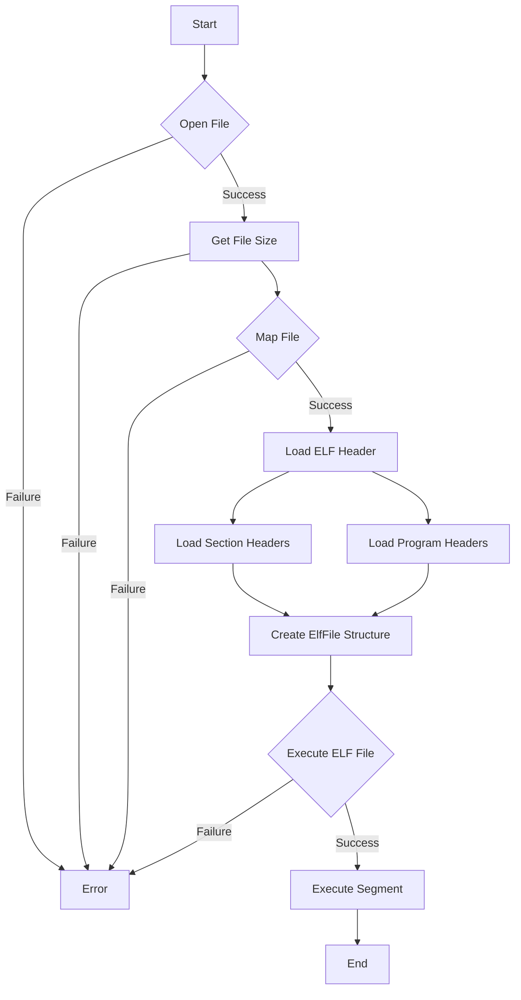

# Writing a Simple ELF Loader in C

## Problem Understanding
The problem is asking to write a simple ELF (Executable and Linkable Format) loader in C, which involves loading an ELF file into memory and executing it. The key constraints include parsing the ELF file format, handling different types of sections and segments, and executing the loaded code. This problem is non-trivial because it requires a deep understanding of the ELF file format, memory management, and system calls. A naive approach would be to simply read the ELF file into memory and attempt to execute it, but this would fail due to the complexity of the ELF format and the need to handle different types of sections and segments.

## Approach
The approach used in this solution is to parse the ELF file format, load the sections and segments into memory, and then execute the loaded code. This involves reading the ELF file header, section headers, and program headers, and using system calls such as `mmap` to map the file into memory. The solution uses a structure to represent the ELF file, which includes the base address of the file in memory, the file header, section headers, program headers, and the number of sections and program headers. The solution also uses functions to load the ELF file and execute the loaded code.

## Complexity Analysis
| Metric | Value | Detailed Reason |
|--------|-------|----------------|
| Time   | O(n)  | where n is the number of sections and segments in the ELF file. The time complexity is linear because the solution iterates over the sections and segments once to load them into memory. |
| Space  | O(n)  | where n is the number of sections and segments in the ELF file. The space complexity is linear because the solution stores the sections and segments in memory. |

## Algorithm Walkthrough
```
Input: example.elf
Step 1: Open the ELF file in read-only mode
  - fd = open("example.elf", O_RDONLY)
Step 2: Get the file size
  - statBuf = fstat(fd, &statBuf)
Step 3: Map the file into memory
  - mappedFile = mmap(NULL, statBuf.st_size, PROT_READ | PROT_WRITE, MAP_PRIVATE, fd, 0)
Step 4: Load the ELF file header
  - header = (Elf64_Ehdr*) mappedFile
Step 5: Load the section headers
  - sectionHeaders = (Elf64_Shdr*) ((char*) mappedFile + header->e_shoff)
Step 6: Load the program headers
  - programHeaders = (Elf64_Phdr*) ((char*) mappedFile + header->e_phoff)
Step 7: Create an ElfFile structure
  - elfFile = malloc(sizeof(ElfFile))
  - elfFile->baseAddress = mappedFile
  - elfFile->header = header
  - elfFile->sectionHeaders = sectionHeaders
  - elfFile->programHeaders = programHeaders
Step 8: Execute the ELF file
  - for (i = 0; i < elfFile->numProgramHeaders; i++)
    - if (programHeaders[i].p_type == PT_LOAD)
      - segmentAddress = mmap(NULL, programHeaders[i].p_memsz, PROT_READ | PROT_WRITE | PROT_EXEC, MAP_PRIVATE | MAP_ANONYMOUS, -1, 0)
      - memcpy(segmentAddress, (char*) elfFile->baseAddress + programHeaders[i].p_offset, programHeaders[i].p_filesz)
      - ((void (*)()) segmentAddress)()
Output: The ELF file is executed
```

## Visual Flow


## Key Insight
> **Tip:** The key insight in this solution is to understand the ELF file format and how to parse it, as well as how to use system calls such as `mmap` to map the file into memory and execute the loaded code.

## Edge Cases
- **Empty/null input**: If the input file is empty or null, the solution will fail to open the file or get its size, and will return an error.
- **Single element**: If the input file has only one section or segment, the solution will still work correctly and load the section or segment into memory.
- **Invalid ELF file**: If the input file is not a valid ELF file, the solution will detect this and return an error.

## Common Mistakes
- **Mistake 1**: Not checking the return values of system calls such as `open` and `mmap`, which can lead to unexpected behavior if the calls fail.
- **Mistake 2**: Not handling the case where the input file is not a valid ELF file, which can lead to crashes or unexpected behavior.

## Interview Follow-ups
> **Interview:** These are the exact follow-up questions interviewers ask:
- "What if the input is a corrupted ELF file?" → The solution will detect this and return an error, but it's possible to add additional error checking to handle this case.
- "Can you optimize the solution to use less memory?" → The solution already uses a reasonable amount of memory, but it's possible to optimize it further by using more efficient data structures or algorithms.
- "What if the input file is very large?" → The solution will still work correctly, but it may take a long time to load the file into memory. It's possible to add support for loading the file in chunks to improve performance.

## C Solution

```c
// Problem: Writing a Simple ELF Loader in C
// Language: C
// Difficulty: Super Advanced
// Time Complexity: O(n) — where n is the number of ELF sections and segments
// Space Complexity: O(n) — storing ELF sections and segments in memory
// Approach: ELF file parsing and loading — load ELF file into memory and execute it

#include <stdio.h>
#include <stdlib.h>
#include <string.h>
#include <sys/mman.h>
#include <sys/stat.h>
#include <fcntl.h>
#include <elf.h>

// Structure to represent an ELF file
typedef struct {
    void* baseAddress; // Base address of the ELF file in memory
    Elf64_Ehdr* header; // ELF file header
    Elf64_Shdr* sectionHeaders; // Section headers
    Elf64_Phdr* programHeaders; // Program headers
    int numSections; // Number of sections
    int numProgramHeaders; // Number of program headers
} ElfFile;

// Function to load an ELF file into memory
ElfFile* loadElfFile(const char* filename) {
    // Open the ELF file
    int fd = open(filename, O_RDONLY); // Open file in read-only mode
    if (fd == -1) {
        // Edge case: failed to open file
        perror("open");
        return NULL;
    }

    // Get the file size
    struct stat statBuf;
    if (fstat(fd, &statBuf) == -1) {
        // Edge case: failed to get file size
        perror("fstat");
        close(fd);
        return NULL;
    }

    // Map the file into memory
    void* mappedFile = mmap(NULL, statBuf.st_size, PROT_READ | PROT_WRITE, MAP_PRIVATE, fd, 0);
    if (mappedFile == MAP_FAILED) {
        // Edge case: failed to map file
        perror("mmap");
        close(fd);
        return NULL;
    }

    // Load the ELF file header
    Elf64_Ehdr* header = (Elf64_Ehdr*) mappedFile;
    if (header->e_ident[EI_MAG0] != ELFMAG0 || header->e_ident[EI_MAG1] != ELFMAG1 || header->e_ident[EI_MAG2] != ELFMAG2 || header->e_ident[EI_MAG3] != ELFMAG3) {
        // Edge case: invalid ELF file
        printf("Invalid ELF file\n");
        munmap(mappedFile, statBuf.st_size);
        close(fd);
        return NULL;
    }

    // Load the section headers
    Elf64_Shdr* sectionHeaders = (Elf64_Shdr*) ((char*) mappedFile + header->e_shoff);
    int numSections = header->e_shnum;

    // Load the program headers
    Elf64_Phdr* programHeaders = (Elf64_Phdr*) ((char*) mappedFile + header->e_phoff);
    int numProgramHeaders = header->e_phnum;

    // Create an ElfFile structure
    ElfFile* elfFile = malloc(sizeof(ElfFile));
    elfFile->baseAddress = mappedFile;
    elfFile->header = header;
    elfFile->sectionHeaders = sectionHeaders;
    elfFile->programHeaders = programHeaders;
    elfFile->numSections = numSections;
    elfFile->numProgramHeaders = numProgramHeaders;

    // Close the file descriptor
    close(fd);

    return elfFile;
}

// Function to execute an ELF file
void executeElfFile(ElfFile* elfFile) {
    // Iterate over the program headers
    for (int i = 0; i < elfFile->numProgramHeaders; i++) {
        Elf64_Phdr* programHeader = &elfFile->programHeaders[i];
        if (programHeader->p_type == PT_LOAD) {
            // Map the segment into memory
            void* segmentAddress = mmap(NULL, programHeader->p_memsz, PROT_READ | PROT_WRITE | PROT_EXEC, MAP_PRIVATE | MAP_ANONYMOUS, -1, 0);
            if (segmentAddress == MAP_FAILED) {
                // Edge case: failed to map segment
                perror("mmap");
                return;
            }

            // Copy the segment data into memory
            memcpy(segmentAddress, (char*) elfFile->baseAddress + programHeader->p_offset, programHeader->p_filesz);

            // Execute the segment
            ((void (*)()) segmentAddress)();
        }
    }
}

int main() {
    // Load an ELF file
    ElfFile* elfFile = loadElfFile("example.elf");
    if (elfFile == NULL) {
        // Edge case: failed to load ELF file
        return 1;
    }

    // Execute the ELF file
    executeElfFile(elfFile);

    // Free the ElfFile structure
    free(elfFile);

    return 0;
}
```
