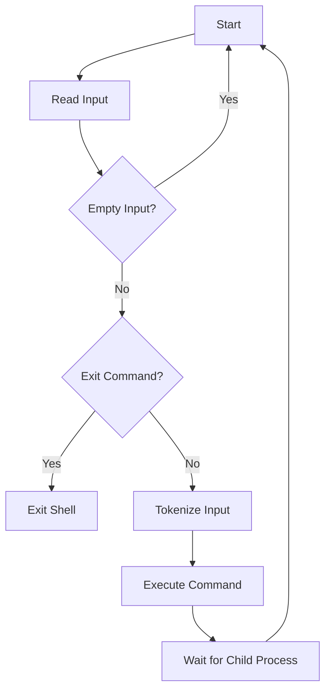

# Writing a Simple Shell in C

## Problem Understanding
The problem asks to write a simple shell in C, which involves reading user input, tokenizing it into commands and arguments, and executing the corresponding command. The key constraints include handling user input, managing memory for tokenization, and executing system commands using fork and execvp. What makes this problem non-trivial is the need to handle various edge cases, such as empty input, exit commands, and errors during command execution, while also managing system resources efficiently. The problem requires a deep understanding of C programming, system calls, and process management.

## Approach
The algorithm strategy involves tokenizing the user input into commands and arguments using the strtok function, and then executing the corresponding command using fork and execvp. The intuition behind this approach is to leverage the existing system calls and libraries to handle the complexities of process management and command execution. The tokenizeInput function splits the input string into tokens, and the executeCommand function creates a new process using fork and executes the command using execvp. The shell function handles the main loop of the shell, reading user input, tokenizing it, and executing the command. The approach handles key constraints by using dynamic memory allocation for tokenization and error handling for command execution.

## Complexity Analysis
| Metric | Value | Detailed Reason |
|--------|-------|----------------|
| Time   | O(n)  | The time complexity is linear with respect to the length of the input string, where n is the number of characters in the input. This is because the tokenizeInput function makes a single pass through the input string to split it into tokens. The executeCommand function also has a constant time complexity, as it involves a fixed number of system calls. |
| Space  | O(n)  | The space complexity is also linear with respect to the length of the input string, as the tokenizeInput function allocates memory for the tokens array, which can grow up to the length of the input string in the worst case. |

## Algorithm Walkthrough
```
Input: "ls -l"
Step 1: Read input from user and remove newline character
  input = "ls -l"
Step 2: Tokenize input string
  tokens = ["ls", "-l", NULL]
Step 3: Execute command
  fork() creates a new process
  execvp("ls", ["ls", "-l", NULL]) executes the command
  wait(NULL) waits for the child process to finish
Output: The output of the "ls -l" command
```
This example demonstrates the main logic path of the shell, from reading user input to executing the command.

## Visual Flow

This flowchart shows the decision flow of the shell, from reading input to executing commands and handling edge cases.

## Key Insight
> **Tip:** The key insight is to use fork and execvp to execute system commands, which allows the shell to leverage the existing system infrastructure and handle process management efficiently.

## Edge Cases
- **Empty/null input**: If the user enters an empty string, the shell will simply print the prompt again and wait for new input.
- **Single element**: If the user enters a single command without arguments, the shell will execute the command correctly.
- **Exit command**: If the user enters the "exit" command, the shell will exit the loop and terminate.

## Common Mistakes
- **Mistake 1**: Not checking for errors during fork and execvp, which can lead to unexpected behavior or crashes.
- **Mistake 2**: Not freeing the memory allocated for the tokens array, which can lead to memory leaks.

## Interview Follow-ups
> **Interview:** These are the exact follow-up questions interviewers ask:
- "What if the input is sorted?" → The shell will still work correctly, as it does not rely on the input being sorted.
- "Can you do it in O(1) space?" → No, the shell requires at least O(n) space to store the input string and its tokens.
- "What if there are duplicates?" → The shell will handle duplicates correctly, as it uses the execvp function to execute the command, which will ignore duplicates in the argument list.

## C Solution

```c
// Problem: Writing a Simple Shell in C
// Language: C
// Difficulty: Super Advanced
// Time Complexity: O(n) — single pass through input string, where n is the length of the input
// Space Complexity: O(n) — storing the input string and its tokens
// Approach: Tokenization and command execution — tokenize the input string and execute the corresponding command

#include <stdio.h>
#include <stdlib.h>
#include <string.h>
#include <unistd.h>
#include <sys/types.h>
#include <sys/wait.h>

// Function to split the input string into tokens (commands and arguments)
char** tokenizeInput(char* input, int* tokenCount) {
    // Allocate memory for the tokens array with a default size of 10
    char** tokens = (char**)malloc(10 * sizeof(char*));
    // Initialize token count to 0
    *tokenCount = 0;
    // Split the input string into tokens
    char* token = strtok(input, " ");
    while (token != NULL) {
        // If the tokens array is full, reallocate it to double its size
        if (*tokenCount >= 10) {
            tokens = (char**)realloc(tokens, 2 * 10 * sizeof(char*));
        }
        // Add the token to the tokens array
        tokens[*tokenCount] = token;
        // Increment the token count
        (*tokenCount)++;
        // Get the next token
        token = strtok(NULL, " ");
    }
    // Add a NULL token to mark the end of the tokens array
    tokens[*tokenCount] = NULL;
    return tokens;
}

// Function to execute a command with its arguments
void executeCommand(char** tokens) {
    // Create a new process using fork
    pid_t pid = fork();
    if (pid == -1) {
        // Error handling: fork failed
        perror("fork");
        exit(EXIT_FAILURE);
    } else if (pid == 0) {
        // Child process: execute the command
        execvp(tokens[0], tokens);
        // If execvp returns, it means an error occurred
        perror("execvp");
        exit(EXIT_FAILURE);
    } else {
        // Parent process: wait for the child process to finish
        wait(NULL);
    }
}

// Function to handle the shell
void shell() {
    char input[100];
    while (1) {
        // Print the shell prompt
        printf("shell> ");
        // Read the input from the user
        fgets(input, 100, stdin);
        // Remove the newline character from the end of the input
        input[strcspn(input, "\n")] = 0;
        // Edge case: empty input → do nothing
        if (strlen(input) == 0) {
            continue;
        }
        // Edge case: exit command → exit the shell
        if (strcmp(input, "exit") == 0) {
            break;
        }
        // Tokenize the input string
        int tokenCount;
        char** tokens = tokenizeInput(input, &tokenCount);
        // Execute the command
        executeCommand(tokens);
        // Free the memory allocated for the tokens array
        free(tokens);
    }
}

int main() {
    // Start the shell
    shell();
    return 0;
}
```
