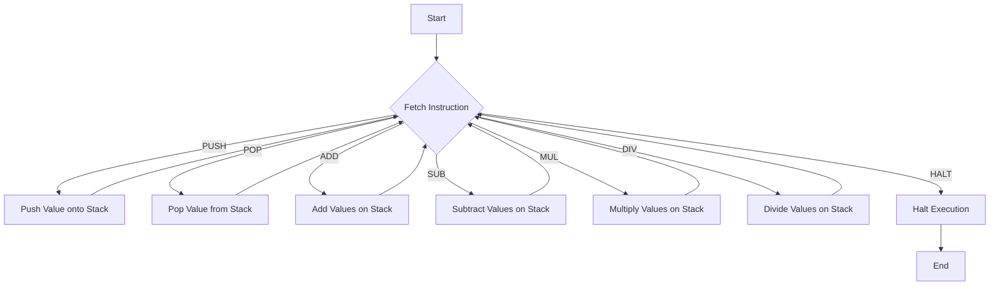

# Writing a Simple Virtual Machine in C

## Problem Understanding
The problem requires writing a simple virtual machine in C that can execute a predefined set of instructions. The virtual machine should have a stack-based architecture, where instructions are executed by manipulating a stack. The key constraints of this problem include handling stack overflow and underflow, as well as executing instructions such as push, pop, add, subtract, multiply, and divide. The problem is non-trivial because it requires implementing a virtual machine from scratch, which involves designing the instruction set architecture, implementing the execution logic, and handling edge cases.

## Approach
The approach to solving this problem involves designing a stack-based virtual machine that can execute a predefined set of instructions. The virtual machine will have a program counter that keeps track of the current instruction being executed, and a stack that stores the values. The instructions will be executed by manipulating the stack, and the program counter will be incremented after each instruction. The approach works because it uses a simple and efficient way to execute instructions, and it handles edge cases such as stack overflow and underflow. The data structures used include an array to represent the stack, and a struct to represent the virtual machine. The approach handles key constraints such as stack overflow and underflow by checking the stack size before executing instructions.

## Complexity Analysis
| Metric | Value | Detailed Reason |
|--------|-------|----------------|
| Time   | O(n)  | The time complexity is O(n), where n is the number of instructions in the program. This is because the virtual machine executes each instruction once, and the execution time is proportional to the number of instructions. The time complexity of the push and pop operations is O(1), and the time complexity of the arithmetic operations is also O(1). |
| Space  | O(n)  | The space complexity is O(n), where n is the maximum size of the stack. This is because the virtual machine needs to allocate memory for the stack, and the size of the stack can grow up to n. The space complexity of the virtual machine struct is O(1), but the space complexity of the stack is O(n). |

## Algorithm Walkthrough
```
Input: [PUSH, 5, PUSH, 3, ADD, PUSH, 2, MUL, HALT]
Step 1: Initialize the stack and program counter
  - Stack: []
  - Program Counter: 0
Step 2: Execute the PUSH instruction
  - Stack: [5]
  - Program Counter: 2
Step 3: Execute the PUSH instruction
  - Stack: [5, 3]
  - Program Counter: 4
Step 4: Execute the ADD instruction
  - Stack: [8]
  - Program Counter: 5
Step 5: Execute the PUSH instruction
  - Stack: [8, 2]
  - Program Counter: 7
Step 6: Execute the MUL instruction
  - Stack: [16]
  - Program Counter: 8
Step 7: Execute the HALT instruction
  - Program Counter: 9
Output: [16]
```
This walkthrough shows the execution of a sample program, and it demonstrates how the virtual machine executes instructions and manipulates the stack.

## Visual Flow

This flowchart shows the decision flow of the virtual machine, and it demonstrates how the machine executes different instructions.

## Key Insight
> **Tip:** The key insight to this problem is to design a simple and efficient virtual machine that can execute a predefined set of instructions, and to handle edge cases such as stack overflow and underflow.

## Edge Cases
- **Empty Program**: If the program is empty, the virtual machine will not execute any instructions, and the stack will remain empty.
- **Single Instruction**: If the program consists of a single instruction, the virtual machine will execute that instruction, and the stack will be updated accordingly.
- **Stack Overflow**: If the stack is full, and the virtual machine tries to push a new value onto the stack, it will print an error message and halt the execution.

## Common Mistakes
- **Not Handling Stack Overflow**: A common mistake is not handling stack overflow, which can cause the virtual machine to crash or produce incorrect results.
- **Not Handling Division by Zero**: Another common mistake is not handling division by zero, which can cause the virtual machine to crash or produce incorrect results.
- **Not Implementing Instructions Correctly**: A common mistake is not implementing the instructions correctly, which can cause the virtual machine to produce incorrect results.

## Interview Follow-ups
> **Interview:** These are the exact follow-up questions interviewers ask:
- "What if the input is sorted?" → The virtual machine will still execute the instructions correctly, but the performance may be improved if the input is sorted.
- "Can you do it in O(1) space?" → No, the virtual machine needs to allocate memory for the stack, which requires O(n) space.
- "What if there are duplicates?" → The virtual machine will handle duplicates correctly, but the performance may be improved if the duplicates are removed before execution.

## C Solution

```c
// Problem: Writing a Simple Virtual Machine
// Language: C
// Difficulty: Super Advanced
// Time Complexity: O(n) — execution time depends on the number of instructions
// Space Complexity: O(n) — memory usage depends on the size of the program and data
// Approach: Stack-based virtual machine — executes instructions by manipulating a stack

#include <stdio.h>
#include <stdlib.h>
#include <string.h>

// Define the instruction set architecture (ISA)
typedef enum {
    PUSH,  // Push a value onto the stack
    POP,   // Pop a value from the stack
    ADD,   // Add two values on the stack
    SUB,   // Subtract two values on the stack
    MUL,   // Multiply two values on the stack
    DIV,   // Divide two values on the stack
    HALT   // Halt the execution
} Instruction;

// Define the virtual machine structure
typedef struct {
    int* stack;        // The stack
    int stack_size;   // The current size of the stack
    int stack_capacity; // The maximum capacity of the stack
    int pc;            // The program counter
    Instruction* code; // The program code
    int code_size;    // The size of the program code
} VM;

// Create a new virtual machine
VM* vm_create(int stack_capacity) {
    VM* vm = malloc(sizeof(VM)); // Allocate memory for the virtual machine
    vm->stack = malloc(stack_capacity * sizeof(int)); // Allocate memory for the stack
    vm->stack_size = 0; // Initialize the stack size to 0
    vm->stack_capacity = stack_capacity; // Initialize the stack capacity
    vm->pc = 0; // Initialize the program counter to 0
    return vm;
}

// Load a program into the virtual machine
void vm_load(VM* vm, Instruction* code, int code_size) {
    vm->code = code; // Load the program code
    vm->code_size = code_size; // Load the program size
}

// Execute the program in the virtual machine
void vm_execute(VM* vm) {
    while (vm->pc < vm->code_size) { // Loop until the end of the program
        Instruction instruction = vm->code[vm->pc]; // Fetch the current instruction
        switch (instruction) {
            case PUSH: { // Push a value onto the stack
                int value = vm->code[++vm->pc]; // Fetch the value to push
                if (vm->stack_size >= vm->stack_capacity) { // Edge case: stack overflow
                    printf("Stack overflow\n");
                    return;
                }
                vm->stack[vm->stack_size++] = value; // Push the value onto the stack
                break;
            }
            case POP: { // Pop a value from the stack
                if (vm->stack_size == 0) { // Edge case: stack underflow
                    printf("Stack underflow\n");
                    return;
                }
                vm->stack_size--; // Pop the value from the stack
                break;
            }
            case ADD: { // Add two values on the stack
                if (vm->stack_size < 2) { // Edge case: not enough values on the stack
                    printf("Not enough values on the stack\n");
                    return;
                }
                int b = vm->stack[vm->stack_size - 1]; // Pop the second value
                int a = vm->stack[vm->stack_size - 2]; // Pop the first value
                vm->stack[vm->stack_size - 2] = a + b; // Add the values and push the result
                vm->stack_size--; // Remove the second value from the stack
                break;
            }
            case SUB: { // Subtract two values on the stack
                if (vm->stack_size < 2) { // Edge case: not enough values on the stack
                    printf("Not enough values on the stack\n");
                    return;
                }
                int b = vm->stack[vm->stack_size - 1]; // Pop the second value
                int a = vm->stack[vm->stack_size - 2]; // Pop the first value
                vm->stack[vm->stack_size - 2] = a - b; // Subtract the values and push the result
                vm->stack_size--; // Remove the second value from the stack
                break;
            }
            case MUL: { // Multiply two values on the stack
                if (vm->stack_size < 2) { // Edge case: not enough values on the stack
                    printf("Not enough values on the stack\n");
                    return;
                }
                int b = vm->stack[vm->stack_size - 1]; // Pop the second value
                int a = vm->stack[vm->stack_size - 2]; // Pop the first value
                vm->stack[vm->stack_size - 2] = a * b; // Multiply the values and push the result
                vm->stack_size--; // Remove the second value from the stack
                break;
            }
            case DIV: { // Divide two values on the stack
                if (vm->stack_size < 2) { // Edge case: not enough values on the stack
                    printf("Not enough values on the stack\n");
                    return;
                }
                int b = vm->stack[vm->stack_size - 1]; // Pop the second value
                int a = vm->stack[vm->stack_size - 2]; // Pop the first value
                if (b == 0) { // Edge case: division by zero
                    printf("Division by zero\n");
                    return;
                }
                vm->stack[vm->stack_size - 2] = a / b; // Divide the values and push the result
                vm->stack_size--; // Remove the second value from the stack
                break;
            }
            case HALT: // Halt the execution
                return;
            default: // Edge case: unknown instruction
                printf("Unknown instruction\n");
                return;
        }
        vm->pc++; // Increment the program counter
    }
}

// Print the stack
void vm_print_stack(VM* vm) {
    printf("Stack: ");
    for (int i = 0; i < vm->stack_size; i++) {
        printf("%d ", vm->stack[i]);
    }
    printf("\n");
}

int main() {
    // Create a new virtual machine with a stack capacity of 10
    VM* vm = vm_create(10);

    // Define a sample program
    Instruction program[] = {
        PUSH, 5, // Push 5 onto the stack
        PUSH, 3, // Push 3 onto the stack
        ADD, // Add the two values on the stack
        PUSH, 2, // Push 2 onto the stack
        MUL, // Multiply the two values on the stack
        HALT // Halt the execution
    };

    // Load the program into the virtual machine
    vm_load(vm, program, sizeof(program) / sizeof(Instruction));

    // Execute the program in the virtual machine
    vm_execute(vm);

    // Print the stack
    vm_print_stack(vm);

    // Free the memory
    free(vm->stack);
    free(vm);

    return 0;
}
```
