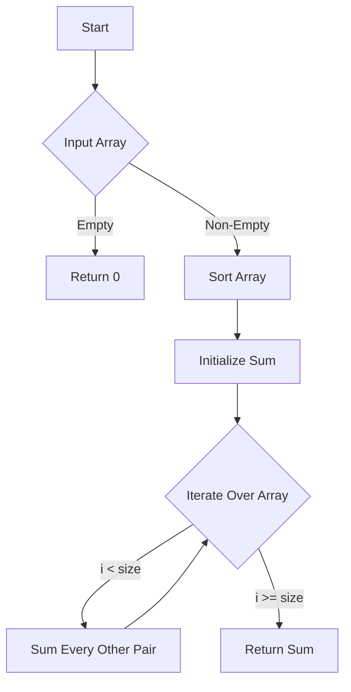

# Array Partition I Sorting

## Problem Understanding
The problem is asking to find the sum of the smaller numbers in each pair of an array after sorting it. The key constraint is that the pairs must be formed from adjacent elements in the sorted array, and we want to minimize the sum of the smaller numbers. This problem is non-trivial because a naive approach might involve trying all possible pairings, which would have a high time complexity. However, by sorting the array, we can ensure that the smallest numbers are paired with the next smallest numbers, thus minimizing the sum of the smaller numbers.

## Approach
The algorithm strategy is to sort the array in ascending order and then sum every other pair, starting from the first element. The intuition behind this approach is that by sorting the array, we can ensure that the smallest numbers are paired with the next smallest numbers, thus minimizing the sum of the smaller numbers. This approach works because the sorting step ensures that the smallest numbers are at the beginning of the array, and by summing every other pair, we are effectively summing the smaller numbers in each pair. The data structure used is a vector, which is chosen because it provides efficient sorting and iteration operations.

## Complexity Analysis
| Metric | Value | Detailed Reason |
|--------|-------|----------------|
| Time   | O(n log n) | The time complexity is O(n log n) because we are using the std::sort function to sort the array, which has a time complexity of O(n log n). The subsequent for loop has a time complexity of O(n), but it is dominated by the sorting step. |
| Space  | O(1) | The space complexity is O(1) because we are not using any extra space that scales with the input size. The input array is sorted in-place, and we only use a constant amount of space to store the sum and loop variables. |

## Algorithm Walkthrough
```
Input: [1, 4, 3, 2]
Step 1: Sort the array in ascending order → [1, 2, 3, 4]
Step 2: Initialize sum to 0
Step 3: Iterate over the sorted array and sum every other pair (starting from the first element)
  - i = 0, sum += 1 → sum = 1
  - i = 2, sum += 3 → sum = 4
Step 4: Return the sum → 4
Output: 4
```
This example demonstrates how the algorithm works by sorting the array, summing every other pair, and returning the sum of the smaller numbers.

## Visual Flow

This flowchart shows the decision flow of the algorithm, including the handling of empty input arrays and the iteration over the sorted array.

## Key Insight
> **Tip:** The key insight is that sorting the array allows us to pair the smallest numbers with the next smallest numbers, thus minimizing the sum of the smaller numbers.

## Edge Cases
- **Empty input**: If the input array is empty, the algorithm returns 0 because there are no pairs to sum.
- **Single element**: If the input array has only one element, the algorithm returns that element because there is only one number to sum.
- **Duplicate elements**: If the input array has duplicate elements, the algorithm still works correctly because the sorting step ensures that the duplicates are paired correctly.

## Common Mistakes
- **Mistake 1**: Not checking for empty input arrays → To avoid this, always check if the input array is empty before proceeding with the algorithm.
- **Mistake 2**: Not using a stable sorting algorithm → To avoid this, use a stable sorting algorithm like std::sort, which ensures that equal elements remain in their original order.

## Interview Follow-ups
> **Interview:** These are the exact follow-up questions interviewers ask:
- "What if the input is sorted?" → The algorithm still works correctly, but the time complexity would be O(n) because we can skip the sorting step.
- "Can you do it in O(1) space?" → Yes, the algorithm already uses O(1) space because we are not using any extra space that scales with the input size.
- "What if there are duplicates?" → The algorithm still works correctly because the sorting step ensures that the duplicates are paired correctly.

## CPP Solution

```cpp
// Problem: Array Partition I Sorting
// Language: cpp
// Difficulty: Easy
// Time Complexity: O(n log n) — sorting the array using std::sort
// Space Complexity: O(1) — not using any extra space that scales with input size
// Approach: Sorting and pair sum — sorting the array and then summing every other pair

class Solution {
public:
    int arrayPairSum(vector<int>& nums) {
        // Edge case: empty input → return 0
        if (nums.empty()) return 0;
        
        // Sort the array in ascending order
        std::sort(nums.begin(), nums.end()); // using std::sort to sort the array
        
        int sum = 0; // initialize sum to 0
        
        // Iterate over the sorted array and sum every other pair (starting from the first element)
        for (int i = 0; i < nums.size(); i += 2) {
            // Add the smaller number of each pair to the sum
            sum += nums[i]; // adding the smaller number to the sum
        }
        
        return sum; // return the sum
    }
};
```
