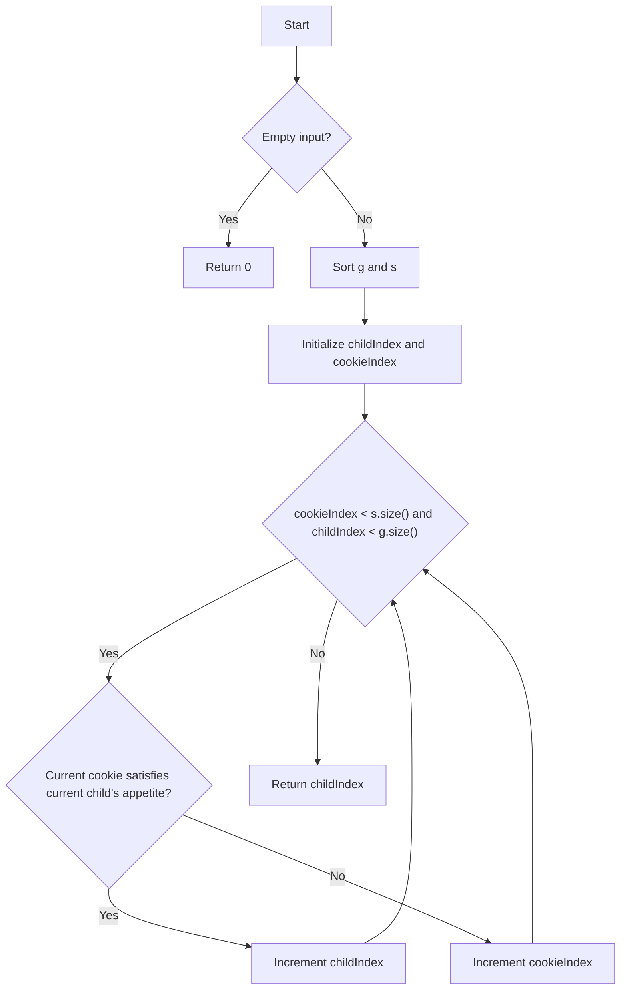

# Assign Cookies Greedy

## Problem Understanding
The Assign Cookies Greedy problem asks to find the maximum number of children that can be satisfied with cookies, given their appetites and the sizes of the cookies. The key constraint is that each child can only be satisfied by a cookie that is at least as large as their appetite. This problem is non-trivial because a naive approach would be to try all possible combinations of children and cookies, which would result in an inefficient solution. The problem requires a greedy algorithm that can efficiently assign cookies to children based on their appetites.

## Approach
The solution uses a greedy algorithm with sorting, where the children's appetites and cookie sizes are sorted in ascending order. This approach works because it ensures that the smallest cookie is assigned to the child with the smallest appetite, and so on. The algorithm iterates through the sorted arrays, assigning cookies to children whenever a cookie satisfies a child's appetite. The use of sorting allows the algorithm to efficiently find the maximum number of satisfied children. The algorithm handles the key constraint by only assigning a cookie to a child if the cookie's size is at least as large as the child's appetite.

## Complexity Analysis
| Metric | Value | Detailed Reason |
|--------|-------|----------------|
| Time   | O(n log n) | The algorithm sorts both the children's appetites and cookie sizes, which takes O(n log n) time. The subsequent while loop takes O(n) time, but it is dominated by the sorting step. |
| Space  | O(1) | The algorithm only uses a constant amount of space to store the indices and does not use any additional data structures that scale with the input size. |

## Algorithm Walkthrough
```
Input: g = [1, 2, 3], s = [1, 2]
Step 1: Sort g and s: g = [1, 2, 3], s = [1, 2]
Step 2: Initialize childIndex and cookieIndex: childIndex = 0, cookieIndex = 0
Step 3: Iterate through cookies: 
  - cookieIndex = 0, childIndex = 0: s[0] >= g[0], so childIndex++
  - cookieIndex = 1, childIndex = 1: s[1] >= g[1], so childIndex++
Step 4: Return the number of satisfied children: childIndex = 2
Output: 2
```
This example demonstrates how the algorithm assigns cookies to children based on their appetites and returns the maximum number of satisfied children.

## Visual Flow

This flowchart illustrates the algorithm's decision flow, including the handling of empty input, sorting, and iterating through the cookies.

## Key Insight
> **Tip:** The key to this problem is to sort both the children's appetites and cookie sizes, allowing the algorithm to efficiently assign cookies to children based on their appetites.

## Edge Cases
- **Empty/null input**: If either the children's appetites or cookie sizes array is empty, the algorithm returns 0, as there are no children to satisfy or no cookies to assign.
- **Single element**: If there is only one child or one cookie, the algorithm checks if the cookie satisfies the child's appetite and returns 1 if it does, or 0 if it does not.
- **All children have the same appetite**: In this case, the algorithm still sorts the cookie sizes and assigns the smallest cookie to the first child, the second smallest cookie to the second child, and so on.

## Common Mistakes
- **Mistake 1**: Not sorting the children's appetites and cookie sizes, leading to incorrect assignments and a lower number of satisfied children. To avoid this, ensure that the sorting step is included in the algorithm.
- **Mistake 2**: Not checking if the current cookie satisfies the current child's appetite before incrementing the child index. To avoid this, include the conditional statement to check if the cookie satisfies the child's appetite.

## Interview Follow-ups
> **Interview:** These are the exact follow-up questions interviewers ask:
- "What if the input is sorted?" → The algorithm would still work, but the time complexity would be O(n) instead of O(n log n) due to the sorting step.
- "Can you do it in O(1) space?" → No, the algorithm uses O(1) space excluding the input arrays, but it is not possible to reduce the space complexity further without using a different approach.
- "What if there are duplicates?" → The algorithm would still work correctly, as it only cares about the relative order of the children's appetites and cookie sizes, not their actual values.

## CPP Solution

```cpp
// Problem: Assign Cookies Greedy
// Language: C++
// Difficulty: Easy
// Time Complexity: O(n log n) — sorting both arrays
// Space Complexity: O(1) — excluding the input arrays
// Approach: Greedy algorithm with sorting — assign the smallest cookie to the child with the smallest appetite

class Solution {
public:
    int findContentChildren(vector<int>& g, vector<int>& s) {
        // Edge case: empty input → return 0
        if (g.empty() || s.empty()) return 0;

        // Sort both arrays in ascending order
        sort(g.begin(), g.end()); // sort children's appetites
        sort(s.begin(), s.end()); // sort cookie sizes

        int childIndex = 0; // index of the current child
        int cookieIndex = 0; // index of the current cookie

        // Iterate through the cookies and assign them to children
        while (childIndex < g.size() && cookieIndex < s.size()) {
            // If the current cookie satisfies the current child's appetite
            if (s[cookieIndex] >= g[childIndex]) {
                // Move to the next child
                childIndex++;
            }
            // Move to the next cookie
            cookieIndex++;
        }

        // Return the number of satisfied children
        return childIndex;
    }
};
```
