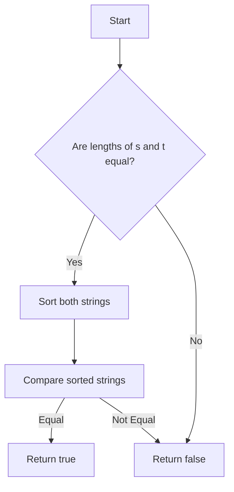

# Check Anagram

## Problem Understanding
The problem is asking to determine if two given strings are anagrams of each other, meaning they contain the same characters but possibly in a different order. A key constraint is that the input strings may have different lengths, which immediately implies they cannot be anagrams if their lengths are not equal. What makes this problem non-trivial is the need to efficiently compare the characters in both strings, as a naive approach such as checking every permutation of one string against the other would be extremely inefficient.

## Approach
The algorithm strategy used here is sorting, where both input strings are sorted and then compared for equality. The intuition behind this approach is that if two strings are anagrams, sorting their characters will result in the same sequence of characters. This approach works because sorting ensures that the characters in both strings are arranged in a consistent order, allowing for a straightforward comparison. The data structure used is the standard string class in C++, which supports sorting and comparison operations. The approach handles the key constraint of different lengths by first checking if the lengths are equal and returning false immediately if they are not.

## Complexity Analysis
| Metric | Value | Detailed Reason |
|--------|-------|----------------|
| Time   | O(n log n) | The time complexity is dominated by the sorting operation, which is O(n log n) for both strings. The subsequent comparison operation is O(n), but this is overshadowed by the sorting time. |
| Space  | O(1) | The space complexity is considered O(1) because, although the sorting operation may use some extra space internally, this space does not scale with the input size n. The input strings are sorted in-place, meaning no additional space that scales with n is used. |

## Algorithm Walkthrough
```
Input: s = "listen", t = "silent"
Step 1: Check if lengths of s and t are equal. Since they are equal (both 6), proceed.
Step 2: Sort both strings: 
  - s becomes "eilnst"
  - t becomes "eilnst"
Step 3: Compare the sorted strings: "eilnst" == "eilnst"
Output: true, indicating that "listen" and "silent" are anagrams.
```

## Visual Flow


## Key Insight
> **Tip:** The key insight here is that sorting both strings provides a simple and efficient way to check for anagrams, leveraging the fact that anagrams will have the same characters in a different order, and sorting normalizes this order.

## Edge Cases
- **Empty/null input**: If either string is empty or null, the function will return false because the lengths will be unequal or the sorting/comparison will fail. This is a correct behavior since an empty string cannot be an anagram of a non-empty string.
- **Single element**: If both strings have only one character, the function will correctly identify them as anagrams if the characters are the same and not anagrams if they are different.
- **Equal strings**: If the input strings are identical, the function will correctly identify them as anagrams because sorting and comparing them will yield equal results.

## Common Mistakes
- **Mistake 1**: Not checking for equal lengths before sorting. This can lead to unnecessary sorting operations when the strings are clearly not anagrams due to different lengths. → To avoid this, always check the lengths first.
- **Mistake 2**: Using a more complex data structure or algorithm than necessary. → To avoid this, stick with the simple and efficient approach of sorting and comparing, as it directly addresses the problem's requirements.

## Interview Follow-ups
> **Interview:** 
- "What if the input is sorted?" → The algorithm would still work correctly, but it would be less efficient than necessary because it would still sort the strings. A more efficient approach in this case would be to directly compare the strings.
- "Can you do it in O(1) space?" → No, achieving O(1) space complexity is not possible with the sorting approach because sorting algorithms typically require some extra space. However, you could achieve O(1) extra space (not counting the input strings) by using a counting sort approach if the character set is limited.
- "What if there are duplicates?" → The algorithm handles duplicates correctly because sorting will group duplicate characters together, allowing for accurate comparison of strings with duplicate characters.

## CPP Solution

```cpp
// Problem: Check Anagram
// Language: cpp
// Difficulty: Easy
// Time Complexity: O(n log n) — sorting both strings and comparing
// Space Complexity: O(1) — not using any extra space that scales with input size
// Approach: Sorting — sorting both strings and comparing for equality

class Solution {
public:
    bool isAnagram(std::string s, std::string t) {
        // Edge case: different lengths → cannot be anagrams
        if (s.length() != t.length()) return false;

        // Sort both strings
        std::sort(s.begin(), s.end());  // O(n log n) time complexity
        std::sort(t.begin(), t.end());  // O(n log n) time complexity

        // Compare sorted strings for equality
        return s == t;  // O(n) time complexity
    }
};
```
