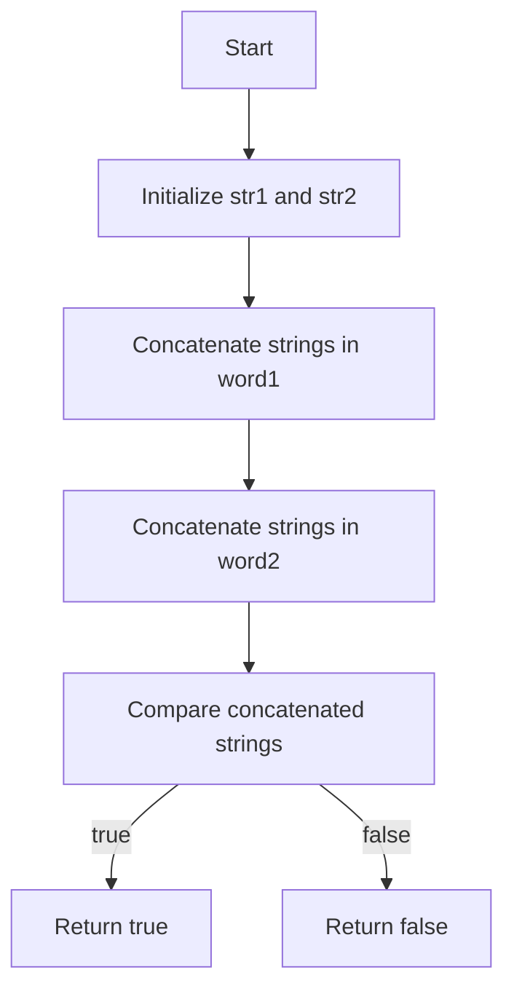

# Check If Two String Arrays are Equivalent

## Problem Understanding
The problem asks us to determine if two string arrays are equivalent by comparing their concatenated strings. The key constraint is that we need to handle empty input arrays and arrays with different lengths. What makes this problem non-trivial is that we cannot simply compare the individual strings in the arrays, as the order of the strings matters. Instead, we need to concatenate the strings in each array and then compare the resulting strings.

## Approach
Our algorithm strategy is to concatenate the strings in each array and then compare the resulting strings. This approach works because it allows us to handle arrays with different lengths and orders of strings. We use two empty strings, `str1` and `str2`, to store the concatenated strings from the input arrays `word1` and `word2`, respectively. We then iterate through each array, appending each string to the corresponding concatenated string. Finally, we compare the concatenated strings using the `==` operator.

## Complexity Analysis
| Metric | Value | Detailed Reason |
|--------|-------|----------------|
| Time   | O(n + m) | We iterate through each array once, where `n` is the total number of characters in `word1` and `m` is the total number of characters in `word2`. The concatenation operation is O(n + m) because we append each character to the concatenated string. The comparison operation is O(n + m) because we compare each character in the concatenated strings. |
| Space  | O(n + m) | We use two concatenated strings, `str1` and `str2`, to store the concatenated strings from the input arrays. The total space used is proportional to the total number of characters in the input arrays. |

## Algorithm Walkthrough
```
Input: word1 = ["ab", "c"], word2 = ["a", "bc"]
Step 1: Initialize empty strings str1 and str2
Step 2: Concatenate the strings in word1: str1 = "ab" + "c" = "abc"
Step 3: Concatenate the strings in word2: str2 = "a" + "bc" = "abc"
Step 4: Compare the concatenated strings: str1 == str2 = true
Output: true
```

## Visual Flow


## Key Insight
> **Tip:** The key insight is to concatenate the strings in each array and then compare the resulting strings, allowing us to handle arrays with different lengths and orders of strings.

## Edge Cases
- **Empty/null input**: If both input arrays are empty, the function returns true, indicating that the arrays are equivalent. If only one array is empty, the function returns false, indicating that the arrays are not equivalent.
- **Single element**: If each array contains a single string, the function compares the two strings and returns true if they are equal, and false otherwise.
- **Different lengths**: If the input arrays have different lengths, the function concatenates the strings in each array and compares the resulting strings, handling the different lengths correctly.

## Common Mistakes
- **Mistake 1**: Not handling the edge case where one or both input arrays are empty. To avoid this mistake, we need to explicitly check for empty input arrays and handle them accordingly.
- **Mistake 2**: Not using the correct concatenation operator (`+=`) to concatenate the strings in each array. To avoid this mistake, we need to use the correct operator to append each string to the concatenated string.

## Interview Follow-ups
> **Interview:** These are the exact follow-up questions interviewers ask:
- "What if the input is sorted?" → The algorithm still works correctly, as it only depends on the concatenated strings, not the order of the input strings.
- "Can you do it in O(1) space?" → No, because we need to store the concatenated strings, which requires O(n + m) space.
- "What if there are duplicates?" → The algorithm still works correctly, as it only depends on the concatenated strings, not the presence of duplicates.

## CPP Solution

```cpp
// Problem: Check If Two String Arrays are Equivalent
// Language: C++
// Difficulty: Easy
// Time Complexity: O(n + m) — iterating through both arrays
// Space Complexity: O(n + m) — storing the concatenated strings
// Approach: Concatenate and compare — join the strings and check for equality

class Solution {
public:
    bool arrayStringsAreEqual(vector<string>& word1, vector<string>& word2) {
        // Initialize empty strings to store the concatenated strings
        string str1, str2; 

        // Edge case: empty input arrays → return false if only one is empty
        if (word1.empty() && word2.empty()) return true;  // both empty → equal
        if (word1.empty() || word2.empty()) return false; // one empty, one not → not equal

        // Concatenate the strings in the first array
        for (const auto& word : word1) {
            // Append each word to the concatenated string
            str1 += word; 
        }

        // Concatenate the strings in the second array
        for (const auto& word : word2) {
            // Append each word to the concatenated string
            str2 += word; 
        }

        // Compare the concatenated strings
        return str1 == str2; // return true if equal, false otherwise
    }
};
```
