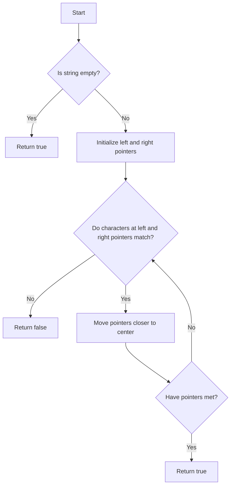

# Check Palindrome String

## Problem Understanding
The problem is asking to determine whether a given string is a palindrome, meaning it reads the same backwards as forwards. The key constraint is that the solution should be efficient and use minimal space. What makes this problem non-trivial is that a naive approach, such as reversing the entire string and comparing it to the original, would be inefficient in terms of space complexity. The problem requires a strategy that can compare characters from both ends of the string without modifying the original string.

## Approach
The algorithm strategy is to use the two-pointer technique, where two pointers are initialized at the start and end of the string, and then moved closer to the center while comparing the characters at the pointers. This approach works because it allows for a single pass through the string, comparing characters from both ends without modifying the original string. The data structure used is a simple string, and the approach handles the key constraint of minimal space complexity by only using a constant amount of space to store the pointers. The two-pointer technique is particularly well-suited for this problem because it allows for an efficient and space-conscious solution.

## Complexity Analysis
| Metric | Value | Detailed Reason |
|--------|-------|----------------|
| Time   | O(n)  | The algorithm makes a single pass through the string, where n is the length of the string. The while loop iterates until the two pointers meet, which happens after n/2 iterations in the worst case, resulting in a linear time complexity. |
| Space  | O(1)  | The algorithm uses a constant amount of space to store the two pointers, regardless of the size of the input string. This results in a constant space complexity. |

## Algorithm Walkthrough
```
Input: "madam"
Step 1: Initialize left pointer to 0 and right pointer to 4
Step 2: Compare characters at left (0) and right (4) pointers: 'm' == 'm', so continue
Step 3: Move left pointer to 1 and right pointer to 3
Step 4: Compare characters at left (1) and right (3) pointers: 'a' == 'a', so continue
Step 5: Move left pointer to 2 and right pointer to 2
Step 6: Since left pointer is no longer less than right pointer, exit loop
Output: true
```
This example demonstrates the algorithm's ability to correctly identify a palindrome string.

## Visual Flow

This flowchart illustrates the decision flow of the algorithm, highlighting the key steps and conditions.

## Key Insight
> **Tip:** The key insight to solving this problem efficiently is to use the two-pointer technique, which allows for a single pass through the string while comparing characters from both ends without modifying the original string.

## Edge Cases
- **Empty/null input**: If the input string is empty, the algorithm correctly returns true, as an empty string is considered a palindrome.
- **Single element**: If the input string has only one character, the algorithm correctly returns true, as a single-character string is always a palindrome.
- **Palindrome with even length**: If the input string has an even length and is a palindrome, the algorithm correctly returns true, as the two-pointer technique can handle even-length palindromes.

## Common Mistakes
- **Mistake 1**: Using a naive approach that reverses the entire string and compares it to the original, which would result in a higher space complexity. To avoid this, use the two-pointer technique instead.
- **Mistake 2**: Not handling the edge case of an empty input string correctly. To avoid this, add a simple check at the beginning of the algorithm to return true for empty strings.

## Interview Follow-ups
> **Interview:** These are the exact follow-up questions interviewers ask:
- "What if the input is sorted?" → The algorithm would still work correctly, as it only compares characters from both ends of the string, regardless of the sorting order.
- "Can you do it in O(1) space?" → The algorithm already uses O(1) space, as it only uses a constant amount of space to store the two pointers.
- "What if there are duplicates?" → The algorithm would still work correctly, as it only compares characters from both ends of the string, regardless of whether there are duplicates or not.

## CPP Solution

```cpp
// Problem: Check Palindrome String
// Language: C++
// Difficulty: Easy
// Time Complexity: O(n) — single pass through string
// Space Complexity: O(1) — constant space used
// Approach: Two-pointer technique — compare characters from both ends

class Solution {
public:
    bool isPalindrome(string s) {
        // Edge case: empty string → return true
        if (s.empty()) return true;

        // Initialize two pointers, one at the start and one at the end of the string
        int left = 0;  // Left pointer
        int right = s.length() - 1;  // Right pointer

        // Loop through the string until the two pointers meet
        while (left < right) {
            // If the characters at the left and right pointers do not match, return false
            if (s[left] != s[right]) return false;

            // Move the pointers closer to the center of the string
            left++;  // Move left pointer to the right
            right--;  // Move right pointer to the left
        }

        // If the loop completes without finding any mismatches, the string is a palindrome
        return true;
    }
};
```
