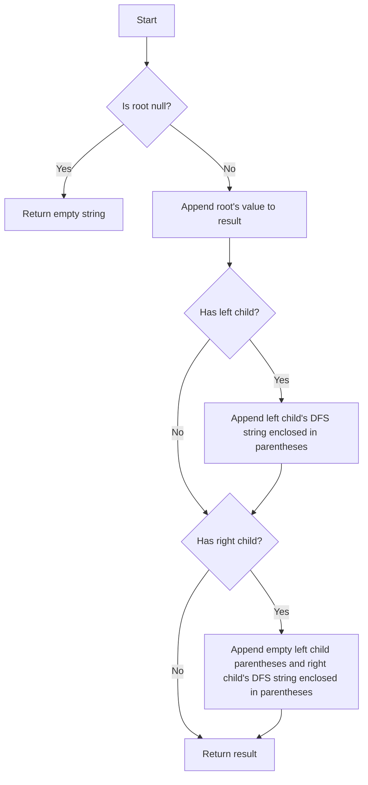

# Construct String from Binary Tree DFS

## Problem Understanding
The problem requires constructing a string representation of a binary tree using Depth-First Search (DFS). The key constraint is that the string representation should be in a specific format, where each node's value is followed by its left and right children enclosed in parentheses. The problem becomes non-trivial due to the need to handle the absence of left or right children, which requires appending empty parentheses to maintain the correct string format.

## Approach
The algorithm strategy is to use recursive DFS to traverse the binary tree and construct the string representation. The intuition behind this approach is to start with the root node's value and recursively append its left and right children's DFS strings enclosed in parentheses. The `tree2str` function uses a recursive DFS approach, handling the edge cases where a node has no left or right child. The function returns an empty string for an empty tree and uses string concatenation to build the result.

## Complexity Analysis
| Metric | Value | Detailed Reason |
|--------|-------|----------------|
| Time   | O(n)  | The algorithm performs a single pass through the tree using recursive DFS, visiting each node once. The time complexity is linear with respect to the number of nodes in the tree. |
| Space  | O(n)  | The space complexity is due to the recursive call stack and the result string. In the worst case, the recursive call stack can grow up to the height of the tree, which is n for an unbalanced tree. The result string also requires O(n) space to store the string representation of the tree. |

## Algorithm Walkthrough
```
Input:      1
         /   \
        2     3
       / \
      4   5
Step 1: result = "1"
Step 2: Append left child's DFS string: result = "1(2(4)5)"
Step 3: Append right child's DFS string: result = "1(2(4)5)3"
Output:    "1(2(4)5)3"
```
This example demonstrates the construction of the string representation for a binary tree with the given structure.

## Visual Flow

This flowchart illustrates the decision flow and string construction process.

## Key Insight
> **Tip:** The key insight is to recursively append the left and right children's DFS strings enclosed in parentheses while handling the absence of children by appending empty parentheses.

## Edge Cases
- **Empty/null input**: The function returns an empty string, as there are no nodes to process.
- **Single element**: The function returns the string representation of the single node, which is simply its value.
- **Unbalanced tree**: The function correctly handles unbalanced trees by recursively appending the DFS strings of the left and right children.

## Common Mistakes
- **Mistake 1**: Forgetting to append empty parentheses for a node with no left child but a right child → Avoid this by checking for the absence of a left child and appending empty parentheses before appending the right child's DFS string.
- **Mistake 2**: Not handling the base case of an empty tree correctly → Avoid this by checking for a null root and returning an empty string.

## Interview Follow-ups
> **Interview:** 
- "What if the input is sorted?" → The algorithm's time complexity remains O(n), as it performs a single pass through the tree regardless of the node values.
- "Can you do it in O(1) space?" → No, the algorithm requires O(n) space due to the recursive call stack and the result string.
- "What if there are duplicates?" → The algorithm correctly handles duplicate node values by appending their values to the result string. The presence of duplicates does not affect the time or space complexity.

## CPP Solution

```cpp
// Problem: Construct String from Binary Tree DFS
// Language: cpp
// Difficulty: Easy
// Time Complexity: O(n) — single pass through tree using recursive DFS
// Space Complexity: O(n) — recursive call stack and result string
// Approach: Recursive DFS string construction — for each node, append its value and recursively its children

/**
 * Definition for a binary tree node.
 * struct TreeNode {
 *     int val;
 *     TreeNode *left;
 *     TreeNode *right;
 *     TreeNode() : val(0), left(nullptr), right(nullptr) {}
 *     TreeNode(int x) : val(x), left(nullptr), right(nullptr) {}
 *     TreeNode(int x, TreeNode *left, TreeNode *right) : val(x), left(left), right(right) {}
 * };
 */

class Solution {
public:
    string tree2str(TreeNode* root) {
        // Edge case: empty tree → return empty string
        if (root == nullptr) return "";

        // Start with the root's value
        string result = to_string(root->val);

        // If the root has a left child, recursively append its DFS string
        if (root->left != nullptr) {
            // Append the left child's DFS string enclosed in parentheses
            result += "(" + tree2str(root->left) + ")";
        }

        // If the root has a right child, recursively append its DFS string
        if (root->right != nullptr) {
            // If the root has no left child, we still need to append an empty left child parentheses
            if (root->left == nullptr) result += "()";
            // Append the right child's DFS string enclosed in parentheses
            result += "(" + tree2str(root->right) + ")";
        }

        return result;
    }
};
```
