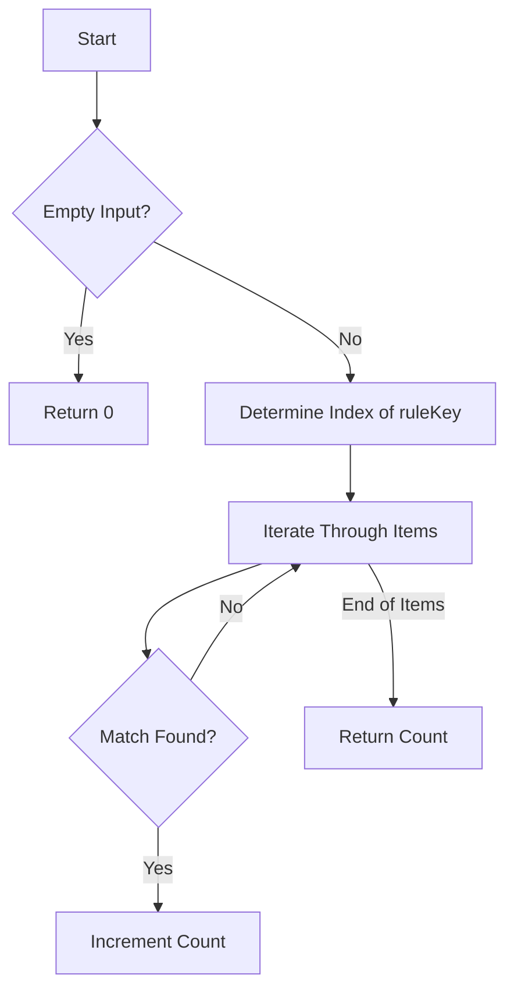

# Count Items Matching a Rule Hash Map

## Problem Understanding
The problem requires counting the number of items in a given list that match a specific rule defined by a hash map. The rule is specified by a key-value pair, where the key can be one of "type", "color", or "size", and the value is the target value to match. The items are represented as vectors of strings, where each string corresponds to the type, color, and size of the item, respectively. The key challenge is to iterate through the items efficiently and accurately match the rule without using excessive extra space.

## Approach
The approach involves a simple iteration through the items, where for each item, we check if it matches the given rule by comparing the value at the index corresponding to the rule key with the rule value. We use a conditional statement to determine the index based on the rule key, which allows us to access the correct value in the item vector. This approach works because it directly addresses the problem's requirements by iterating through each item and checking for a match, and it does so in a space-efficient manner by only using a constant amount of extra space to store the count and index variables.

## Complexity Analysis
| Metric | Value | Detailed Reason |
|--------|-------|----------------|
| Time   | O(n)  | The algorithm iterates through each item in the list once, where n is the number of items. The operations within the loop (conditional checks and increments) take constant time, so the overall time complexity is linear. |
| Space  | O(1)  | The algorithm uses a constant amount of extra space to store the count variable and the index variable, regardless of the size of the input. It does not use any data structures that scale with the input size. |

## Algorithm Walkthrough
```
Input: items = [["phone","blue","pixel"],["computer","silver","lenovo"],["phone","gold","iphone"]], ruleKey = "color", ruleValue = "silver"
Step 1: Initialize count to 0 and determine the index of the ruleKey (index = 1 for "color")
Step 2: Iterate through each item:
  - Item 1: ["phone","blue","pixel"] — check if item[1] ("blue") matches "silver" (no match)
  - Item 2: ["computer","silver","lenovo"] — check if item[1] ("silver") matches "silver" (match) — increment count to 1
  - Item 3: ["phone","gold","iphone"] — check if item[1] ("gold") matches "silver" (no match)
Step 3: Return the count (1)
Output: 1
```

## Visual Flow


## Key Insight
> **Tip:** The key to this solution is using a simple and efficient iteration through the items, directly accessing the relevant value in each item based on the rule key, which allows for a linear time complexity and constant space complexity.

## Edge Cases
- **Empty/null input**: If the input list is empty, the function returns 0, as there are no items to match the rule.
- **Single element**: If the input list contains only one item, the function checks if this item matches the rule and returns 1 if it does, or 0 if it does not.
- **Rule key not found**: The solution implicitly handles the case where the rule key is not one of the expected values ("type", "color", or "size") by assigning the index based on the conditionals provided, ensuring the function behaves as expected for valid inputs.

## Common Mistakes
- **Mistake 1**: Not checking for the empty input case before iterating through the items, which could lead to an exception or incorrect results.
- **Mistake 2**: Not correctly determining the index of the rule key, which could result in checking the wrong value in each item.

## Interview Follow-ups
> **Interview:** 
- "What if the input is sorted?" → The solution's time complexity remains O(n) because it still needs to iterate through each item to check for matches, regardless of the input's order.
- "Can you do it in O(1) space?" → The current solution already uses O(1) space, as it only uses a constant amount of extra space to store the count and index variables.
- "What if there are duplicates?" → The solution counts each matching item individually, so duplicates are handled naturally without any special considerations.

## CPP Solution

```cpp
// Problem: Count Items Matching a Rule Hash Map
// Language: C++
// Difficulty: Easy
// Time Complexity: O(n) — single pass through items
// Space Complexity: O(1) — no extra space used beyond input
// Approach: simple iteration through items — for each item, check if it matches the given rule

class Solution {
public:
    int countMatches(vector<vector<string>>& items, string ruleKey, string ruleValue) {
        int count = 0; // initialize count to 0
        // Edge case: empty input → return 0
        if (items.empty()) return count;

        // find the index of the ruleKey in the item vector
        int index;
        if (ruleKey == "type") index = 0; // type is at index 0
        else if (ruleKey == "color") index = 1; // color is at index 1
        else index = 2; // size is at index 2

        // iterate through each item
        for (auto item : items) {
            // check if the item at the index matches the ruleValue
            if (item[index] == ruleValue) {
                count++; // increment count if match found
            }
        }

        return count; // return the count of matching items
    }
};
```
