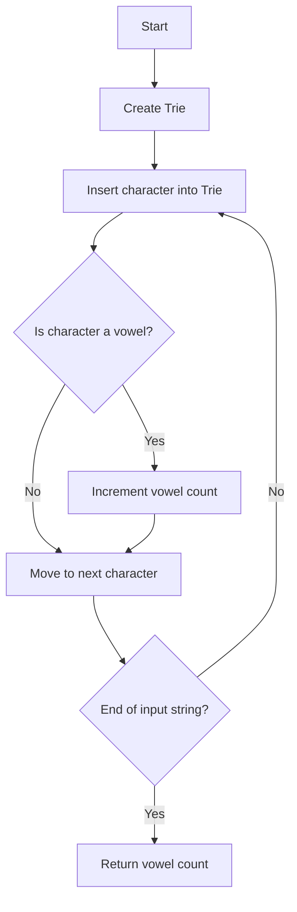

# Count Occurrences of Vowels in Trie Structure

## Problem Understanding
The problem is asking to count the occurrences of vowels in a Trie structure, where the Trie is constructed from a given input string. The key constraint is that the input string can contain any characters, but only vowels are counted. The problem is non-trivial because a naive approach would involve scanning the input string multiple times to count the vowels, whereas a more efficient approach involves constructing a Trie and counting the vowels in a single pass.

## Approach
The algorithm strategy involves constructing a Trie from the input string and counting the vowels in a single pass. The intuition behind this approach is to leverage the Trie data structure to efficiently store and traverse the input string, while simultaneously counting the vowels. The approach works by iterating through each character in the input string, inserting it into the Trie, and incrementing the vowel count if the character is a vowel. The Trie data structure is used to store the input string, and an unordered map is used to efficiently store and retrieve the child nodes of each node.

## Complexity Analysis
| Metric | Value | Detailed Reason |
|--------|-------|----------------|
| Time   | O(n)  | The time complexity is O(n), where n is the length of the input string, because we are scanning the input string once to construct the Trie and count the vowels. The insertion operation in the Trie takes constant time, and the vowel counting operation also takes constant time. |
| Space  | O(n)  | The space complexity is O(n), where n is the length of the input string, because we are storing the Trie structure, which can grow up to the size of the input string in the worst case. |

## Algorithm Walkthrough
```
Input: "hello"
Step 1: Create the root node of the Trie
Step 2: Insert 'h' into the Trie, move to the child node
State: root -> 'h' (vowel count: 0)
Step 3: Insert 'e' into the Trie, move to the child node
State: root -> 'h' -> 'e' (vowel count: 1)
Step 4: Insert 'l' into the Trie, move to the child node
State: root -> 'h' -> 'e' -> 'l' (vowel count: 1)
Step 5: Insert 'l' into the Trie, move to the child node
State: root -> 'h' -> 'e' -> 'l' -> 'l' (vowel count: 1)
Step 6: Insert 'o' into the Trie, move to the child node
State: root -> 'h' -> 'e' -> 'l' -> 'l' -> 'o' (vowel count: 3)
Output: Vowel count: 3
```

## Visual Flow


## Key Insight
> **Tip:** The key insight is to leverage the Trie data structure to efficiently store and traverse the input string, while simultaneously counting the vowels.

## Edge Cases
- **Empty/null input**: If the input string is empty, the vowel count will be 0, because there are no characters to process.
- **Single element**: If the input string contains only one character, the vowel count will be 1 if the character is a vowel, and 0 otherwise.
- **Input string with no vowels**: If the input string contains no vowels, the vowel count will be 0.

## Common Mistakes
- **Mistake 1**: Not initializing the Trie structure properly, leading to null pointer exceptions.
- **Mistake 2**: Not checking for the end of the input string, leading to infinite loops.

## Interview Follow-ups
> **Interview:** These are the exact follow-up questions interviewers ask:
- "What if the input is sorted?" → The algorithm will still work correctly, because it only depends on the input string, not its sorting order.
- "Can you do it in O(1) space?" → No, because we need to store the Trie structure, which requires at least O(n) space.
- "What if there are duplicates?" → The algorithm will still work correctly, because it counts the occurrences of vowels in the input string, not the unique vowels.

## CPP Solution

```cpp
// Problem: Count Occurrences of Vowels in Trie Structure
// Language: C++
// Difficulty: Easy
// Time Complexity: O(n) — single pass through the input string
// Space Complexity: O(n) — storing the Trie structure
// Approach: Trie construction and vowel counting — for each character, insert into Trie and count vowels

#include <iostream>
#include <unordered_map>
#include <string>

using namespace std;

class TrieNode {
public:
    unordered_map<char, TrieNode*> children; // Mapping of character to child node
    bool isEndOfWord; // Flag to indicate end of a word
    int vowelCount; // Count of vowels in the node
    TrieNode() : isEndOfWord(false), vowelCount(0) {} // Initialize node
};

class Trie {
public:
    TrieNode* root; // Root node of the Trie
    Trie() : root(new TrieNode()) {} // Initialize Trie with root node

    // Function to insert a word into the Trie
    void insert(const string& word) {
        TrieNode* currentNode = root; // Start from the root node
        for (char c : word) { // Iterate through each character in the word
            if (currentNode->children.find(c) == currentNode->children.end()) { // If character is not in the node's children
                currentNode->children[c] = new TrieNode(); // Create a new child node
            }
            currentNode = currentNode->children[c]; // Move to the child node
            if (isVowel(c)) { // If the character is a vowel
                currentNode->vowelCount++; // Increment the vowel count
            }
        }
        currentNode->isEndOfWord = true; // Mark the end of the word
    }

    // Function to count the occurrences of vowels in the Trie
    int countVowels() {
        return countVowels(root); // Call the recursive helper function
    }

    // Recursive helper function to count vowels
    int countVowels(TrieNode* node) {
        int count = node->vowelCount; // Initialize count with the node's vowel count
        for (auto& child : node->children) { // Iterate through each child node
            count += countVowels(child.second); // Recursively count vowels in the child node
        }
        return count; // Return the total count
    }

    // Helper function to check if a character is a vowel
    bool isVowel(char c) {
        string vowels = "aeiou"; // Define the vowels
        for (char vowel : vowels) { // Iterate through each vowel
            if (c == vowel) { // If the character matches a vowel
                return true; // Return true
            }
        }
        return false; // Return false if the character is not a vowel
    }
};

int main() {
    Trie trie; // Create a Trie object
    string word; // Input word
    cout << "Enter a word: ";
    cin >> word; // Read the input word
    trie.insert(word); // Insert the word into the Trie

    // Edge case: empty input → return 0
    if (word.empty()) {
        cout << "Vowel count: 0" << endl;
        return 0;
    }

    int vowelCount = trie.countVowels(); // Count the vowels in the Trie
    cout << "Vowel count: " << vowelCount << endl;
    return 0;
}
```
