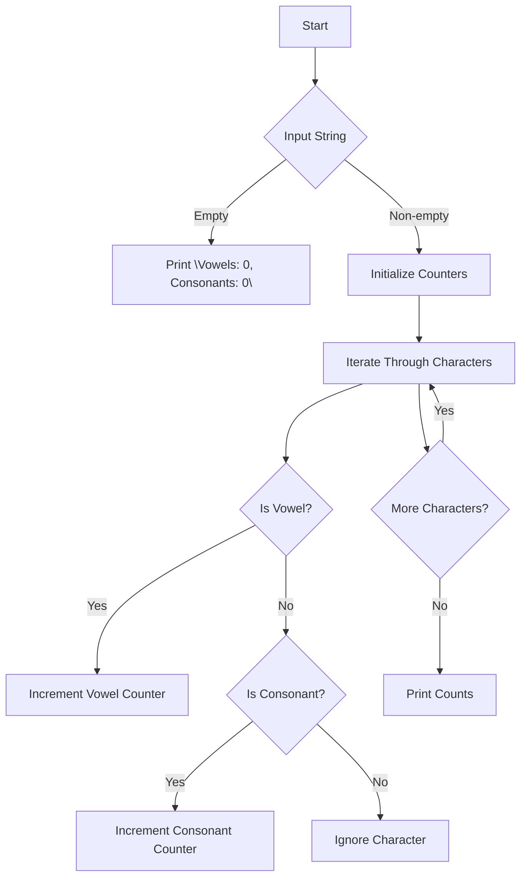

# Count Vowels and Consonants

## Problem Understanding
The problem asks us to count the number of vowels and consonants in a given string. The key constraint is that we need to handle both uppercase and lowercase letters, as well as ignore non-alphabet characters such as spaces and punctuation. What makes this problem non-trivial is that we need to handle these edge cases correctly, and a naive approach might not account for all possible scenarios, such as empty strings or strings with only non-alphabet characters.

## Approach
The algorithm strategy is to iterate through each character in the input string, convert it to lowercase for simplicity, and then check if it is a vowel or a consonant using conditional checks. We use two counters, one for vowels and one for consonants, which are initialized to zero at the beginning. This approach works because it ensures that each character is checked exactly once, and the conditional checks are sufficient to distinguish between vowels and consonants. We use a simple `for` loop to iterate through the string, and the conditional checks are implemented using `if` statements.

## Complexity Analysis
| Metric | Value | Detailed Reason |
|--------|-------|----------------|
| Time   | O(n)  | The algorithm iterates through each character in the input string exactly once, where n is the length of the string. The conditional checks inside the loop take constant time, so the overall time complexity is linear. |
| Space  | O(1)  | The algorithm uses a constant amount of space to store the two counters, regardless of the size of the input string. |

## Algorithm Walkthrough
```
Input: "Hello World"
Step 1: Initialize vowelCount = 0, consonantCount = 0
Step 2: Convert 'H' to lowercase 'h', check if 'h' is a vowel (no), check if 'h' is a consonant (yes), increment consonantCount = 1
Step 3: Convert 'e' to lowercase 'e', check if 'e' is a vowel (yes), increment vowelCount = 1
Step 4: Convert 'l' to lowercase 'l', check if 'l' is a vowel (no), check if 'l' is a consonant (yes), increment consonantCount = 2
Step 5: Convert 'l' to lowercase 'l', check if 'l' is a vowel (no), check if 'l' is a consonant (yes), increment consonantCount = 3
Step 6: Convert 'o' to lowercase 'o', check if 'o' is a vowel (yes), increment vowelCount = 2
Step 7: Convert ' ' to lowercase ' ', check if ' ' is a vowel (no), check if ' ' is a consonant (no), ignore
Step 8: Convert 'W' to lowercase 'w', check if 'w' is a vowel (no), check if 'w' is a consonant (yes), increment consonantCount = 4
Step 9: Convert 'o' to lowercase 'o', check if 'o' is a vowel (yes), increment vowelCount = 3
Step 10: Convert 'r' to lowercase 'r', check if 'r' is a vowel (no), check if 'r' is a consonant (yes), increment consonantCount = 5
Step 11: Convert 'l' to lowercase 'l', check if 'l' is a vowel (no), check if 'l' is a consonant (yes), increment consonantCount = 6
Step 12: Convert 'd' to lowercase 'd', check if 'd' is a vowel (no), check if 'd' is a consonant (yes), increment consonantCount = 7
Output: Vowels: 3, Consonants: 7
```

## Visual Flow


## Key Insight
> **Tip:** The key insight is to convert all characters to lowercase before checking if they are vowels or consonants, which simplifies the conditional checks and ensures that the algorithm works correctly for both uppercase and lowercase letters.

## Edge Cases
- **Empty/null input**: If the input string is empty, the algorithm will print "Vowels: 0, Consonants: 0" immediately.
- **Single element**: If the input string contains only one character, the algorithm will correctly count it as either a vowel or a consonant.
- **Non-alphabet characters**: If the input string contains non-alphabet characters such as spaces or punctuation, the algorithm will ignore them and only count the alphabet characters.

## Common Mistakes
- **Mistake 1**: Not converting characters to lowercase before checking if they are vowels or consonants, which can lead to incorrect counts.
- **Mistake 2**: Not handling non-alphabet characters correctly, which can lead to incorrect counts or crashes.

## Interview Follow-ups
> **Interview:** These are the exact follow-up questions interviewers ask:
- "What if the input is sorted?" → The algorithm will still work correctly, as it only depends on the characters in the input string, not their order.
- "Can you do it in O(1) space?" → No, the algorithm needs to use at least two counters to store the vowel and consonant counts, which requires O(1) space.
- "What if there are duplicates?" → The algorithm will correctly count each character individually, even if there are duplicates in the input string.

## CPP Solution

```cpp
// Problem: Count Vowels and Consonants
// Language: C++
// Difficulty: Easy
// Time Complexity: O(n) — single pass through string
// Space Complexity: O(1) — constant space for counters
// Approach: Simple iteration with conditional checks — count vowels and consonants separately

#include <iostream>
#include <string>

class Solution {
public:
    // Function to count vowels and consonants in a given string
    void countVowelsAndConsonants(const std::string& input) {
        int vowelCount = 0;  // Initialize vowel counter
        int consonantCount = 0;  // Initialize consonant counter

        // Edge case: empty input → return immediately
        if (input.empty()) {
            std::cout << "Vowels: 0, Consonants: 0" << std::endl;
            return;
        }

        // Iterate through each character in the input string
        for (int i = 0; i < input.length(); i++) {
            char currentChar = input[i];  // Get the current character
            // Convert to lowercase for simplicity
            if (currentChar >= 'A' && currentChar <= 'Z') {
                currentChar += 'a' - 'A';  // Convert to lowercase
            }

            // Check if the character is a vowel
            if (currentChar == 'a' || currentChar == 'e' || currentChar == 'i' || currentChar == 'o' || currentChar == 'u') {
                vowelCount++;  // Increment vowel counter
            }
            // Check if the character is a consonant (assuming only alphabets)
            else if (currentChar >= 'a' && currentChar <= 'z') {
                consonantCount++;  // Increment consonant counter
            }
            // Edge case: non-alphabet characters (e.g., spaces, punctuation) → ignore
        }

        // Print the counts
        std::cout << "Vowels: " << vowelCount << ", Consonants: " << consonantCount << std::endl;
    }
};

int main() {
    Solution solution;
    std::string input;
    std::cout << "Enter a string: ";
    std::getline(std::cin, input);
    solution.countVowelsAndConsonants(input);
    return 0;
}
```
