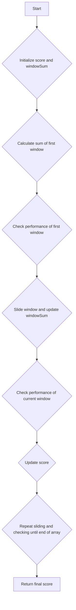

# Diet Plan Performance Sliding Window

## Problem Understanding
The problem asks to calculate the performance score of a diet plan based on the calorie intake over a given period. The diet plan performance is evaluated using a sliding window of k days, where the score is increased if the total calories in the window exceed the upper limit, decreased if the total calories are below the lower limit, and remains unchanged if the total calories are within the limits. The key constraints are the size of the sliding window (k), the lower and upper limits for calorie intake, and the array of daily calorie intake values. This problem is non-trivial because it requires efficient handling of the sliding window and the conditional updates of the score, which cannot be simply solved by a naive approach that checks every possible window.

## Approach
The algorithm strategy used is the sliding window technique, where a window of k days is maintained and slid over the array of calorie intake values. The intuition behind this approach is to efficiently calculate the sum of calories in each window by only considering the changes at the boundaries of the window. This approach works because the sum of calories in the window can be updated in constant time by subtracting the calories of the day going out of the window and adding the calories of the day entering the window. A single array of calorie intake values and a few variables are used to store the current window sum and the score, making the space complexity constant.

## Complexity Analysis
| Metric | Value | Detailed Reason |
|--------|-------|----------------|
| Time   | O(n)  | The algorithm makes a single pass through the array of calorie intake values, where n is the number of days. The operations within the loop ( updating the window sum and checking the performance) take constant time. |
| Space  | O(1)  | The algorithm uses a constant amount of space to store the variables (score, windowSum, and loop indices), regardless of the input size. |

## Algorithm Walkthrough
```
Input: calories = [1, 2, 3, 4, 5], k = 3, lower = 3, upper = 3
Step 1: Initialize score = 0, windowSum = 0
Step 2: Calculate the sum of the first window (i = 0 to k-1): windowSum = 1 + 2 + 3 = 6
Step 3: Check the performance of the first window: windowSum (6) > upper (3), so score += 1 = 1
Step 4: Slide the window:
    - Remove the calories of the day going out of the window: windowSum -= 1 = 5
    - Add the calories of the day entering the window: windowSum += 4 = 9
    - Check the performance of the current window: windowSum (9) > upper (3), so score += 1 = 2
Step 5: Continue sliding the window and updating the score until the end of the array
Output: score = 2
```

## Visual Flow


## Key Insight
> **Tip:** The key insight is to use the sliding window technique to efficiently calculate the sum of calories in each window by only considering the changes at the boundaries of the window, allowing for a single pass through the array.

## Edge Cases
- **Empty/null input**: If the input array is empty, the algorithm returns 0 as there are no calories to process.
- **Single element**: If the input array has only one element, the algorithm checks the performance of this single element against the lower and upper limits and returns the score accordingly.
- **k equals the size of the input array**: If the window size k equals the size of the input array, the algorithm only checks the performance of the entire array and returns the score.

## Common Mistakes
- **Mistake 1**: Not updating the window sum correctly when sliding the window, leading to incorrect scores. → To avoid this, ensure that the calories of the day going out of the window are subtracted and the calories of the day entering the window are added correctly.
- **Mistake 2**: Not handling edge cases such as an empty input array or a window size that equals the size of the input array. → To avoid this, add explicit checks for these edge cases and handle them accordingly.

## Interview Follow-ups
> **Interview:** These are the exact follow-up questions interviewers ask:
- "What if the input is sorted?" → The algorithm's time complexity remains O(n) because it still needs to make a single pass through the array to calculate the sum of calories in each window.
- "Can you do it in O(1) space?" → The algorithm already uses O(1) space because it only uses a constant amount of space to store the variables, regardless of the input size.
- "What if there are duplicates?" → The algorithm handles duplicates correctly because it checks the performance of each window based on the sum of calories, which can include duplicates.

## CPP Solution

```cpp
// Problem: Diet Plan Performance Sliding Window
// Language: cpp
// Difficulty: Easy
// Time Complexity: O(n) — single pass through the calories array
// Space Complexity: O(1) — constant space used for variables
// Approach: Sliding window technique — maintain a window of k days

class Solution {
public:
    int dietPlanPerformance(vector<int>& calories, int k, int lower, int upper) {
        // Initialize variables to store the score and the current window sum
        int score = 0; 
        int windowSum = 0; // Sum of calories in the current window

        // Edge case: empty input → return 0
        if (calories.empty()) {
            return 0; 
        }

        // Calculate the sum of the first window
        for (int i = 0; i < k; i++) {
            windowSum += calories[i]; // Add calories of the current day to the window sum
        }

        // Check the performance of the first window
        if (windowSum < lower) {
            score -= 1; // Decrease score if the sum is less than lower
        } else if (windowSum > upper) {
            score += 1; // Increase score if the sum is more than upper
        }

        // Slide the window and calculate the score for each window
        for (int i = k; i < calories.size(); i++) {
            // Remove the calories of the day going out of the window
            windowSum -= calories[i - k]; 

            // Add the calories of the day entering the window
            windowSum += calories[i]; 

            // Check the performance of the current window
            if (windowSum < lower) {
                score -= 1; // Decrease score if the sum is less than lower
            } else if (windowSum > upper) {
                score += 1; // Increase score if the sum is more than upper
            }
        }

        return score; // Return the final score
    }
}
```
