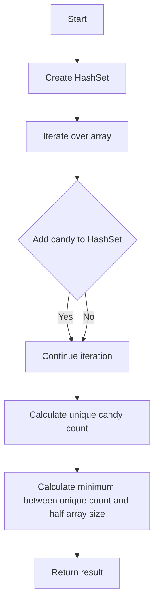

# Distribute Candies Hash Set

## Problem Understanding
The problem asks to find the maximum number of unique candies that can be distributed to a sister, given that she can have at most half of the total candies. The key constraint is that each candy type can only be given once. This problem is non-trivial because a naive approach of simply counting the unique candies may not work if the number of unique candies exceeds half of the total candies, as the sister can only have half of the total candies.

## Approach
The algorithm strategy is to use a HashSet to store unique candies and iterate over the array to count them. This approach works because HashSet automatically eliminates duplicates, and by checking the size of the set, we can determine the number of unique candies. The unordered_set data structure is used because it provides constant time complexity for insert and search operations. The approach handles the key constraint by taking the minimum between the size of the set and half the size of the input array, ensuring that the sister does not receive more than half of the total candies.

## Complexity Analysis
| Metric | Value | Detailed Reason |
|--------|-------|----------------|
| Time   | O(n)  | The algorithm iterates over the array once, where n is the number of candies. The insert operation in the HashSet takes constant time, so the overall time complexity is linear. |
| Space  | O(n)  | In the worst-case scenario, the HashSet will store all unique candies, which can be at most n. Therefore, the space complexity is also linear. |

## Algorithm Walkthrough
```
Input: [1, 1, 2, 2, 3, 3]
Step 1: Create an empty HashSet uniqueCandies = {}
Step 2: Iterate over the array and add each candy to the set:
  - Add 1 to the set: uniqueCandies = {1}
  - Add 1 to the set (already exists, so it's not added): uniqueCandies = {1}
  - Add 2 to the set: uniqueCandies = {1, 2}
  - Add 2 to the set (already exists, so it's not added): uniqueCandies = {1, 2}
  - Add 3 to the set: uniqueCandies = {1, 2, 3}
  - Add 3 to the set (already exists, so it's not added): uniqueCandies = {1, 2, 3}
Step 3: Calculate the number of unique candies: uniqueCandyCount = 3
Step 4: Calculate the minimum between the size of the set and half the size of the input array: min(3, 6 / 2) = min(3, 3) = 3
Output: 3
```

## Visual Flow


## Key Insight
> **Tip:** The key insight is to use a HashSet to automatically eliminate duplicate candies and then take the minimum between the size of the set and half the size of the input array to ensure that the sister does not receive more than half of the total candies.

## Edge Cases
- **Empty input array**: If the input array is empty, the function will return 0, as there are no candies to distribute.
- **Single element**: If the input array contains only one element, the function will return 1, as there is only one unique candy.
- **All candies are the same**: If all candies in the input array are the same, the function will return 1, as there is only one unique candy, and the sister can have at most half of the total candies, which is 1 in this case.

## Common Mistakes
- **Mistake 1**: Forgetting to take the minimum between the size of the set and half the size of the input array, which can lead to incorrect results when the number of unique candies exceeds half of the total candies. → To avoid this, always calculate the minimum between the two values.
- **Mistake 2**: Using a data structure with high time complexity for insert and search operations, such as a linked list. → To avoid this, use a HashSet, which provides constant time complexity for insert and search operations.

## Interview Follow-ups
> **Interview:** These are the exact follow-up questions interviewers ask:
- "What if the input is sorted?" → The algorithm will still work correctly, as it only relies on the HashSet to eliminate duplicates and does not depend on the order of the input array.
- "Can you do it in O(1) space?" → No, it's not possible to solve this problem in O(1) space, as we need to store the unique candies in a data structure, which requires at least O(n) space in the worst case.
- "What if there are duplicates?" → The algorithm will automatically eliminate duplicates using the HashSet, so it will work correctly even if there are duplicates in the input array.

## CPP Solution

```cpp
// Problem: Distribute Candies Hash Set
// Language: C++
// Difficulty: Easy
// Time Complexity: O(n) — single pass through array to count unique candies
// Space Complexity: O(n) — HashSet stores at most n unique candies
// Approach: HashSet unique candy counting — for each candy, check if it exists in the set

class Solution {
public:
    int distributeCandies(vector<int>& candies) {
        // Create a HashSet to store unique candies
        unordered_set<int> uniqueCandies;
        
        // Iterate over each candy in the array
        for (int candy : candies) {
            // Add the candy to the set if it doesn't exist
            uniqueCandies.insert(candy); // HashSet automatically eliminates duplicates
        }
        
        // The number of unique candies is the minimum between the size of the set and half the size of the input array
        int uniqueCandyCount = uniqueCandies.size();
        
        // Edge case: if the number of unique candies is greater than half the size of the input array, return half the size of the input array
        // This is because we can't distribute more than half the candies as unique
        return min(uniqueCandyCount, candies.size() / 2);
    }
};
```
